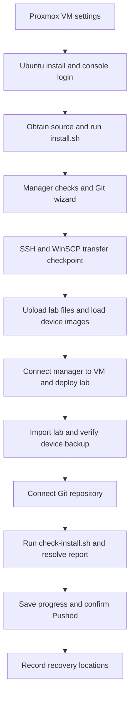

# Fresh VM guide, version 2 — Proxmox to your first Git save

This is the **installer-based walkthrough** for Containerlab Node Manager
**1.19.1** on Ubuntu Server **24.04 LTS**. “Version 2” is the guide edition, not
the application version. It supplements the [short install guide](INSTALL.md)
and keeps the [original manual guide](FRESH-VM-GUIDE.md) available.

The route is: create the VM in Proxmox, install Ubuntu, log into its console,
obtain the project source, run **one installer**, then verify file transfer,
load your lab, and save its progress to Git. You do not need WinSCP to bootstrap
the installer.

The published baseline is GitHub main `2d34415` (**1.19.0**); this guide includes
the **1.19.1** discovery/Git SSH stream fixes and helper timeout changes prepared
for publication. Obtain matching source after these fixes merge. Instructions were checked
against source and the linked provider documentation. The administrative WinSCP
procedure below was confirmed by the user; a complete fresh-VM run of 1.19.1 has
not been verified by its author.

## Before you start

Have your Ubuntu Server ISO, Proxmox access, a workstation that can reach the
VM's network, and internet access from the VM. Obtain your licensed network
images and lab files separately. Create a GitHub repository with **Add a README**
selected if you want to complete Git setup during installation.

This guide uses these examples; substitute your actual values:

| Item | Example |
|---|---|
| Ubuntu VM name | `clab-3` |
| Normal Ubuntu administrator | `archtop` |
| VM LAN address | `10.150.2.213` |
| Manager source folder | `/home/archtop/projects/v1.19.1` |
| Uploaded files | `/home/archtop/uploads` |
| Lab topology/project | `/etc/containerlab/practice-lab` |
| Lab-config Git checkout | `/home/archtop/labs/my-lab` |
| Persistent manager data | `/srv/containerlab-node-manager/data` |

Use the IP, gateway, DNS and VLAN assigned to your VM. Do not choose an address
just because it did not answer a ping. Commands run inside the **Ubuntu VM**
unless explicitly labeled **Proxmox host** or **Windows workstation**. Code
blocks omit shell prompts so they can be copied directly.



## 1. Set up the VM in Proxmox

### Check the Proxmox node clock

In the **Proxmox host shell**, check:

```bash
date -u
timedatectl status
```

Compare UTC with a trusted current clock. If it is wrong, have the Proxmox
administrator repair the node's existing time synchronization before building
the guest. Do not copy a timestamp from this guide or change the host timezone
to compensate. Check the Ubuntu guest separately in step 3; a correct host
clock alone does not prove the guest clock is correct.

### Create VM

In the Proxmox web interface, select the intended node and choose **Create VM**.
Record the actual VM ID and name. Apply these settings before starting Ubuntu:

| Proxmox page/setting | Selection for this build |
|---|---|
| General | Your assigned VM ID and hostname; example name `clab-3` |
| OS | Ubuntu Server 24.04 LTS ISO, Linux guest; use amd64 for the x86 NOS images in this project |
| System | Keep compatible machine/BIOS defaults; SCSI controller **VirtIO SCSI single** |
| Disk | SCSI disk on the intended storage, **IO thread** enabled; keep default cache policy; Discard only if supported by that storage |
| CPU | **Type: host** for VM-backed network devices needing nested KVM; choose cores for the intended lab |
| Memory | Allocate for Ubuntu, Docker and all devices running together; size from the device-image requirements |
| Network | **VirtIO** NIC on the workstation-reachable bridge, commonly `vmbr0`; set a VLAN tag only when required |
| Options → QEMU Guest Agent | Optional; enabling the virtual channel also requires a guest package, covered in step 8 |

Disk capacity must cover downloaded archives, Docker images, running devices,
lab files, backups and Git history. No single RAM/CPU/disk allocation fits all
topologies. Host CPU passthrough can constrain migration between unlike Proxmox
nodes. [Proxmox VM documentation](https://github.com/proxmox/pve-docs/blob/master/qm.adoc)

### Check nested virtualization when your NOS needs it

For VM-backed images such as cJunosEvolved or XRv9k, check the physical host's
nested KVM setting. Ordinary Linux containers and the manager itself do not need
nested virtualization.

**vJunos-switch requires a different deployment plan:** Containerlab documents
that it cannot run inside a VM because its architecture already uses nested
virtualization. A Proxmox Ubuntu guest with `/dev/kvm` does not remove that
limitation. Use a host supported by the image's requirements; the manager's new
Junos adapter only adds node login/backup handling.
[Containerlab vJunos-switch requirements](https://containerlab.dev/manual/kinds/vr-vjunosswitch/)

**Proxmox host shell:** run the command matching its CPU vendor:

```bash
# Intel
cat /sys/module/kvm_intel/parameters/nested

# AMD — use this instead on an AMD host
cat /sys/module/kvm_amd/parameters/nested
```

Expect `Y` or `1`. If it is disabled, have the Proxmox administrator enable the
appropriate KVM module option during host maintenance. Do not unload a KVM
module while other VMs are using it.

If changing an existing VM's CPU type, use **Shutdown** for that chosen VM,
wait until it is stopped, change **Hardware → Processors → Type → host**, then
**Start** it. Do not copy another VM's numeric ID or hard-stop a running lab.
[Linux nested KVM documentation](https://docs.kernel.org/virt/kvm/x86/running-nested-guests.html)

## 2. Install Ubuntu Server

Open the VM's **Console** and boot the ISO. Complete the Ubuntu installer:

1. Select the normal Ubuntu Server installation and your keyboard settings.
2. Configure the assigned IPv4 address, subnet, gateway and DNS. Use DHCP with a
   reservation if that is how your network allocates stable VM addresses.
3. Leave the proxy blank unless your network requires one.
4. Select the intended disk. If using LVM, inspect the proposed **root logical
   volume size** before accepting the layout. Ensure `/` has the space you want
   Docker and the lab to use; a large virtual disk can still have a small root LV.
5. Create the normal administrator account, for example **archtop**, and its
   password. This account owns your Git checkout and is your WinSCP login.
6. Select **Install OpenSSH server**. For the password-based WinSCP workflow in
   this guide, allow password authentication for your normal account. Importing
   SSH keys can change that installer default; check the setting explicitly.
7. Finish installation, reboot, detach the ISO when requested, and boot from the
   installed disk. Extra server snaps and Ubuntu Pro are not prerequisites here.

The Ubuntu account created during installation has sudo access. It is separate
from the later `clab-discovery` account.
[Ubuntu installer screens](https://github.com/canonical/subiquity/blob/main/doc/tutorial/screen-by-screen.rst),
[Ubuntu storage setup](https://github.com/canonical/subiquity/blob/main/doc/howto/configure-storage.rst)

## 3. Log into the VM console and check the foundation

Log into Ubuntu in the **Proxmox console** as your normal user. If SSH already
works, you may use your workstation's SSH client instead. Run:

```bash
whoami
sudo -v
ip -br address
ip route
getent hosts github.com
df -h /
date -u
timedatectl status
```

Confirm the username, assigned address, default route, DNS lookup and usable
root filesystem capacity. If the root volume is unexpectedly small, use the
master wiki's [Part 3 disk inspection procedure](WIKI-MASTER-GUIDE.md) before
loading large images; the installer does not expand disks or filesystems.

Compare the displayed UTC date and time with a trusted current clock **before
installing Git or cloning**. A different local timezone is fine; UTC must be
correct. If the time is wrong, or a newly started time service has not caught up,
complete [clock recovery](#recovery-c) first. `NTP service: active` means the
service is running, not that it has synchronized. A deliberately manual or
host-managed clock can be correct even when synchronization is reported as no.

For VM-backed NOS images, also check:

```bash
ls -l /dev/kvm
```

If it is missing, resolve the Proxmox nesting/CPU settings before expecting those
devices to boot. You can still install the manager while resolving that issue.

**Checkpoint:** you are in the Ubuntu VM as the ordinary administrator, sudo
works, GitHub resolves, and the UTC clock is correct. Do not run the following Linux commands in Windows
PowerShell or the Proxmox host shell.

## 4. Obtain the source and launch the installer

Copy this block once into the **Ubuntu terminal**. It installs Git only if it
is missing, clones into a new folder, and starts the terminal installer. The
subshell stops at a failed command without closing your login session.

```bash
(
  set -e
  if ! command -v git >/dev/null 2>&1; then
    sudo apt-get update --error-on=any
    sudo apt-get install -y git
  fi
  mkdir -p "$HOME/projects"
  git clone https://github.com/ArchRuger/CLAB-BACKUP-WORKER-v2.git "$HOME/projects/v1.19.1"
  bash "$HOME/projects/v1.19.1/deploy/install.sh"
)
```

The final command runs **without sudo**. The installer requests administrator
access for its privileged steps and keeps Git login/configuration under your
normal account. The source must be present before its installer can run.

If that source folder already exists, reuse it instead of cloning over it:

```bash
bash "$HOME/projects/v1.19.1/deploy/install.sh"
```

The installer banner must identify **1.19.1** for this guide. A directory name
does not pin a Git version; if main has advanced, use that release's matching
guide. Its source consistency check must pass.

**Bootstrap APT failure:** if the initial Git installation fails with
`file:/cdrom ... Release`, go to [recovery A](#recovery-a) below. If the error
happens inside the installer, return to its menu and select installation-media
repair when reviewing the install plan. Neither case requires a new VM.
For `Release file ... is not valid yet` or `expired`, use
[clock recovery](#recovery-c) instead. Media-source repair and clock correction
address different errors.

## 5. Complete the full installation menu

Choose **1. Install or update manager, then set up Git**. For a fresh standalone
VM, the normal selections are:

| Prompt or setting | What to choose |
|---|---|
| Manager bind/port settings | With no existing `.env`, defaults are all VM interfaces and port **8081**; there is no separate port prompt |
| Lab operation access | Enable reviewed lab operations |
| Back up and disable obsolete installation-media APT entries | **y** to repair the common leftover ISO/CD-ROM source; network sources are retained |
| Installation plan | Review the source folder and account, then **y** |
| sudo password | Your ordinary Ubuntu account password |
| Create `clab-discovery` password | Choose a password and enter it twice; save it for the manager's VM connection |

The installer handles missing Git, SSH, Docker/Compose and Containerlab;
prepares persistent manager storage; installs and verifies helpers; builds and
starts the manager; then checks its running version and HTTP response. Image
builds can take time. Keep the terminal open and wait for the result.

Before APT updates, setup displays UTC and NTP status. If a time service is
already active but not yet synchronized, it waits up to 30 seconds before
continuing. This is a read-only preflight: it does not change time services,
servers, timezone or the clock, and it does not require NTP for an otherwise
correct clock. APT output and failure status are retained, with specific guidance
for future-dated or expired repository metadata. Git/GitHub CLI package setup
uses the same checks. If APT reports a clock error, follow [recovery C](#recovery-c).

Existing `.env` settings, passwords, manager data and compatible installations
are retained. This is a fresh-build guide; upgrades with customized settings
should use the `.env` copy option described in [INSTALL.md](INSTALL.md).

If a step fails, read its output. Use **Retry this step** after fixing it, or
**Return to menu**. Menu **3. Check running installation** opens the full
[installation report](HEALTH-CHECK.md) without rebuilding. Before browser VM/Git
setup, some checks will need attention; repeat it at the step 12 checkpoint.
Do not continue as though an incomplete install passed.

**Checkpoint:** the terminal reports that the manager is running and its HTTP
and version checks passed. That check does **not** prove workstation reachability,
WinSCP transfer, device backup or Git push; the next steps verify those.

## 6. Set up the engineer's Git checkout

When offered **Set up or repair Git now**, choose it if your GitHub repository
with its initial README is ready. Otherwise choose **Finish; set up Git later**.
You can reopen the Git wizard without rebuilding:

```bash
bash "$HOME/projects/v1.19.1/deploy/install.sh" --git
```

The six phases guide you through:

1. **Account and registrations:** confirm your ordinary Linux account is shown.
   Sudo reads existing registration settings; it does not make Git run as root.
2. **Repository:** choose Clone for a new checkout, Existing for a completed
   clone, or select a previously registered checkout from the menu. Paste the
   GitHub **Code → HTTPS** URL, such as `https://github.com/OWNER/REPOSITORY.git`.
   A `/tree/main` browser URL is not the clone URL; the wizard offers a correction.
   Accept a persistent checkout path such as `/home/archtop/labs/my-lab`.
3. **GitHub login:** copy the device code, press Enter when requested, and open
   the displayed authorization URL on your workstation. Keep the VM terminal
   waiting. A missing browser on the VM is expected.
4. **Checkout:** let the wizard clone or validate that directory. It holds your
   saved configurations and is separate from the application source.
5. **Identity and access:** enter your intended commit author name and email if
   prompted. These label commits and do not have to match your Ubuntu username.
   GitHub login alone does not set them.
6. **Registration:** review and confirm. Wait for **Registered** and **Ready**.

Existing settings are preserved. Registration validates repository state and
performs a push dry run; no lab configs are pushed during setup. Server branch
rules can still reject a future changed commit. Retry or sign-in recovery stays
within the wizard. Cancel keeps completed work.

If Git setup is incomplete, the manager can still run. Finish Git setup before
the final Git save in step 12. More recovery detail is in [GIT-SETUP.md](GIT-SETUP.md).

## 7. Verify SSH and WinSCP before transferring lab files

### Which login goes where?

| Connection | Username | Password/identity |
|---|---|---|
| Ubuntu console, SSH and **WinSCP** | Your normal VM account, e.g. **archtop** | That Ubuntu account's password or its configured SSH authentication |
| Manager **VM connection** | **clab-discovery** | The password created during installation |
| GitHub authorization | Your GitHub account | GitHub CLI browser/device login |
| Git commits | Your author name/email | Identity settings; not a login password |
| Network-device backup/terminal | The device's own account | Device credentials configured in the manager |

**SFTP is supplied by OpenSSH; there is no separate `sftp.service` to start.**
The installer installs OpenSSH and starts SSH, but retains existing SSH settings
and does not perform an SFTP transfer test. `clab-discovery` is deliberately
restricted to manager commands and cannot be your WinSCP account.
[Ubuntu SFTP server manual](https://manpages.ubuntu.com/manpages/noble/man8/sftp-server.8.html)

### Check the VM service and subsystem

**Ubuntu VM, as your normal user:**

```bash
mkdir -p "$HOME/uploads"
sudo /usr/sbin/sshd -t
sudo systemctl status ssh.service ssh.socket --no-pager
sudo ss -ltnp '( sport = :22 )'
sudo /usr/sbin/sshd -T | grep '^subsystem '
sudo ssh-keygen -lf /etc/ssh/ssh_host_ed25519_key.pub
```

`sshd -t` succeeds silently. Expect an SSH listener and an SFTP subsystem such
as `sftp /usr/lib/openssh/sftp-server` or `sftp internal-sftp`. Ubuntu can use
socket activation, so an inactive service alone is not proof that SSH is down;
inspect the socket and listener too. If you configured another SSH port, use it
consistently. [Ubuntu OpenSSH setup](https://ubuntu.com/server/docs/how-to/security/openssh-server/)

### Connect from Windows and test a transfer

Create a **new WinSCP site** with these values:

| WinSCP setting | Value |
|---|---|
| File protocol | **SFTP** |
| Host name | Your VM LAN address, e.g. `10.150.2.213` |
| Port number | **22**, unless you configured a different SSH port |
| User name | **archtop**, or your actual normal VM account |
| Password | That account's Ubuntu password |
| Advanced → Environment → SFTP → SFTP server | Leave at its default for normal-user uploads; administrative access uses the optional setup below |
| Remote directory | `/home/archtop/uploads`, adjusted for your account |

Compare WinSCP's first host-key prompt with the VM console fingerprint before
accepting it. If it negotiates RSA or ECDSA instead, inspect the corresponding
`/etc/ssh/ssh_host_*_key.pub` file on the console. Upload a small text file into
`uploads`, download it again, and confirm its contents. Successful directory
listing alone does not prove you have write permission.
[WinSCP connection guide](https://winscp.net/eng/docs/guide_connect)

**Checkpoint:** normal-user SSH/SFTP works from the workstation and a file can
be uploaded and downloaded. For a timeout or network failure, complete the
network access checks in step 8, then return here. For other errors, follow
[recovery B](#recovery-b) before transferring the lab. Reinstalling the manager
does not repair a wrong WinSCP username, remote directory or network path.

<a id="winscp-admin-sftp"></a>

### Optional: WinSCP access to root-owned files

Use this when you intentionally need administrative file access, including an
existing WinSCP site configured to launch SFTP with `sudo`. The installer starts
SSH but **does not add this sudoers permission**. This WinSCP session can modify
root-owned files. Continue logging in as your normal administrator, such as
`archtop`; keep `clab-discovery` reserved for the manager.

On the **Ubuntu VM**, first verify the SFTP executable exists:

```bash
ls -l /usr/lib/openssh/sftp-server
```

If it is missing, follow the package instructions in [recovery B](#recovery-b).
Otherwise open the account's sudoers file:

```bash
sudo EDITOR=nano visudo -f /etc/sudoers.d/archtop-sftp
```

Add this line once, replacing `archtop` with your actual VM account if different:

```text
archtop ALL=(root) NOPASSWD: /usr/lib/openssh/sftp-server
```

Save with **Ctrl+O**, **Enter**, then **Ctrl+X**. Validate before reconnecting:

```bash
sudo visudo -c
```

Expect `parsed OK`; correct any reported syntax error before continuing. In
WinSCP, edit the site and open **Advanced → Environment → SFTP → SFTP server**.
Set it to:

```text
sudo -n /usr/lib/openssh/sftp-server
```

Save the site, disconnect and reconnect using **archtop** and its Ubuntu
password. Test a small upload in the intended directory. No SSH restart is
needed for this sudoers change. A `sudo: a password is required` error means the
rule did not grant this account/passwordless command combination; check the
username, executable path and sudoers validation. The `-n` option prevents an
interactive sudo prompt that WinSCP cannot answer.
[WinSCP sudo/SFTP guidance](https://winscp.net/eng/docs/faq_su)

## 8. Finish optional VM integration and check network access

If you enabled **QEMU Guest Agent** in Proxmox, install its guest component now:

```bash
sudo apt-get install -y qemu-guest-agent
sudo systemctl start qemu-guest-agent
sudo systemctl status qemu-guest-agent --no-pager
```

The manager installer does not install this package. The Proxmox guest-agent
channel must also be enabled; if enabled after boot, a full VM shutdown/start
may be needed. It helps Proxmox guest integration but is not a manager dependency.
[Proxmox guest-agent documentation](https://github.com/proxmox/pve-docs/blob/master/qm.adoc)

Allow your workstation to reach the VM's SSH port and manager port **8081**.
Check the Proxmox firewall, VLAN/routing and Ubuntu firewall according to your
network policy. If UFW is already enabled, add rules scoped to your actual
workstation address, replacing the placeholder:

```bash
sudo ufw status
sudo ufw allow from WORKSTATION_IP to any port 22 proto tcp
sudo ufw allow from WORKSTATION_IP to any port 8081 proto tcp
```

Do not enable a firewall blindly during a remote session. The installer does
not configure network routes or firewall rules. From Windows PowerShell, test:

```powershell
Test-NetConnection 10.150.2.213 -Port 22
Test-NetConnection 10.150.2.213 -Port 8081
```

Use the VM's LAN address in your workstation browser. `127.0.0.1` on Windows is
Windows itself, not the VM. With NAT instead of a bridged VM network, your
administrator must arrange the appropriate forwards.

## 9. Upload the lab project and prepare device images

Create a new, engineer-owned project directory inside the manager's default
trusted lab root. This example assumes the project directory is new:

```bash
sudo install -d -o "$(id -un)" -g "$(id -gn)" -m 0755 /etc/containerlab/practice-lab
```

In WinSCP, open that remote folder and upload the **whole project**: the
`.clab.yaml` or `.clab.yml`, referenced startup configurations, and the matching
annotations file if you have one. Preserve relative directories and filenames.
Do not recursively change ownership of unrelated projects or manager storage.

The installer does not provide router/switch images. Review every `image:` entry
in your topology. For an image you are entitled to pull, run the applicable
`sudo docker pull IMAGE:TAG`; authenticate to its registry with
`sudo docker login REGISTRY` when required. Replace those placeholders with the
actual image and registry, and enter credentials only at the prompt.

For a **Docker image archive made with `docker save`**, upload it to `~/uploads`
and load it, for example:

```bash
sudo docker load -i "$HOME/uploads/device-image.tar"
sudo docker image ls
```

Replace the filename with your actual archive. A raw `.qcow2`, `.img` or vendor
root filesystem is not necessarily a Docker image archive; follow that image's
Containerlab/vendor packaging procedure. Confirm installed tags match the
topology before deployment.

## 10. Open the manager and connect it to the VM

On the **workstation**, open `http://10.150.2.213:8081/`, replacing the address
and any customized port. There is no separate manager UI account setup.

Open **VM connection** and enter:

| Field | Value for this standalone installation |
|---|---|
| VM address | `127.0.0.1` — the manager container shares the VM network |
| SSH port | `22`, or the VM's actual SSH port |
| Username | `clab-discovery` |
| Password | The `clab-discovery` password created during installer setup |
| Inspection method | Installed discovery and file helper |
| Automatic discovery | Enabled |

Use **Save and test connection**. The first successful connection saves and
trusts the VM's SSH fingerprint. Reopen **VM connection** and compare the saved
fingerprint against the VM console host key checked in step 7. Later key changes
block connection; verify the replacement independently before resetting trust.
For connection or fingerprint recovery, see [VM-CONNECTION.md](VM-CONNECTION.md).

**Checkpoint:** the UI reports the VM connected. Seeing no labs yet is expected
if you have not deployed one. WinSCP's `archtop` password and this manager
connection password are separate settings.

## 11. Deploy, import and verify a backup

On the **Ubuntu VM**, deploy your intended topology using its actual filename:

```bash
sudo containerlab deploy -t /etc/containerlab/practice-lab/practice-lab.clab.yaml
sudo containerlab inspect --all --format json
```

These commands deploy the training lab; the installer does not. Fresh
Containerlab installation through this project uses sudo, so the Docker and
`clab_admins` groups are not prerequisites for this workflow. VS Code integration
is optional and has separate access requirements.

Wait for the devices to finish booting. A Docker container marked Running does
not prove that its NOS SSH service is ready. In the manager:

1. Refresh discovery or wait for the next poll.
2. Select the detected lab marked **Ready to import**.
3. Review its name, nodes, links and source files; confirm **Import lab**.
4. Inspect the topology and node addresses. Verify imported credentials or set
   appropriate device profiles. Do not use the VM password for a device unless
   that device was deliberately configured with it.
5. Test a device login, then take one backup and inspect/download the result.
6. Once that succeeds, capture the full intended node set.

For the Juniper kinds added in 1.18.0, use these names in your topology and
select the matching NOS when adding a credential profile:

| Device | Canonical Containerlab kind | Manager import aliases |
|---|---|---|
| Juniper vQFX | `juniper_vqfx` | `vr-vqfx`, `vqfx` |
| Juniper vJunos-switch | `juniper_vjunosswitch` | `vr-vjunosswitch`, `vjunosswitch` |

Enter the actual device username/password; the manager does not fill in default
passwords. If upgrading a saved lab, **Sync from VM** can map unknown nodes to
these kinds, or choose the NOS under **Node details → Edit connection**. Review
**Include in backups** because existing selections are preserved. The same
Junos SSH driver used for cJunosEvolved captures
`show configuration | display set | no-more`; saved files use `.set`, Git
manifests report `junos-display-set`, and individual downloads use
`vQFX_*.cfg` or `vJunos-switch_*.cfg`. Live configuration restore is unavailable.
See the [vQFX](https://containerlab.dev/manual/kinds/vr-vqfx/) and
[vJunos-switch](https://containerlab.dev/manual/kinds/vr-vjunosswitch/) requirements,
including the vJunos-switch VM limitation in step 1. Live login and backup of
these images must still be verified on your deployment.

No initial inventory upload is normally needed for a deployed lab whose files
the helper can read. Keep YAML, annotations and startup files in their lasting
project folder. Discovery is read-only until you explicitly request a supported
operation. Unsupported NOS backup drivers require separate support; an Alpine
discovery smoke test does not validate EOS/Junos/IOS-XR backup.

## 12. Connect the Git repository and save progress

After the Git wizard reported **Registered** and **Ready**:

1. Open the lab's **More → Git repository** settings.
2. Select the registered checkout and the devices to include; review the
   destination and save the connection.

Now return to the **Ubuntu terminal** for the separate installation report:

```bash
bash "$HOME/projects/v1.19.1/deploy/check-install.sh" --require-git
```

If you completed the administrative WinSCP sudoers setup in step 7, use:

```bash
bash "$HOME/projects/v1.19.1/deploy/check-install.sh" --require-git --require-admin-sftp
```

Approve sudo for inspection. The report checks services, SSH/SFTP policy,
helper execution as `clab-discovery`, persistent storage, actual folder browsing
through the saved VM connection and each registered Git checkout. It provides
**PASS / FAIL / WARN / SKIP / INFO** results and next steps; it changes no setup
or lab configuration. Normal request audit logs can still be written.

**Checkpoint:** resolve failed checks and review every warning/skipped check.
`AUTOMATED CHECKS PASSED` means the automated checks passed; your real WinSCP
transfer, device backup and Git push remain separate evidence. Installer menu
**3. Check running installation** runs this same report. The initial installation
checked restricted helper execution and local container/version/HTTP readiness
before browser setup; the saved SSH connection is checked here afterwards.

If **Deploy New Lab → Lab Topologies** reports **Operations helper is unavailable**,
update both the image and helper from this matching source checkout and retest the
actual failed folder:

```bash
cd "$HOME/projects/v1.19.1"
sudo bash deploy/start-manager.sh --enable-operations
bash deploy/check-install.sh --require-git --lab-path /etc/containerlab/practice-lab
```

Substitute your failed folder. The launcher retains custom trusted roots and
download permission, verifies the delegated helper and rebuilds the image. Close and reopen the UI
folder. A successful root helper check alone does not prove that its restricted
sudo/SSH path or a particular folder works. See [the full report guide](HEALTH-CHECK.md)
for diagnosis, larger folder trees, JSON output and all options.

After those checks, finish the real Git workflow in the browser:

1. Choose **Save progress** for the `latest` target with push enabled.
2. Wait for **Pushed** and check GitHub for the files under `latest/` and its
   `manifest.json`.

Save progress captures, exports, commits and pushes. There is no separate Commit
button, and setup itself did not already push these configs. You may then save a
baseline or named checkpoint as appropriate for your lab.

If a push fails, open the **original save** and use its Retry/Push action after
fixing the reported problem. Do not keep making captures or manually commit the
manager's staged files as the normal repair. [Git recovery guide](GIT-SETUP.md#fix-a-failed-save)

**Checkpoint:** the manager reports **Pushed**, and GitHub shows the intended
configuration files. A clean `git status`, working GitHub login or running
container alone would not establish this end-to-end result.

## 13. Record the installation and check persistence

Record your VM ID/name/address, normal user, source folder, project folder and
Git remote/checkout. Keep passwords in your password manager. Preserve:

| Location | What it contains |
|---|---|
| `/srv/containerlab-node-manager/data` | Encrypted state **and state.key**, profiles, captures and history; owner remains `10001:10001` |
| `/etc/clab-manager` | Host operation and Git registration settings |
| `/etc/containerlab/practice-lab` | The original lab project and related files |
| `/home/archtop/labs/my-lab` | Full Git working tree including `.git` |
| Normal user's home configuration | Persistent GitHub credential-helper settings |
| Ubuntu account/SSH configuration | Account password hashes and VM host identity |

Use your normal VM backup process; GitHub lab-config history is not a VM backup.
The master wiki covers [manager data backup and recovery in Part 17](WIKI-MASTER-GUIDE.md).

At a suitable time, save lab work and perform a normal Ubuntu reboot. Afterwards
verify WinSCP, the manager page, saved lab/history and VM connection. Reopen
`bash "$HOME/projects/v1.19.1/deploy/install.sh"` and select **Check running
installation** if needed. Training device restart behavior is separate; inspect
your lab rather than assuming every NOS resumed. Do not delete persistent data
or clone everything again to recover a failed check.

<a id="recovery-a"></a>

## Recovery A — APT installation media blocks bootstrap

If the source is already present, the terminal installer can back up and repair
media entries after your confirmation. If APT failed **before you could clone
the source**, use the VM console to find the obsolete entry:

```bash
sudo grep -nHE 'file:/+cdrom|cdrom:' /etc/apt/sources.list /etc/apt/sources.list.d/*.list /etc/apt/sources.list.d/*.sources
```

Open the matching file with `sudo nano /actual/path/from/output`. The sudo is
needed because system package configuration belongs to root.

- In `.list` or `sources.list`, put `#` before the media `deb` line.
- In `.sources`, set `Enabled: no` in the media-only stanza. If the stanza also
  lists network URIs, remove only the media URI instead.

These are **alternative formats**, not two required edits or commands. Keep
Ubuntu/security/Docker network entries enabled. Save with **Ctrl+O**, **Enter**,
then exit with **Ctrl+X**. Missing-file notices for an unused format are harmless.
Run `sudo apt-get update` successfully and return to step 4. Do not bypass
signature checks. [APT source formats](https://manpages.ubuntu.com/manpages/noble/man5/sources.list.5.html)

<a id="recovery-b"></a>

## Recovery B — SSH or WinSCP fails

Keep the Proxmox console available while diagnosing access. Choose the case
matching the actual error; “SFTP is not running” is not a diagnosis by itself.

| What happens | First action |
|---|---|
| Connection refused | Confirm VM IP/port, SSH service/socket and listener in step 7 |
| Connection times out | Complete the Proxmox/Ubuntu firewall and workstation network checks in step 8, then retry step 7 |
| Authentication failed | Use the ordinary VM account and its own credentials; inspect existing SSH policy if they are correct |
| Login closes or reports manager-only commands | Stop using `clab-discovery`; open a new WinSCP site as your ordinary account |
| Login succeeds but SFTP initialization fails | For normal uploads, use WinSCP's default SFTP server and check the subsystem below. For a site using `sudo`, check the [administrative SFTP setup](#winscp-admin-sftp) |
| `sudo: a password is required` when connecting | Check the matching account's sudoers rule and `sudo -n` server setting in [administrative SFTP setup](#winscp-admin-sftp) |
| Listing works but upload says Permission denied | Test `/home/YOUR_USER/uploads`; use an engineer-owned project folder, or the [administrative setup](#winscp-admin-sftp) when root file access is intended |

### Packages/service missing

On the VM console, run each command successfully before continuing:

```bash
sudo apt-get update
sudo apt-get install -y openssh-server openssh-sftp-server
sudo /usr/sbin/sshd -t
sudo systemctl enable --now ssh
```

Ubuntu's OpenSSH server package normally installs the SFTP component as a
dependency. Installing it again does not necessarily repair an administrator's
modified SSH configuration. [Ubuntu OpenSSH package](https://packages.ubuntu.com/noble/openssh-server)

### Separate a server issue from a workstation issue

As your ordinary VM user, test SFTP locally, using your actual username:

```bash
sftp archtop@127.0.0.1
```

Verify any first host-key prompt against the console fingerprint. At the
`sftp>` prompt, enter `pwd`, then `ls`, then `bye`. For a custom SSH port, use
`sftp -P PORT archtop@127.0.0.1`, replacing `PORT`. If local SFTP succeeds but
WinSCP cannot connect, check the workstation settings, network path and any SSH
policy that differs by client address or hostname, as described below.

### SFTP subsystem missing or incorrect

Inspect configured declarations and the installed server:

```bash
sudo grep -nHE '^[[:space:]]*(Include|Match|Subsystem)' /etc/ssh/sshd_config /etc/ssh/sshd_config.d/*.conf
ls -l /usr/lib/openssh/sftp-server
```

Before editing, back up the file you will change. For the main file:

```bash
sudo cp -a /etc/ssh/sshd_config "/etc/ssh/sshd_config.before-sftp-$(date +%Y%m%d-%H%M%S)"
sudo nano /etc/ssh/sshd_config
```

There must be **one** effective global SFTP subsystem declaration, usually
`Subsystem sftp /usr/lib/openssh/sftp-server`. A deliberately configured
`Subsystem sftp internal-sftp` is also valid. Repair the existing declaration
or restore a missing one in the global section **before any Match block**.
Check included files to avoid duplicates; do not blindly append it at the end.

Retain the manager's `Match User clab-discovery` / forced-gateway policy. For
intentional root file administration, use the normal administrator account and
the [separate sudoers setup](#winscp-admin-sftp) above. Validate SSH configuration
changes before applying:

```bash
sudo /usr/sbin/sshd -t && sudo systemctl reload ssh
```

If validation fails, correct the error before reloading. Retest normal-user
SFTP and then WinSCP. [OpenSSH subsystem and Match settings](https://manpages.ubuntu.com/manpages/noble/man5/sshd_config.5.html)

### Correct password rejected for the normal account

Ubuntu setup or a prior administrator may have selected key-only access. Review
the effective policy for your account and the actual workstation address:

```bash
sudo /usr/sbin/sshd -T -C user=archtop,host=workstation,addr=192.0.2.10 |
  grep -E '^(passwordauthentication|authenticationmethods|forcecommand|allowusers|denyusers|allowgroups|denygroups) '
sudo journalctl -u ssh.service -n 50 --no-pager
```

Replace `archtop` and the documentation address `192.0.2.10` with your actual
user and workstation IP. Use the configured login method or have your VM
administrator correct the intended account policy. Do not enable passwords for
every user or remove the manager's Match block as a blanket fix.

<a id="recovery-c"></a>

## Recovery C — APT says “not valid yet” or “expired”

`Release file ... is not valid yet (invalid for another ... )` means repository
metadata is dated ahead of the VM clock. On a fresh VM, an incorrect or
unsynchronized guest clock is a common cause. The duration in that error is the
gap to the metadata date, not a measurement of the exact guest clock error.
An `expired` message can mean a guest clock that is ahead **or** a stale mirror.
APT checks these dates as part of repository validation.
[Ubuntu APT date checks](https://manpages.ubuntu.com/manpages/noble/man5/apt.conf.5.html)

If the installer already reported that it changed/backed up a CD-ROM source,
that repair succeeded. A later clock error needs a separate correction; do not
restore the obsolete CD-ROM source or clone the project again.

### Continue the paused installation

1. Leave the installer at its **Recovery** menu. Open a **second terminal into
   the same Ubuntu VM**, using another SSH session or the Proxmox console.
   Do not paste shell commands into the installer's numbered-choice prompt.
2. Inspect the clock and configured time service:

   ```bash
   date -u
   timedatectl status
   ```

   Compare UTC against a trusted current clock. Changing the displayed timezone
   does not correct UTC. If this VM should use network time, enable its installed
   time provider:

   ```bash
   sudo timedatectl set-ntp true
   timedatectl status
   date -u
   ```

   Allow the provider time to synchronize, then repeat the last two checks.
   `set-ntp true` starts an available installed provider; it does not install one
   or replace its server configuration. If your environment deliberately manages
   time another way, repair that method instead. Do not install a second time
   provider just to make a status flag say yes.
   [Ubuntu timedatectl reference](https://manpages.ubuntu.com/manpages/noble/man1/timedatectl.1.html)
3. Once UTC is correct, verify the actual APT operation:

   ```bash
   sudo apt-get update --error-on=any
   ```

4. After that succeeds, return to the original installer and choose **1. Retry
   this step after fixing the error**. Completed setup and data are retained.
   If the failure was in the Git wizard, use that phase's **Retry** action. If
   you already exited, run `bash /actual/source/folder/deploy/install.sh` as your
   ordinary user again; use `--git` for Git-only recovery. Before source bootstrap,
   return to step 4 of this guide after the APT check succeeds.

### Time service is active but the clock is still wrong

Use the commands for the VM's **existing provider**, not both sets as repair
instructions. Standard Ubuntu 24.04 commonly uses systemd-timesyncd; a managed
image may use chrony or another provider.

For **systemd-timesyncd**:

```bash
systemctl status systemd-timesyncd.service --no-pager
timedatectl timesync-status
sudo journalctl -u systemd-timesyncd.service -n 30 --no-pager
```

For **chrony**:

```bash
systemctl status chrony.service --no-pager
chronyc tracking
chronyc sources -v
sudo journalctl -u chrony.service -n 30 --no-pager
```

`timesync-status` applies to timesyncd; its failure does not establish that
chrony is broken. Inspect the selected provider's reachability and synchronization
status. Check DNS and access to your configured time servers, including NTP
traffic on UDP 123. Have the VM administrator correct an unavailable provider or
network policy using the site's approved time source. If a large chrony correction
is pending, the administrator should choose when to apply that clock adjustment.
If wrong time returns after a VM restart, also recheck the Proxmox node clock.
[Ubuntu time synchronization](https://ubuntu.com/server/docs/how-to/networking/timedatectl-and-timesyncd/),
[chrony tracking and correction](https://chrony-project.org/doc/4.5/chronyc.html)

If UTC is correct and APT still rejects the dates, investigate that repository's
mirror, cached metadata or proxy with its administrator. Keep APT date and
signature checks enabled; do not use a guessed `date -s` timestamp or disable
validation to continue. Retry the same installation step only after APT succeeds.

## What the installer covers, and what this guide adds

| Work | Where it happens |
|---|---|
| Proxmox VM, nested KVM, Ubuntu install, disk allocation | Steps 1–3; administrator choices |
| Correct UTC on host/guest and functioning time provider | Steps 1 and 3; recovery C if needed. Installer checks status and waits briefly but does not set time |
| Obtain source | Step 4; VM console/SSH bootstrap |
| Docker, SSH, Containerlab, manager storage/password/helpers/build/start | Installer in step 5 |
| Git login, identity, checkout and registration | Git terminal wizard in step 6 |
| Ordinary-user SFTP and actual workstation transfer | Explicit checkpoint in step 7 |
| Optional administrative WinSCP access | Manual sudoers entry and matching WinSCP setting in step 7; not added by the installer |
| Full installation report after browser VM/Git setup | Second script `deploy/check-install.sh` in step 12; explicit service/helper/folder/Git results and recovery, with manual transfer/backup/push still required |
| QEMU guest agent and firewall/network access | Step 8; outside the manager installer |
| Vendor images, topology upload and lab deployment | Steps 9 and 11; your chosen lab |
| VM host trust, device credentials, lab/Git selection and first push | Browser workflow in steps 10–12 |
| Backup records and persistence confirmation | Step 13 |

Once these checkpoints pass, daily use is to run your lab, make changes, and
choose **Save progress**. Return to the Git-only menu for setup repair; return
to installation checks for manager problems.
