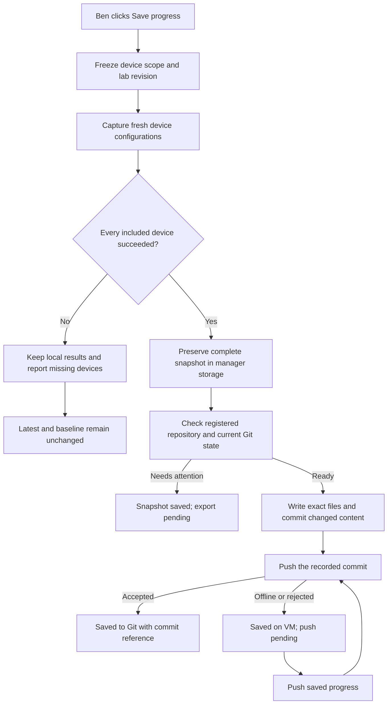
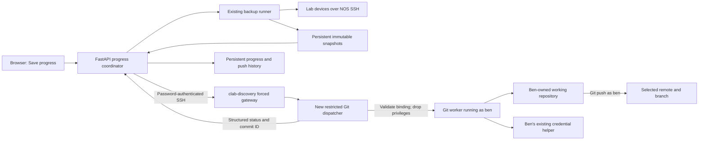
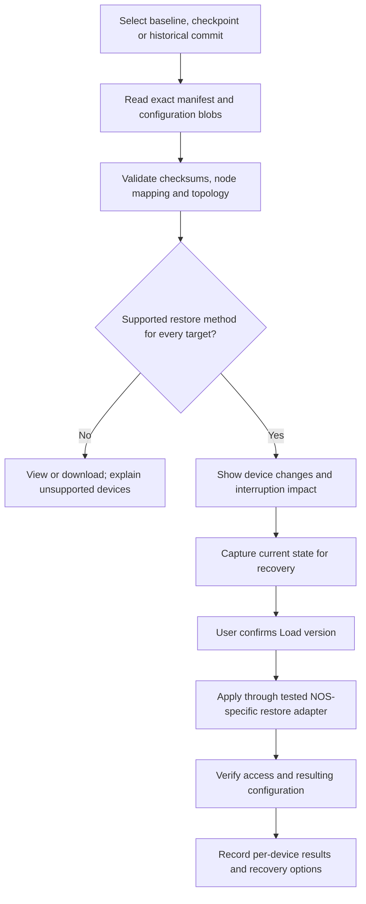

# Proposal: Save and resume lab progress with Git

Status: architecture proposed against 1.14.0. The 1.15.0 source implements the
repository save/export, retry, milestone and version retrieval stages. Read
[GIT-PROGRESS.md](GIT-PROGRESS.md) for the delivered behavior and setup. Live NOS
restore and optional convenience stages below remain future work.

## Recommended experience

Give each lab one primary **Save progress** button. After a one-time repository
connection, this captures fresh configurations from the lab, saves a complete local
snapshot, updates the repository's `latest/` folder, creates a commit when content
changes, and pushes to the selected remote branch. Ben does not download a ZIP,
move files, stage them, write a commit message or open a terminal for a normal save.

Show the destination beside the button:

```text
BENS-BGP-LAB · main · latest/                 [ Save progress ▾ ]
Last saved to Git: 10:42 · 7 devices · 3 configs changed · a1b2c3d
```

Use a split-button menu for less frequent choices. Put repository setup, branch
selection and Git diagnostics in **More → Git repository**, alongside the existing
Credentials and Action logs entries. Keep Backup history for capture results and
link each Git save to its original backup. Avoid adding another global sidebar flow.

| Action | User-facing behavior |
|---|---|
| **Save progress** | Capture the configured devices, update `latest/`, commit changes and push. This is the default. |
| **Save locally** | Capture and commit to the VM repository without a network push; show **Not pushed**. |
| **Save checkpoint…** | Capture once, update `latest/` and also preserve that complete capture in a new named folder, then commit/push once. |
| **Set baseline…** | Copy a selected complete capture into `baseline/`; show its identity and ask before replacing an existing baseline. |
| **View changes / History** | Show per-device changes, saved versions, commit messages and push status. |
| **Push saved progress** | Send already-created manager commits; do not reconnect to devices or recapture configurations. |
| **Update from remote** | Fetch, then fast-forward only when the checkout is clean and has no conflicting local history. |
| **Load version…** | Choose baseline, a named checkpoint or a historical commit. Initially view/download the exact files; the final resume stage adds reviewed device restore. |

Automatic messages such as `Save BENS-BGP-LAB: 3 device configs changed` are enough
for the daily path. An optional note can describe an experiment. If configuration
content is unchanged, show **No changes; already up to date**. If a prior push is
pending, retry that push instead of creating an empty commit.

The Save progress click authorizes capture, commit and push to the destination
already displayed beside it. The server still validates the registered scope and
current state, but does not put a Git confirmation dialog in front of every normal
save. Changing the destination, replacing a baseline or applying a saved version
requires its own explicit action. Offer **Review changes before pushing** as an
optional repository preference, rather than making it the default daily workflow.

## Ben's repository

Use an existing, user-owned working repository selected by Ben. For the lowest
friction, recommend a checkout dedicated to saved lab progress. Do not require a
specific repository name or silently switch branches in his development checkout.
The default managed folder layout is:

```text
/home/ben/labs/BENS-BGP-LAB/
  .git/
  BENS-BGP-LAB.clab.yaml                 existing project file
  BENS-BGP-LAB.clab.yaml.annotations.json
  baseline/
    PE1.cfg
    PE2.cfg
    SW1.conf
    manifest.json
  latest/
    PE1.cfg
    PE2.cfg
    SW1.conf
    manifest.json
  checkpoints/
    bgp-peering-working/
      PE1.cfg
      PE2.cfg
      SW1.conf
      manifest.json
    route-policy-experiment/
      ...
```

`baseline/` changes only through Set baseline. `latest/` represents the most recent
complete saved capture. Named checkpoints are create-only by default; choose a new
name instead of replacing one. Git history retains earlier versions of `latest/`,
so every ordinary save does not need another timestamped folder. Existing folder
names can be mapped during setup. Multiple labs may share a repository if each has
its own non-overlapping prefix, such as `labs/bgp/latest/`.

Use stable filenames derived from node identity, with deterministic collision
handling. Keep timestamps out of filenames in `latest/` so Git can show useful
diffs. Existing timestamped download filenames remain unchanged.

Each manifest records schema version, lab identity, selected node set, exclusions,
node-to-filename mapping, actual configuration format, checksums and the topology
digest captured with the job. Record capture times/job identity when publishing a
changed snapshot; keep subsequent unchanged-save attempts in manager history so
timestamps alone do not create commits. Treat a changed topology or node set as a
meaningful change. File extensions do not establish restore compatibility.

New progress jobs must freeze topology and scope metadata before capture. Existing
1.14.0 historical jobs do not retain a historical topology digest or explicit
exclusions. Export their verified job/node metadata with **topology provenance
unknown**; never attach the current topology digest as if it described the old
capture. A successful legacy job proves completeness for its recorded node set,
not for the whole current lab. It must not be advertised as restore-ready without
additional mapping and compatibility validation.

The first release exports device configurations and this manifest. Existing YAML,
annotations, README files and unrelated work are outside its staging list. A later
**Include lab definition and diagram** option can make checkpoints more portable,
after reviewing the source files and their referenced dependencies. Until then,
matching topology/device-image prerequisites remain necessary for restoration.

## One-time setup and account ownership

Ben authenticates Git on the VM outside the manager, as requested. The manager
connects a lab to an administrator-approved binding containing:

- VM account, repository directory and immutable binding ID.
- Remote name and verified push URL; the selected current branch.
- Managed paths for latest, baseline and checkpoints.
- Devices included in progress saves and explicit exclusions.
- Default save-and-push behavior and the repository's existing commit identity.

Proposed host setup would register the owner and repository, for example:

```bash
# Proposed new command; this script does not exist in 1.14.0.
sudo bash deploy/setup-git.sh --owner ben --repo /home/ben/labs/BENS-BGP-LAB
```

This allows the UI to choose a registered repository without accepting an arbitrary
Linux username, filesystem destination or shell command on every request. Initial
support should require a normal initialized checkout with an existing commit;
linking does not create a remote repository or alter its existing history.
Initially reject bare repositories, linked worktrees, submodules and symlinked
destinations until their ownership and containment rules are explicitly supported.

The connection check must run Git as **ben**, with Ben's HOME and configured
credential helper. HTTPS with an existing noninteractive helper is the recommended
first transport. GitHub CLI can be configured as that helper outside the app using
`gh auth setup-git`. The test must use the same service context as future saves:
an interactive terminal login or temporary credential cache does not establish
that unattended access will survive a reboot. [Git credentials](https://git-scm.com/docs/gitcredentials),
[GitHub CLI setup](https://cli.github.com/manual/gh_auth_setup-git).

Read access can be tested without writing. A push dry run is a useful check, but
must not be presented as proof that all remote rules will accept the next commit.
Expired authentication, protected branches or unavailable signing should produce
a specific action message while retaining the capture. The app never asks for,
copies or displays Ben's Git token. Keep the VM connection password independent.

**Identity boundary:** the current manager has no browser login. In this design,
`ben` identifies the VM execution account, not an authenticated web user. The first
release is for one trusted operator per VM, or engineers deliberately sharing that
operator's authority. If one VM must isolate Ben's repositories from Alice's,
application login, sessions and per-repository authorization are prerequisites.

## Daily workflow



The default node set is all supported configuration devices in this lab, including
devices not selected for scheduled backups. Show unsupported devices and exclusions
at setup. An included node being offline must not silently remove it from a save.
A completed capture is a set taken over a time interval, not an atomic snapshot of
every router at one instant; show the capture window and keep the scope fixed.

Use the immutable `history/<job-id>/` files for export. The current manager's
`latest/` directory can mix newly successful files with older files when a backup
partially fails. Exporting that directory wholesale would mislabel old data as a
complete new checkpoint. For normal progress saves, require a valid artifact for
every included node from the same job before publishing any repository snapshot.

## Component architecture



The existing manager stays outside the repository filesystem. Transfer selected
snapshot files over the established SSH channel; no home-directory mount,
credential mount or general writable SFTP account is needed. Introduce a bounded
transfer protocol with per-file length/digest checks and staged writes. Do not send
an entire repository, `.git`, raw inventories or the manager's encrypted state.

The privileged dispatcher reads a root-owned repository binding, validates it and
changes to the configured UID/GID before opening repository data or invoking Git.
Git commands, hooks, filters, credential helpers and signing tools must run with
Ben's privileges, never root's. Preserve the registered user's credential context
but reject caller-controlled executable paths and environment overrides. Scope
permissions to these bindings; do not grant general `sudo git`, root ownership or
`safe.directory=*` to make a broken setup work.

The helper accepts actions such as `status`, `receive-snapshot`, `commit`, `push`,
`history` and `read-version`, using validated IDs and fixed argument arrays. This
gives the requested Git-command buttons without exposing a shell textbox. Resolve
and verify the remote destination, including configured push URLs/rewrites, rather
than trusting the display label `origin`. Reject unexpected changes until relinked.

The first-time connection flow should clearly say that full device configurations
may contain secrets and will be written to that chosen repository. Export no VM
login secrets, NOS credential profiles or encryption keys. Avoid automatic regex
redaction of the configuration itself: it could make a resume checkpoint unusable.
Keep config diffs out of routine logs and require an explicit view action.

## Git commands behind the buttons

These are conceptual command mappings, not scripts to paste blindly. The helper
supplies validated branch names and exact literal paths from its manifest.

| Operation | Git behavior |
|---|---|
| Inspect connection | `rev-parse`, `status --porcelain`, remote/branch inspection and bounded `ls-remote`/fetch checks. |
| Save configs | Copy validated immutable artifacts; Git itself does not retrieve router configurations. |
| Stage export | `git add -A -- <exact-owned-paths>`; never repository-wide `git add .` or `git add --all`. |
| Commit export | `git commit --only -F <message-file> -- <exact-owned-paths>`; include new files in the index first. |
| Push | `git push --porcelain <registered-remote> <recorded-commit>:refs/heads/<registered-branch>`; no force and no implicit all-branch/tag push. |
| History / compare | Bounded `git log`, `git diff` and `git show` for the registered snapshot paths. |
| Update checkout | Fetch the selected branch, then `git merge --ff-only <fetched-commit>` after checking a clean checkout and expected branch. |
| Read a saved version | Resolve a selected ref to a commit, then read its manifest/files by that commit; do not switch the user's checkout to view history. |

Path-scoped commits can exclude other indexed paths, while normal branch pushes
preserve existing remote history through fast-forward rules. A fast-forward-only
update refuses divergent history instead of creating an automatic merge. [Git commit](https://git-scm.com/docs/git-commit),
[Git push](https://git-scm.com/docs/git-push), [Git merge](https://git-scm.com/docs/git-merge).

For the first implementation, stop before writing if any files are already staged,
if managed paths have uncommitted edits, or if a merge/rebase/cherry-pick is active.
Unrelated unstaged edits may remain, but are never included. Do not auto-stash,
reset, clean or switch branches. Block a push when its outgoing history includes
pre-existing commits that were not part of the approved manager save chain: pushing
one selected commit also publishes its unpublished ancestors.

Serialize operations by the repository's common Git directory, not only lab ID.
The manager lock does not stop Ben's terminal or editor, so recheck branch, HEAD,
remote, index and managed-file digests before mutation. Validate the staged and
committed tree against the approved manifest, including changes made by hooks or
filters, before pushing. External races must preserve the snapshot and report a
conflict; they must not trigger a destructive reset of someone else's work.

Deletion is limited to files explicitly owned by the previous manifest. A failed
capture never removes a previous device config. A deliberate topology/node-set
change requires review before deleting its old managed files. Never recursively
replace a user-chosen directory whose contents are not fully accounted for.

## Status, retries and failures

Treat capture, repository commit and remote push as three separately recorded
outcomes. A successful local backup must remain successful if Git is unavailable.

| Situation | Result shown to Ben |
|---|---|
| One included router fails | **Capture incomplete — 6 of 7 devices saved locally. Latest unchanged.** |
| Complete snapshot; repo permission/conflict problem | **Snapshot saved — repository needs attention.** Retry export from that snapshot. |
| Files written but commit fails | **Snapshot saved — Git commit needs attention.** Preserve recovery journal and artifacts. |
| Commit succeeds; network/auth/push fails | **Saved on VM — not pushed.** Retain commit ID; offer Push saved progress. |
| Remote advanced after preflight | **Saved on VM — remote changed.** Do not force or auto-rebase; resolve/update, then retry. |
| No content changes | **No configuration changes.** Record the attempt locally and retry any pending push. |
| Browser closes or manager restarts | Reconcile the persisted operation/commit, rather than issuing another capture or duplicate commit. |

Persist a progress job before work starts. Suggested states are `capturing`,
`captured`, `exporting`, `committing`, `committed`, `pushing`, `synced`,
`needs_attention` and `capture_incomplete`. Store capture job ID, binding revision,
expected HEAD, snapshot digest, exact path list, commit ID and push outcome.

Each request carries an idempotency ID. Add that ID to commit metadata and keep a
host-side journal so a lost response after a successful commit can be reconciled.
If push success is uncertain, fetch/check whether the remote contains the recorded
commit before retrying. A multi-file filesystem write, commit and network push
cannot form one transaction; the immutable capture is the durable recovery source.

Offline saving is allowed when the local checkout is eligible. Remote status must
then say **Unknown / not pushed**, not **Synced**. Retain every captured version;
never silently combine or discard pending commits. Start with manual retry, then
add opt-in reconnect retry bound to the same repository, branch and snapshot.

## Loading a previous lab state

The end-to-end target includes **Load version**, but Git retrieval and changing
running devices are separate operations. Selecting a folder or checking out a
commit does not configure routers.



For a stopped lab, an alternative is to generate reviewed startup files and a
separate deployment definition, then use the existing deployment confirmation.
Do not rewrite Ben's original YAML or redeploy merely because he selected a version.
For a running lab, choose explicit merge/replace semantics per supported NOS and
preserve management connectivity. Cross-device restore is not atomic; report
partial application and available rollback instead of promising all-or-nothing.

Current captures are Junos display-set text and IOS-XR/EOS running configurations.
Those need validated adapters before being advertised as portable startup files
or one-click restores. For example, Containerlab documents special management-IP
handling for cJunosEvolved startup files, so copying a downloaded configuration
into `startup-config` is not sufficient validation. [cJunosEvolved startup configuration](https://containerlab.dev/manual/kinds/cjunosevolved/#startup-configuration).

## Fit with the existing code

| Existing component | Proposed extension |
|---|---|
| `app/runner.py`: `Runner.submit/execute` | Reuse device capture and immutable job artifacts; expose capture completion to the progress coordinator. Separate artifact validity from the existing internal Git commit outcome. |
| `app/downloads.py`: `stored_path`, naming helpers | Reuse safe artifact resolution and node identity; add stable Git filenames separately from timestamped downloads. |
| `app/lab_operations.py` | Reuse VM SSH transport, job output/history conventions and busy guards; add shared guards for progress jobs. Do not pass Git into the generic lifecycle request. |
| `app/store.py` | Persist lab repository settings, jobs, retries and binding revisions in existing durable state. |
| `deploy/clab-manager-gateway` | Add one fixed Git-helper command; keep password-only authentication and forced-command restrictions. |
| New `app/git_progress.py` | Orchestrate capture → export → commit → push; resolve scope, revisions, retries and statuses. |
| New `app/host_git.py` and `deploy/setup-git.sh` | Register approved repo owners, drop privileges, validate paths and execute bounded Git actions. Version and capability checks must cover the new helper. |
| Static lab UI | Add Save progress split button, compact destination/status, repository setup and per-device changes/history. |

The current runner already creates a **manager-internal** Git repository under
`/data/backups/<lab>/latest`, using a local `NOS Backup` identity. Keep that behavior
separate initially; it is not Ben's selected repository and has no configured push.
The existing host Git path is for project cloning and intentionally suppresses
global Git configuration. Reusing it unchanged would bypass Ben's login context.

The new Git endpoints should reuse origin checks and accept binding/job IDs rather
than arbitrary paths. Suggested API groups are repository status, save-progress,
job status/retry, checkpoint creation, history/compare and version read. Existing
backup scheduling continues unchanged unless Ben explicitly opts a schedule into
Git publishing. Capture/lifecycle/reset/removal guards must account for these jobs
so in-flight artifacts and pending Git saves cannot be discarded silently.

## Delivery sequence and acceptance

1. **Repository connection and export:** register the VM owner/repo; validate the
   real noninteractive Git context; export a selected complete historical capture
   with stable names and a manifest. Read-only status/diff comes first.
2. **Save progress:** capture fresh configurations, commit/push exact artifacts,
   retain local saves on failure, expose pending status and implement restart-safe
   retry. This is the first daily-use milestone.
3. **Baseline, checkpoints and history:** preserve named captures, compare versions,
   browse prior commits and prepare a selected version without touching devices.
4. **Resume lab:** implement and test NOS-specific apply/startup adapters, reviewed
   restore, recovery capture and verification. This completes save-and-resume.
5. **Optional convenience:** reconnect retries, save before Stop/Destroy, opt-in
   Git publishing after scheduled backup, and isolated Git worktrees for engineers
   who frequently edit the same checkout concurrently.

Acceptance should cover a real Linux VM running the helper as Ben and a test
remote: first save, unchanged save, checkpoint/baseline protection, partial capture,
offline/auth failure, protected branch, remote advancement, dirty/staged files,
unpublished foreign commits, filename collisions, invalid paths, interrupted
transfer/commit/push, restart reconciliation and unchanged administrator access.
Verify that only approved artifact paths enter a commit and no Git process runs
as root. Restore needs live tests for each supported NOS/version, including loss
of management access and partial failure; backup tests cannot establish restore
correctness.

Recommended first milestone: **Ben connects the repository once, clicks Save
progress after his experiment, and sees either a verified remote commit or an
honest “saved locally, not pushed” result with a retry button.**
