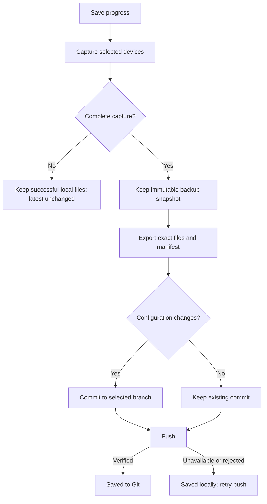
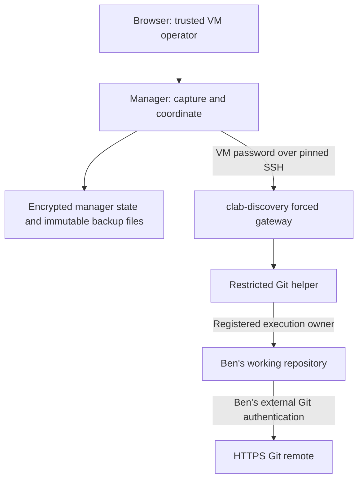
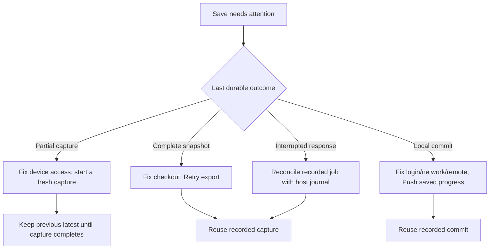

# Save lab progress to Git — 1.15.0

Connect a lab to an existing repository on its VM once, then use **Save progress**
to capture its selected devices, save the complete capture in that repository,
commit changed configurations and push. Ben keeps his existing Git login and
commit identity. The manager never asks for his Git token.

This is a local source release. Build the 1.15.0 image and install its matching VM
helpers; a previously published image does not acquire these features automatically.
See [Fresh VM setup](FRESH-VM-GUIDE.md) and [VM connection](VM-CONNECTION.md).

## What each save means

Capture, local commit and remote push have separate outcomes. **Saved on VM**
means a configuration snapshot or Git commit exists locally; **Pushed** means
the push was verified. A failed push does not turn a successful device capture
into a failed backup.



Only configurations and their manifest enter the Git commit. Existing topology
YAML, annotations, README files and unrelated edits stay outside the export. The
manifest records the lab, selected and excluded nodes, capture identity, topology
provenance, configuration formats and file checksums. Git export uses one completed
backup job, not the rolling `latest` backup directory that can contain files from
different capture attempts.

A progress save supports up to 500 devices, with nonempty UTF-8 configurations
up to 2 MiB each and 16 MiB in total. Oversized or incomplete captures do not
replace the repository snapshot.

## One-time setup on Ben's VM

1. Obtain the 1.15.0 source and finish the existing password-based VM connection.
2. As **Ben**, clone or prepare a normal repository with an existing commit, a
   current branch, an HTTPS remote and the intended author name/email. Complete
   Git authentication outside this application, then publish the initial commit
   so local HEAD matches the existing remote branch at registration.
3. Keep the checkout clean. Commit or move unrelated work before connecting it.
   Use a separate checkout if Ben regularly edits another copy of the same project.
4. As the VM administrator, register the exact owner and checkout from the source
   directory:

```bash
sudo bash deploy/setup-git.sh --owner ben --repo /home/ben/labs/BENS-BGP-LAB
```

The helper records the current branch and uses `origin` unless `--remote NAME`
selects another existing remote. Optional `--label "Ben BGP lab"` sets its display
name; the registration ID is generated automatically. Optional `--prefix labs/bgp`
places `latest`, `baseline` and `checkpoints` below `labs/bgp/`. Each registered
prefix must be separate from the others. Bare repositories, linked worktrees,
submodules and symlinked destinations are not supported.

5. Open the lab in the manager. Choose **Git repository settings**, select the
   registered checkout and choose the devices to include. The initial list selects
   supported devices independently of the normal backup schedule checkboxes.
6. Review the repository/branch and acknowledge that captured device configurations
   will be committed there. Choose whether saves should pause for review before
   pushing. Save the connection settings, then perform the first **Save progress**.

Authentication must work without an interactive prompt in Ben's service context.
A login that depends on an unlocked desktop, a temporary terminal environment or
an expired credential cache can fail during unattended saves. Configure and test
the chosen credential helper as Ben. GitHub CLI users can configure an existing
login with `gh auth setup-git`; the manager does not run a login or create tokens.
See [Git credential helpers](https://git-scm.com/docs/gitcredentials) and
[GitHub CLI Git setup](https://cli.github.com/manual/gh_auth_setup-git).

Git connections in this release use HTTPS. The password for `clab-discovery`
remains the manager-to-VM credential; it is separate from Ben's Git authentication.
Do not put tokens in repository URLs, installation commands or the manager UI.

## Repository layout

```text
BENS-BGP-LAB/
├── BENS-BGP-LAB.clab.yaml          existing file; not rewritten by saves
├── latest/
│   ├── PE1.cfg
│   ├── PE2.cfg
│   └── manifest.json
├── baseline/
│   ├── PE1.cfg
│   └── manifest.json
└── checkpoints/
    └── bgp-peering-working/
        ├── PE1.cfg
        └── manifest.json
```

Names above illustrate the layout; the exporter chooses stable filenames from
node identity and configuration format. Repeated saves update `latest/`; Git
history preserves earlier contents. Capture timestamps alone do not create an
extra commit when the configurations and meaningful metadata are unchanged.

**Set baseline** changes `baseline/` explicitly. Replacing an existing baseline
requires review. **Save checkpoint** creates a named milestone; choose a new name
for another milestone. The helpers reject unsafe paths, overlapping registered
destinations and unsupported repository layouts rather than guessing a location.

## Everyday buttons

| Action | Result |
|---|---|
| **Save progress** | Capture the configured device selection, export `latest`, commit changes and push; a review preference pauses before push. |
| **Save locally** | Capture and commit without pushing. |
| **Save checkpoint…** | Capture a named milestone in `checkpoints/<name>`. |
| **Set baseline…** | Select a complete recorded capture for `baseline`; explicitly review replacement. |
| **View changes / History** | Inspect saved versions and compare configurations. |
| **Push saved progress** | Publish the existing saved commit without recapturing devices. |
| **Update from remote** | Update an eligible clean checkout using a fast-forward; no merge/rebase conflict resolution. |
| **Load version…** | Inspect or download a baseline, checkpoint or historical version as a ZIP. |
| **Git repository settings** | Choose a registered repository and explicit device selection. |

Git commands are constructed by the helper from fixed operations. The UI accepts
repository IDs and reviewed choices, not arbitrary command lines. Commits include
the exact exported paths. A dirty checkout, unexpected staged work, changed branch
or remote, hooks/filters that alter exported files, or conflicting history can
require attention.
There is no force push, automatic stash, destructive reset or broad `git add .`.

Ordinary backup schedules still create manager backups. They do not automatically
publish configurations to Ben's remote repository. Saving progress is an explicit
action, and existing **Backup history** downloads remain available.

## Running account and persistence



The privileged entry point validates the registered owner/repository and drops
privileges before running Git. Git uses Ben's HOME, author configuration and
credential helper. The manager container neither mounts Ben's checkout nor needs
his token. The existing restricted VM SSH gateway stays in place.

The browser has no account login in this release. **Ben is the VM execution owner**,
not a signed-in web user. People with access to this manager share its authority
over the registered repositories. Use one trusted operator per VM, or a group
deliberately sharing that authority. Separate Ben/Alice browser permissions are
not implemented by registering two Linux owners.

| Data | Location / recovery requirement |
|---|---|
| Lab repository selection, scope and progress jobs | Encrypted manager state under `/srv/containerlab-node-manager/data`; keep `state.key` with `state.enc`. |
| Immutable captured configurations | Manager `backups/<lab-id>/history/<backup-job-id>`; included in a complete data archive. |
| Exported configurations and local Git commits | Ben's registered checkout; back it up independently until all intended commits are pushed. |
| Git credentials | Ben's external credential configuration; provision it again when rebuilding a VM. |
| Host registration | `/etc/clab-manager/git.json`; retain the root-owned registration when backing up the VM. |
| Host journal and transfer snapshots | `<checkout>/.git/clab-manager/`; retain these with the complete checkout for interrupted-save recovery. |

Back up the whole manager data directory, the registered checkout and its helper
registration/journal. A manager data archive alone does not include Ben's working
repository or external Git authentication. A remote Git repository alone does not
include unpublished snapshots, manager device credentials or diagram edits.

## Failure and recovery



| Message or condition | Next step |
|---|---|
| A selected device failed | Inspect **Backup history**, repair access and start a new save. Successful files remain local; the repository's complete latest is retained. |
| Complete snapshot; repository needs attention | Resolve the reported checkout problem as Ben, then **Retry export** from that job. |
| Commit exists; push failed or review is required | Review the recorded commit and use **Push saved progress**. No new capture is needed. |
| Remote advanced / push rejected | Inspect the repository as Ben. Resolve divergence outside the app; never force push merely to clear the status. |
| Unexpected branch, URL, owner or repository identity | Restore the registered destination or deliberately register/reconnect the intended checkout after resolving pending work. |
| Helper unavailable or older than the manager | Run `sudo bash deploy/setup-git.sh --refresh` from the 1.15.0 source and refresh repository status. |
| Manager restarted during a save | Open the recorded job and retry. The coordinator reconciles the recorded operation with the VM journal rather than silently recapturing. |
| Git authentication expired | Repair Ben's Git login on the VM, then retry the existing push. Changing the VM SSH password does not repair Git credentials. |

Active progress jobs prevent conflicting lab operations. Pending saves also block
actions that would forget or redirect their context, including removing the lab,
starting fresh, replacing the repository connection and changing the VM identity.
Password rotation for the same VM/account is allowed so that access can be repaired.

To stop pursuing a pending export, choose **Keep snapshot only** and confirm the
explicit dismissal. It retains the captured backup and any existing Git commit,
then permits disconnect/removal. This does not unpublish a remote commit or undo
files already saved to the checkout. A later **Start fresh** still deletes manager
backup files after its normal confirmation; Ben's checkout and Git remote remain
outside manager storage.

## Loading an earlier lab version

**Load version** retrieves files. Select `baseline`, a checkpoint or a previous
commit, review its manifest and download the configuration ZIP. It does not switch
the repository branch, rewrite the original lab YAML, redeploy the lab or apply
commands to running routers.

Captures retain their real format: Junos display-set output and IOS-XR/EOS running
configuration text are not universally interchangeable startup files. Device apply
and one-click restore remain unavailable until each NOS adapter has been validated
with recovery capture, management-access checks and partial-failure handling.
Older backup jobs can have unknown topology provenance; the UI must not represent
the current topology as the topology used for that historical capture.

## Upgrade and validation

Upgrade the manager from the 1.15.0 source, retaining its persistent data.
`deploy/start-manager.sh` refreshes the Git helper when a registry already exists.
To refresh only that helper, use `sudo bash deploy/setup-git.sh --refresh` from
the same source. This preserves registration IDs and revisions. Existing VM
passwords, labs, device profiles and backup files are retained. No remote repository is created,
and no user repository is pushed merely by installing the helper.

Registering the same checkout/prefix again preserves its ID but can change its
registration revision. Use `--refresh` for routine code upgrades. Before changing
a registration, resolve pending saves and reconnect the lab afterward so it uses
the new revision. A registration binds the selected branch and push destination;
changing either outside the app requires deliberate registration and reconnection.

Before adopting the workflow on a real lab, verify a first save and unchanged save
against a disposable repository, then a locally saved commit and manual push retry.
Check baseline replacement, a named checkpoint and ZIP retrieval. Review the
release's [validation record](clab-backup-ui/VALIDATION.md) for the exact automated
and platform-specific coverage. Linux owner switching, the external credential
helper, the selected Git service and real network devices need validation in the
deployment environment; a local source delivery does not establish those results.

The earlier [architecture proposal](GIT-LAB-PROGRESS-PROPOSAL.md) records the broader
save-and-resume design. This guide describes the delivered save/export workflow;
the proposal's future restore and optional convenience stages remain separate work.
