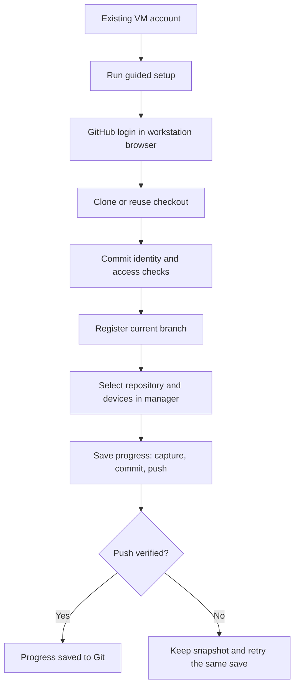

# Git setup — start here

Use your **existing Ubuntu VM account**. On a standalone VM, you do not need an
additional Linux user. The VM username and GitHub username can be different.

**Recommended:** `bash deploy/install.sh` handles the full VM setup and then
opens the Git terminal wizard. For a working manager, choose **Git setup / repair
only**, or run `bash deploy/install.sh --git`. See [INSTALL.md](INSTALL.md).

The Git wizard has numbered phases with **Retry**, **Sign in again** where
applicable, and **Cancel and keep completed work**. It reads existing registered
settings before proceeding, so a custom remote, label, prefix or branch is not
silently replaced. Select the exact registration when a checkout has several
managed prefixes. Unexpected owner, branch or push-URL changes require repair
before continuing.

Guided setup needs sudo for reading protected registration settings and final
registration, as well as any requested package install. Git commands and login
still run as your ordinary account. For a separate owner without sudo, use the
advanced administrator/owner workflow below.

## First setup

1. Install/start the manager using [FRESH-VM-GUIDE.md](FRESH-VM-GUIDE.md), configure
   its VM password, and confirm that a manual device backup works.
2. On GitHub, create the repository that will hold your configurations. Choose
   the intended visibility and **Add a README** so it has an initial commit.
   Copy **Code → HTTPS**, for example `https://github.com/OWNER/REPOSITORY.git`.
   A browser address ending in `/tree/main` is not a clone URL.
   Your GitHub account needs write access.
3. In the VM terminal, as your ordinary account, enter the release source
   directory and run this command **without sudo**:

   ```bash
   cd "$HOME/projects/v1.19.1"
   bash deploy/setup-git.sh
   ```

Use your actual source folder if it has a different name. This is the folder
containing `deploy/` and `clab-backup-ui/`, not the lab-config checkout under
`~/labs/`. You can also run `bash "$HOME/projects/v1.19.1/deploy/setup-git.sh"`
from any directory. The launcher prints your actual absolute setup command.

Finish the wizard until it reports **Registered** and **Ready** before connecting
the repository in the UI. A running manager, successful GitHub login, and a clean
`git status` do not establish that registration or commit identity is ready.

The wizard shows the Linux account it will use, then:

- Installs missing Git/GitHub CLI packages through sudo, if you choose to do so.
- Offers to clone a repository into `~/labs/REPOSITORY`, or reuse an existing checkout.
- Reuses a GitHub login or opens GitHub's browser authorization flow for that account.
- Configures the Git credential helper and asks for missing commit author name/email.
- Checks GitHub repository write permission, then asks to register the displayed checkout.
- Registers its current branch after checking ownership, identity, clean managed
  files, remote synchronization and a **push dry run**. Setup does not create or push commits.

**On a VM without a browser:** copy the one-time code, press Enter when prompted,
and open the displayed URL in your workstation browser. A message about a missing
browser on the VM is expected. Keep the terminal open until authorization completes;
do not press Ctrl+C. This is [GitHub CLI's login flow](https://cli.github.com/manual/gh_auth_login).

**Checkout directory** means the local repository on the VM, for example
`/home/archtop/labs/my-bgp-lab`. The wizard clones into that directory; subsequent
saves write `latest/`, `baseline/` or checkpoints inside it. It is separate from
the manager's application source directory under `~/projects/`.

Finally, open your lab in the manager → **More → Git repository**, select the
checkout and devices, review the destination, and save the connection settings.
Click **Save progress**. It captures, exports, commits and pushes automatically;
there is no separate Commit button. Confirm the save reports **Pushed** and the
repository contains `latest/` with configurations and `manifest.json`.



## Already working? Upgrade without setting it up again

Keep your current Linux owner, checkout and login, including a separate account
you have already configured. From the new source, use the normal launcher:

```bash
sudo bash deploy/start-manager.sh
```

The launcher refreshes an installed Git helper and retains registrations,
passwords and manager data. For a helper-only refresh:

```bash
sudo bash deploy/setup-git.sh --refresh
```

Do not clone again or create another Linux account just to upgrade. Guided setup
can be rerun after interruption: if cloning completed, select **existing** and the
same checkout. If it stopped during package installation/login before cloning,
select **clone** again. It
keeps existing author settings and files. Re-registering unchanged settings keeps
the registration ID/revision; changed owner, branch, destination or prefix needs
pending saves resolved and the lab reconnected.

## Package installation recovery

Git/GitHub CLI package installation shares the main installer's APT preflight.
It displays UTC/NTP status and waits up to 30 seconds for an already-active NTP
service to synchronize. It does not require NTP when the clock is maintained
another way, change time settings, or hide APT output/failure status.

For `Release file ... is not valid yet` or `expired`, use
[clock recovery](FRESH-VM-GUIDE-V2.md#recovery-c). Keep the wizard open, correct/check
time in another VM terminal and use its **Retry** action after APT succeeds.
This is separate from the CD-ROM source error below. Setup never disables APT
date or signature validation to get past either error.

If `sudo apt-get update` fails with `file:/cdrom ... Release` or `cdrom:`, Ubuntu
still has an installation-media source enabled. Locate the entry:

```bash
sudo grep -nHE 'file:/+cdrom|cdrom:' /etc/apt/sources.list /etc/apt/sources.list.d/*.list /etc/apt/sources.list.d/*.sources
```

A missing-file message for an unused format is harmless. Open the matching file
with `sudo nano /actual/path/from/output`, and disable only its installation-media
entry. For `sources.list` or a `.list` file, put `#` before the matching `deb` line.
For a `.sources` file, add `Enabled: no` to the media-only stanza (or change its
existing `Enabled` value). If that stanza lists both media and network URIs,
remove only the media URI instead. Keep Ubuntu network mirrors, security updates
and Docker entries enabled. These are the supported
[APT source formats](https://manpages.ubuntu.com/manpages/noble/man5/sources.list.5.html).
Save in nano with **Ctrl+O**, **Enter**, then **Ctrl+X**.

The `.list` and `.sources` instructions are alternatives, not commands or two
required edits. If the entry is in `.list`, commenting it out completes the edit;
you do not need a `.sources` file. Use `sudo nano` because these files belong to root.

Run these in order; continue only after each command succeeds:

```bash
sudo apt-get update
sudo apt-get install -y git gh
bash deploy/setup-git.sh
```

Run the wizard as your ordinary VM account, without sudo. If it stopped before
cloning, choose **clone**, enter the repository HTTPS URL without `/tree/main`,
and accept its repository-named checkout directory. No manager rebuild is needed
for this VM package-source repair. Other APT errors (network, sudo, unavailable
package or signature failures) require resolving the specific message. The wizard
can offer installation-media repair with your confirmation and a backup; it keeps
other package sources and validation settings intact.

## Which account/password goes where?

| Item | Purpose | Where it persists |
|---|---|---|
| Existing Linux account, e.g. `archtop` | Owns checkout and runs Git | VM account database and that user's home |
| GitHub account | Authorizes HTTPS access to the remote repository | Owner's configured Git credential helper |
| Commit name/email | Records authorship; does not log in to GitHub | Repository `.git/config` when the wizard supplies it |
| `clab-discovery` password | Connects the manager to the VM's restricted gateway | VM hash in `/etc/shadow`; manager copy encrypted in its persistent data |

GitHub does not accept a website password for HTTPS Git push. The wizard uses
GitHub CLI and [configures its credential helper](https://cli.github.com/manual/gh_auth_setup-git).
The manager never collects GitHub tokens. GitHub CLI uses a system credential
store when available; on a headless VM it may report storing credentials in the
owner's configuration file. Keep that home directory private and on persistent
storage. Shell-only tokens or credentials under another user's home will not be
available to unattended manager saves.

## Recover an existing checkout that will not register

Run guided setup as the Linux account that owns the checkout, **without sudo**.
Version 1.16.0 and later preserve a selected existing registration's custom settings.
In 1.15.3 and later
you can supply the existing checkout directly:

```bash
bash "$HOME/projects/v1.19.1/deploy/setup-git.sh" --guided --repo "$HOME/labs/my-lab"
```

Replace `my-lab` with the actual folder. This command works even when your current
directory is the lab-config repository. It reuses that checkout and login, prompts
for missing or invalid commit name/email, then offers registration. It does not
clone again. For 1.15.2, run the wizard without arguments and choose **existing**.
The commit name/email identify the author; they are neither the Linux username
nor a GitHub login. Valid existing settings are kept; new values are local to
this checkout. Your Linux owner is automatically selected by the wizard.

For manual repair, as the checkout owner without sudo, set your chosen identity:

```bash
cd "$HOME/labs/my-lab"
git config --local user.name "Your Name"
git config --local user.email "your-email@example.com"
git var GIT_AUTHOR_IDENT
git var GIT_COMMITTER_IDENT
```

Both checks must succeed. Then, from the manager source folder, register:

```bash
cd "$HOME/projects/v1.19.1"
sudo bash deploy/setup-git.sh --repo "$HOME/labs/my-lab"
```

Omitting `--owner` uses the ordinary account invoking sudo. For example, `archtop`
owns `/home/archtop/labs/...`; do not copy `--owner patrick` from a separate-account
example. Run `whoami` in your ordinary terminal to check your Linux account.
Explicit sudo registration validates identity/login but does not configure them.
It never runs Git as root. Retain custom `--remote`, `--prefix` and `--label`
options when retrying a custom registration. For new registrations the wizard
uses `origin` and the repository root; for existing ones it retains the selected
settings. Once registration succeeds, reopen **More → Git repository**
and select the checkout. These identity/registration repairs need no container rebuild.

## Fix a failed save

Open the **original failed save** from progress history. Its snapshot is already
preserved. Repair the stated problem, then use its **Retry export and push** or
**Push saved progress** button. Retry uses the existing snapshot/commit.

| Symptom | Action |
|---|---|
| `bash: deploy/setup-git.sh: No such file or directory` | You are probably in the lab-config checkout. Run the absolute source-script path above or change to the source folder containing `deploy/`. The script cannot report this itself because Bash has not started it. |
| Linux owner does not exist | Use your actual VM account. `--owner` is not a GitHub username. |
| Missing checkout / `.git` | Use the wizard's Clone option. `mkdir` creates a folder, not a repository. |
| Permission denied | Check who owns the checkout. Clone as its intended owner; do not use `sudo git clone` or recursively change ownership of an existing project. |
| `gh` missing / owner not in sudoers | Your VM administrator installs `gh`. Authenticate as the repository owner. The owner does not need sudo membership to use Git or the manager. |
| Invalid username/token or interactive password prompt | Run the commands below **as the registered Linux owner**, then retry the original save. |
| Missing/invalid commit identity, despite a clean `git status` | Use guided existing-checkout recovery above, or set local name/email and verify both Git identities. Retry registration if it failed; retry the original save if already registered. |
| Already staged changes after a failed manager export | Retry the original failed save after fixing its error. Do not start another save or manually commit its staged files. Resolve unrelated staged work separately. |
| You already committed the manager files manually | As the owner, publish that manual commit with normal Git. Check it reached the remote. In the manager dismiss the old export using **Keep snapshot only**, then start a new save. The manager does not automatically push unrelated/manual history. |
| Local and remote branch differ | Inspect `git status -sb` and resolve synchronization as the owner. Setup does not reset, merge, stash or force-push your work. |
| Push rejected despite successful setup | Check branch protection/rules, current write permission and credential expiry. A dry run checks transport/access but cannot guarantee a later changed commit passes every server rule. |

Authentication repair, as the **repository owner**, without sudo:

```bash
gh auth login --hostname github.com --git-protocol https --web
gh auth setup-git --hostname github.com
```

If already logged into the wrong GitHub account, use `gh auth switch --hostname
github.com` to select an existing login or run login again to add the intended account.
Do not paste credentials into the remote URL or manager UI.

## Advanced: separate owner, other HTTPS host, or managed prefix

New wizard registrations use `origin`; existing registered remote names are
retained. For another HTTPS provider, complete
that provider's persistent credential-helper setup as the repository owner first;
the wizard can clone/register after you confirm it is configured.

For an existing checkout, the VM administrator can register directly:

```bash
# Defaults to the ordinary account invoking sudo:
sudo bash deploy/setup-git.sh --repo "$HOME/labs/my-lab"

# An existing separate owner does not need to be in sudoers:
sudo bash deploy/setup-git.sh --owner patrick --repo /home/patrick/labs/patricks-bgp-lab
```

For a separate owner, prepare its checkout/login/identity under that account, then
return to the administrator for registration. Optional `--remote NAME`,
`--label "Display name"` and `--prefix labs/bgp` select an existing remote,
display label and managed subfolder. Prefixes must not overlap. A normal checkout
with an existing published commit is required; linked worktrees, submodules,
bare repositories and symbolic-link paths are unsupported.

Back up the complete checkout including `.git`, the owner's credential recovery
method, `/etc/clab-manager/git.json` and manager data separately. The manager data
backup does not include the repository or the owner's Git login. Detailed save,
review and recovery behavior is in [GIT-PROGRESS.md](GIT-PROGRESS.md).
