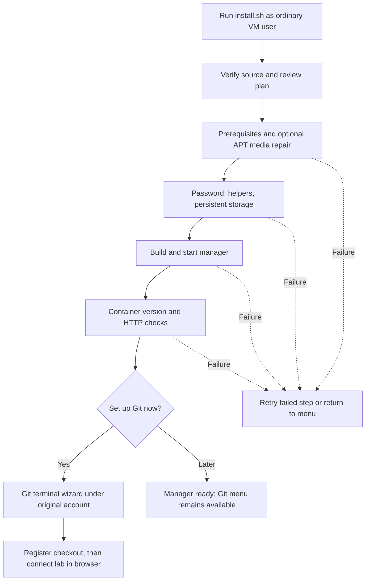

# Guided VM installation — 1.19.2

This release also includes the remaining [deployment audit fixes](DEPLOYMENT-AUDIT.md).

Starting before Ubuntu is installed? Use the
[Fresh VM guide, version 2](FRESH-VM-GUIDE-V2.md) for Proxmox settings, first
login, this installer, WinSCP/SFTP checks and your first successful Git save.
This page is the short installation reference; the [quick install](QUICK-INSTALL.md)
is the paste-only version of the whole route.

This guide targets **1.19.2**, integrating storage-failure recovery, topology
file protection and bounded Git operations with 1.19.1's SSH and timeout fixes.
It is published as GitHub main `f9dbf44` (**1.19.2**). Starting from a Proxmox
snapshot, or stuck on WinSCP or VS Code permissions? The three paste-in fixes
below cover the VM clock, root SFTP access and the Containerlab extension.
After updating, open **Debug panel** in the manager sidebar to verify the release
and check VM helpers. See [development diagnostics](DEBUG-PANEL.md).

After cloning or extracting the source on your Ubuntu 24.04 VM, run one command
as your existing ordinary VM account, **without sudo**:

```bash
bash deploy/install.sh
```

Before cloning or installing packages, check the VM clock:

```bash
date -u
timedatectl status
```

Compare UTC with a trusted current clock. After a Proxmox snapshot rollback the
clock is usually stuck at the snapshot time; paste this to resynchronize now:

```bash
sudo timedatectl set-ntp true
sudo systemctl restart systemd-timesyncd
sleep 10
date -u
timedatectl status
```

If the date is still wrong, or APT reports `not valid yet` / `expired`, follow
[the clock fix](FRESH-VM-GUIDE-V2.md#fix-the-clock), which includes a manual
bootstrap for a VM that cannot reach a time server, and
[clock recovery](FRESH-VM-GUIDE-V2.md#recovery-c) for a paused installer.
Then clone into a new source folder:

```bash
git clone https://github.com/ArchRuger/CLAB-BACKUP-WORKER-v2.git "$HOME/projects/v1.19.2"
bash "$HOME/projects/v1.19.2/deploy/install.sh"
```

Git is needed for the clone. If Git is not yet installed, extract a source ZIP
instead or install Git using the VM administrator. The installer requires the
Python 3 and sudo normally present on Ubuntu Server; it explains missing
requirements. Internet access is needed for packages, image builds and GitHub.

## Terminal menu

```text
Containerlab Node Manager 1.19.2 — guided setup
Linux account: your existing VM account
Persistent home: /home/your-account
Source: /home/your-account/projects/v1.19.2

Setup menu
  1. Install or update manager, then set up Git
  2. Git setup / repair only (no rebuild)
  3. Check running installation
  4. Exit
```

Enter a number and press Enter. The menus work over SSH and VM consoles without
curses, a desktop browser or extra terminal UI packages. Commands that need
passwords or GitHub device authorization keep the terminal attached.

## What the full installation does

Review the displayed plan, then approve it once. The installer:

1. Retains an existing `.env`, or offers to copy one from an older source folder
   without showing its contents. Defaults are all VM interfaces and port 8081.
2. Installs missing prerequisites and enables Docker/SSH. Compatible tools stay
   installed. Conflicting Docker packages stop with instructions instead of being
   removed automatically. See the provider notes below.
   A previously disabled Docker source gets a specific recovery message; setup
   preserves that choice rather than silently enabling it or adding a duplicate.
3. Optionally backs up and disables obsolete installation-media APT entries.
   Only media entries/URIs are removed from use; network mirrors remain. Package
   signature verification stays enabled.
4. Runs the existing manager launcher to prepare persistent storage, create or
   retain the restricted `clab-discovery` password, install/verify helpers, and
   build/recreate the manager. You choose whether to enable reviewed lab operations;
   existing operations permissions remain on upgrades. Before building, it tests
   discovery and enabled operations/Git through the restricted account and gateway;
   a failed permission or capability check stops the launch.
5. Checks the running Compose container, application version and HTTP response
   using the actual container bind address and port.
6. Offers Git setup under the **original ordinary Linux account**. Git setup has
   its own retry/cancel flow; a Git error does not undo a working manager.

Before APT updates, both installation paths display UTC/NTP status and wait up
to 30 seconds only for already-active NTP. The check is read-only and does not
require NTP when the clock is maintained another way. APT output and failure
status are retained; clock-related failures get specific recovery instructions.
The installer does not set the clock or change time services, servers or timezone.



Existing manager data, passwords, registered Git repositories and lab containers
are retained. Source installation does not migrate data out of an old container
that lacks persistent storage; use [the migration guide](STANDALONE-SETUP.md)
first in that case. A new source folder does not automatically inherit another
folder's `.env`; select the copy option if you customized the old one.

## Git setup and recovery

Use menu **2** whenever Git needs attention. It does not rebuild the manager.
You can open it directly from any directory:

```bash
bash "$HOME/projects/v1.19.2/deploy/install.sh" --git
```

The wizard separates Linux owner, GitHub login, commit name/email and checkout
directory. It checks the repository and identity before registration and supports
existing checkout recovery. Already registered checkouts appear in a menu, so you
can select the saved path without typing it again. Your account name is detected;
there is no need to
copy an example `--owner patrick` command or create another Linux account.

Read [GIT-SETUP.md](GIT-SETUP.md) for repository preparation, device-code login,
registration and the detailed recovery table. You still create the destination
GitHub repository with an initial README. The wizard does not create a remote
repository, invent commit identity, or publish commits during setup.

## WinSCP file transfers

Use SFTP on port 22 with your normal Ubuntu account, such as `archtop`. For
uploads to your own directories, leave WinSCP's SFTP server setting at default.

Lab folders such as `/etc/containerlab` belong to root, so uploads there report
**Permission denied**, and a WinSCP site that launches SFTP with `sudo` fails
with `sudo: a password is required` until the VM allows it. The installer does
not add that sudoers rule. Paste this on the VM as the account WinSCP uses:

```bash
sudo -v
me="$(id -un)"
printf '%s ALL=(root) NOPASSWD: /usr/lib/openssh/sftp-server\n' "$me" | sudo tee "/etc/sudoers.d/${me}-sftp" >/dev/null
sudo chmod 0440 "/etc/sudoers.d/${me}-sftp"
sudo visudo -cf "/etc/sudoers.d/${me}-sftp"
sudo -k
sudo -n /usr/lib/openssh/sftp-server </dev/null >/dev/null && echo "Root SFTP is ready for $me"
```

Expect `parsed OK` and the `Root SFTP is ready` line; the block is safe to rerun.
In WinSCP's **Advanced → Environment → SFTP → SFTP server**, use:

```text
sudo -n /usr/lib/openssh/sftp-server
```

Save and reconnect as **archtop** with its Ubuntu password. This session has
root-level file access, and uploaded files belong to root. See the
[full procedure and troubleshooting](FRESH-VM-GUIDE-V2.md#winscp-admin-sftp).
Use `clab-discovery` only for the manager connection.

## VS Code access

**Remote - SSH** connects as `archtop`, but the Containerlab extension then
reports:

```text
Extension activation failed. Insufficient permissions. Ensure archtop is in the clab_admins and docker group(s).
```

The installer keeps your account out of those groups and removes the
containerlab SUID bit because the manager does not need them. For VS Code,
restore the standard containerlab setup for your own account:

```bash
sudo groupadd -r -f clab_admins
sudo usermod -aG docker,clab_admins "$(id -un)"
sudo chmod u+s /usr/bin/containerlab
ls -l /usr/bin/containerlab
id "$(id -un)"
```

Then run **Remote-SSH: Kill VS Code Server on Host...** from the VS Code Command
Palette and reconnect, because the VS Code server already running on the VM
keeps the old groups. Both groups give root-equivalent access; add only your
own account. See [the VS Code details](FRESH-VM-GUIDE-V2.md#vscode-access),
including the `~/.vscode-server` ownership fix and why the block must be rerun
after a containerlab package upgrade.

## Finish in the browser

The final terminal checks verify the local manager. On your workstation:

1. Open `http://VM_ADDRESS:8081` (or the configured port).
2. In **VM connection**, use `clab-discovery` and the password created during
   setup. After the first successful connection saves its fingerprint, reopen
   **VM connection** and compare it with the VM console host key.
3. Import the intended lab, configure device credentials and verify a backup.
4. In **More → Git repository**, select the registered checkout and devices.
5. Back in the VM terminal, run the [full installation report](HEALTH-CHECK.md):

   ```bash
   bash deploy/check-install.sh --require-git
   ```

   If you configured root file access in WinSCP, include that requirement:

   ```bash
   bash deploy/check-install.sh --require-git --require-admin-sftp
   ```

6. Resolve any **FAIL**, **WARN** or **SKIP** items using their displayed next
   steps. Then choose **Save progress** and check that it reports **Pushed** and
   that the intended files appear on GitHub.

Host trust, lab selection and device credentials still require your choices in
the browser. The installer does not deploy router labs or publish lab configs.

Menu **3. Check running installation** opens the same full report. The installer
still performs a shorter container/version/HTTP check during initial setup;
the saved VM connection is configured afterwards in the browser. The second
script checks services, permissions, helpers through `clab-discovery`, actual
folder browsing through saved SSH, storage and registered Git checkouts. It
reports problems without automatically fixing them. Automated success does not
replace the real WinSCP transfer, device backup or deliberate Git push above.

For **Operations helper is unavailable**, run from the matching source checkout:

```bash
sudo bash deploy/start-manager.sh --enable-operations
bash deploy/check-install.sh --lab-path /etc/containerlab/vJunOS-SW
```

Use your actual failed folder and complete matching source. The first command
updates both helpers and the manager image, retaining custom roots and data. Close
and reopen the UI folder. The second command only checks. For older checkers with
false sudo failures, use the [root-run workaround and recovery guide](HEALTH-CHECK.md#recover-the-operations-helper-error).

## Retry without starting over

Each failed install phase offers **Retry this step** or **Return to menu**. Read
the actual package/launcher error before retrying. A successful launch with an
HTTP problem can be checked again using menu **3**, without rebuilding. If Git
was canceled or failed, use menu **2**. Exiting retains completed work; on a
later run, the scripts inspect the current VM and preserve existing setup.

For `Release file ... is not valid yet`, keep the installer open, fix/check the
VM clock in another terminal, then choose **1. Retry this step after fixing the
error**. See [detailed clock recovery](FRESH-VM-GUIDE-V2.md#recovery-c). A successful
CD-ROM source repair does not fix clock errors; no fresh VM or new clone is needed.

If you accidentally run `sudo bash deploy/install.sh`, it prints the equivalent
ordinary-user command and stops before running Git as root. The installer uses
sudo only where the VM needs administrator access. A separate repository owner
without sudo access can use the advanced administrator/owner workflow in the Git
guide instead.

## Provider installation notes

Docker uses its [official Ubuntu signed APT repository](https://docs.docker.com/engine/install/ubuntu/).
Containerlab uses the [official release packages](https://containerlab.dev/install/)
with published checksum verification. New installations keep containerlab at
normal executable permissions and use sudo for host operations. Existing
containerlab installations are preserved. No Docker group change or re-login is
needed. The helper does not deploy a lab, prune images or replace unrelated APT
sources. The automated prerequisite path targets Ubuntu 24.04; use the manual
guide for other distributions or offline staging.

The detailed manual steps remain in [FRESH-VM-GUIDE.md](FRESH-VM-GUIDE.md). They
are useful for diagnostics and managed environments; you do not need to repeat
their install commands after this menu has completed successfully.
