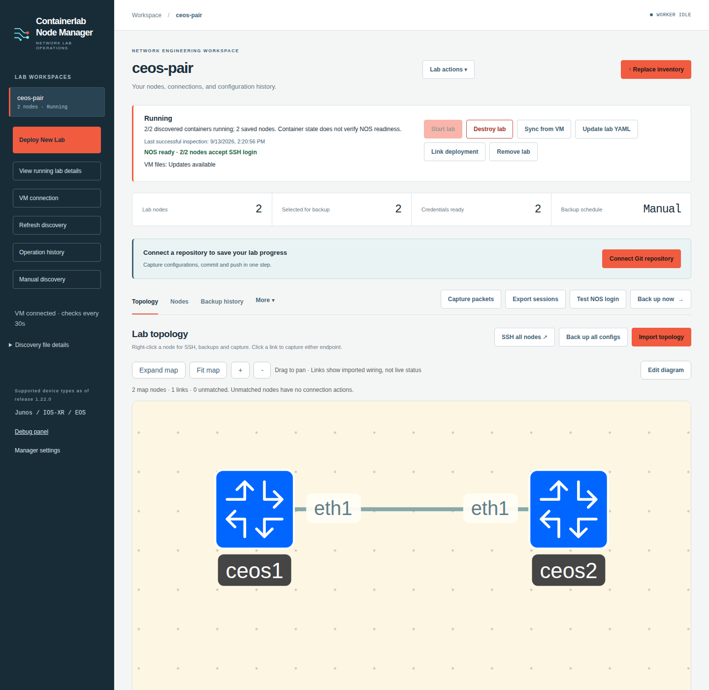
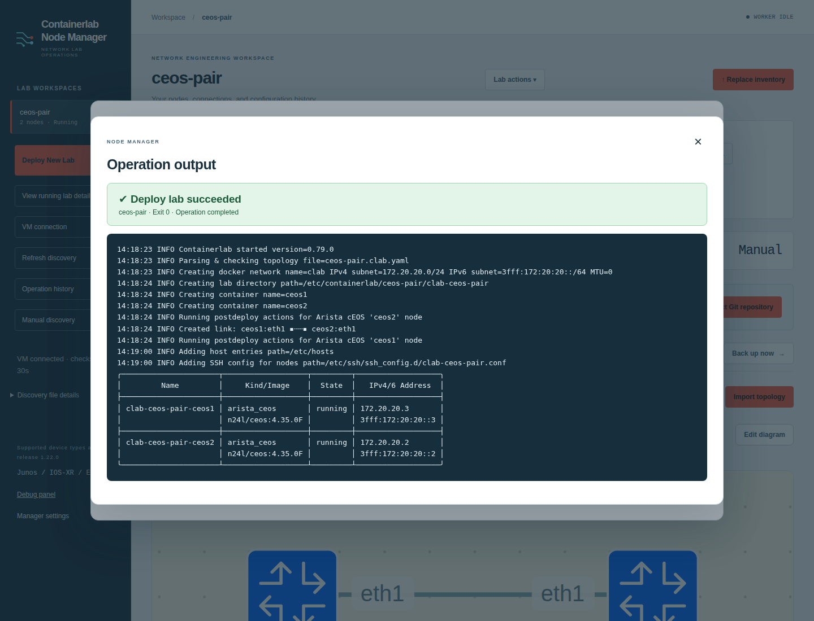
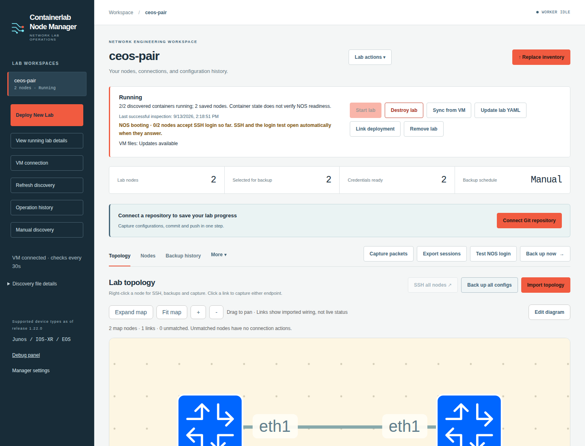
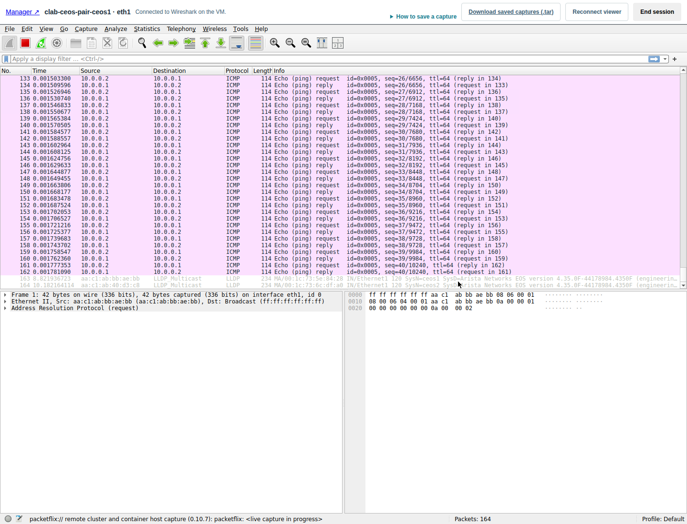
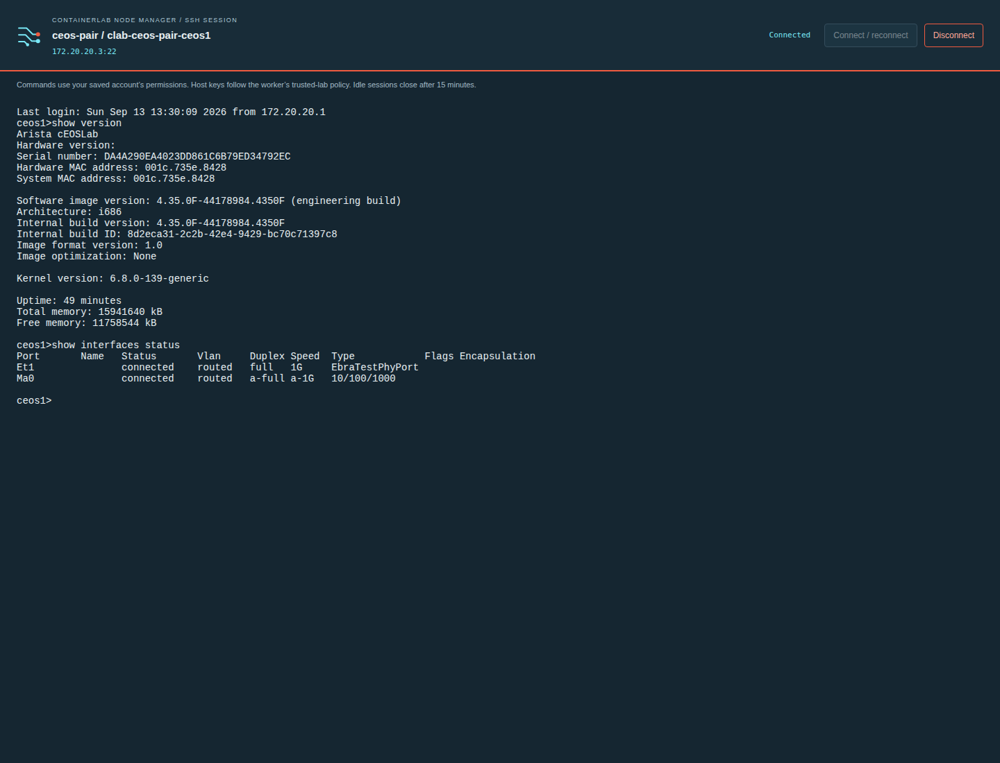
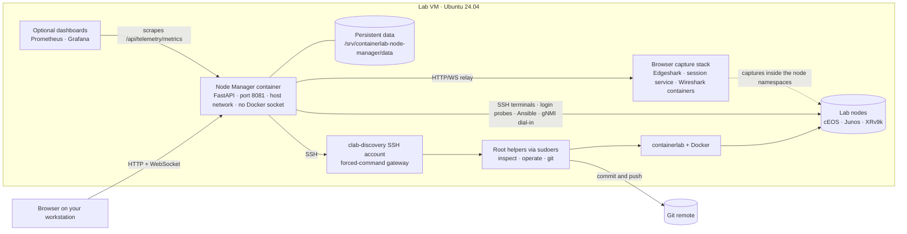

# Containerlab Node Manager

[](https://github.com/ArchRuger/CLAB-BACKUP-WORKER-v2/actions/workflows/release-check.yml)

A browser workspace for engineers who run network labs with
[containerlab](https://containerlab.dev). One small container on the lab VM lets you
deploy a topology, watch the devices boot, open SSH to every node, capture packets in
Wireshark from the browser, back up device configurations and save lab progress to
Git. Nothing is installed on your workstation; you only need a browser.

Current release: **1.23.1** · [changelog](docs/CHANGELOG.md) · [all documentation](docs/README.md)

## What it does

- **Deploy and manage labs** from the topology files on your VM: deploy, redeploy,
  start, stop, destroy and inspect, each shown for review before it runs. The
  workspace, map and node logins are ready as soon as you click *Deploy lab*.
- **Know when a lab is really up.** Containers run long before a network OS is
  usable, so the manager logs in to every node and asks for `show version` until it
  answers, then opens SSH and runs a login test by itself.
- **Work on the nodes**: browser SSH terminals, a topology map with right-click
  actions, an editable diagram with draw.io export, SuperPuTTY session export.
- **Keep configurations**: on-demand and scheduled backups over Ansible for EOS,
  Junos and IOS-XR, per-device history and downloads, and *Save progress* that commits
  and pushes to your Git repository from the VM with your existing login.
- **See the packets**: Wireshark runs on the VM in an isolated container and streams
  to your browser. Pick a node's port on the map and start.
- **Watch the network live**: once a node answers, the manager configures its gNMI
  service if needed, subscribes to interface counters, link state and BGP neighbours,
  and shows charts in a Telemetry tab and live link colours on the map. The last hour
  stays in memory only; nothing to configure per router or per lab. Optional Grafana
  dashboards open in another tab from the same data.
- **Stay in step with the VM**: read-only discovery every 30 seconds over a
  restricted SSH account, automatic node addresses, VM file sync, a health report and
  a debug panel.

Device kinds with backup and login-test drivers: Arista cEOS, Juniper cJunosEvolved,
vJunos-switch and vQFX, Cisco XRv9k. Any node that speaks SSH gets a terminal.

## A quick look



| | |
|---|---|
|  |  |
| *Every host command is reviewed, then runs with live output and a clear verdict.* | *A running container is not a usable device; the manager says when the NOS answers.* |
|  |  |
| *Wireshark runs on the VM and streams to the browser: a ping crossing the captured link.* | *SSH to any node in a browser tab with the credentials the manager already holds.* |

More in the [tour](docs/TOUR.md).

## Quick start on a fresh VM

You need Ubuntu Server 24.04, your ordinary account (not root), internet access and
a correct clock. The guided installer adds Docker, containerlab, the restricted
`clab-discovery` account and the manager itself.

1. Get the source and start the installer:

   ```bash
   command -v git >/dev/null || sudo apt-get install -y git
   git clone https://github.com/ArchRuger/CLAB-BACKUP-WORKER-v2.git ~/projects/clab-manager
   bash ~/projects/clab-manager/deploy/install.sh
   ```

2. Answer the prompts. `1` at *Setup menu*, *Manager bind/port settings* and *Lab
   operation access* takes the defaults; say `y` to the plan, enter your sudo
   password, and create a password for `clab-discovery` when asked (write it down).
   Choose `2` at *Next step* to set up Git later. The image build takes a few
   minutes; the installer ends with
   `Manager 1.23.1: running; HTTP and version checks passed.`

3. Open `http://VM_IP:8081`. The VM connection dialog opens on its own: enter the
   `clab-discovery` password and click **Save and test connection**.

4. Click **Deploy a new lab**, expand `/etc/containerlab`, pick a `.clab.yaml` and
   choose **Deploy lab**. The lab appears in the sidebar at once; the deployment bar
   shows *NOS booting* and then *NOS ready*, SSH opens on each node as it answers,
   and the login test runs by itself. Open **Telemetry** to watch interface rates and
   link state stream in; the map colours its links as the nodes report.

5. Optional, Wireshark in the browser:

   ```bash
   cd ~/projects/clab-manager
   sudo bash deploy/setup-capture.sh
   sudo docker compose --env-file clab-backup-ui/.env -f clab-backup-ui/compose.yml up -d --no-deps backup-ui
   ```

6. Optional, Grafana dashboards in another tab:

   ```bash
   cd ~/projects/clab-manager
   sudo bash deploy/setup-telemetry.sh
   sudo docker compose --env-file clab-backup-ui/.env -f clab-backup-ui/compose.yml up -d --no-deps backup-ui
   ```

7. Check the installation at any time with `bash deploy/check-install.sh`.

The [quick install](docs/QUICK-INSTALL.md) lists the same route step by step, the
[fresh VM guide](docs/FRESH-VM-GUIDE-V2.md) starts before Ubuntu is installed, and
[Git setup](docs/GIT-SETUP.md) connects a repository for *Save progress*.

## How it fits together



The manager never gets a Docker socket or root on the VM. Everything it does on
the host goes through one SSH account whose only command is a gateway that starts
three exact helper programs (`sudoers` lists them), and lab commands touch only
the topology folders you trusted at install time. More diagrams (the VM access
boundary, the deploy-to-ready sequence, the capture stack and where data lives)
and a module map are in [docs/ARCHITECTURE.md](docs/ARCHITECTURE.md).

## Documentation

| Read this | When you want to |
|---|---|
| [Tour](docs/TOUR.md) | See the UI and the deploy-to-ready flow in screenshots |
| [Quick install](docs/QUICK-INSTALL.md) | Follow the shortest route: paste, type, click |
| [Fresh VM guide](docs/FRESH-VM-GUIDE-V2.md) | Build a VM from Proxmox settings to the first Git save, with recovery steps |
| [Guided installation](docs/INSTALL.md) | Understand the installer's menu and phases |
| [VM connection](docs/VM-CONNECTION.md) | Set up or repair the `clab-discovery` account and password |
| [Lab operations](docs/LAB-OPERATIONS.md) | Deploy, destroy, inspect, edit diagrams, read NOS readiness |
| [Git setup](docs/GIT-SETUP.md) and [Save lab progress](docs/GIT-PROGRESS.md) | Register a checkout and save, checkpoint, load and push |
| [Browser Wireshark](docs/CAPTURE.md) | Install the capture stack, run sessions, download captures |
| [Network telemetry](docs/TELEMETRY.md) | Enable automatic gNMI telemetry, read the charts and the live map, per-NOS support and the live acceptance procedure |
| [Health check](docs/HEALTH-CHECK.md) and [Debug panel](docs/DEBUG-PANEL.md) | Read `check-install.sh` results and diagnose helpers |
| [Architecture](docs/ARCHITECTURE.md) | See how the pieces connect and which module does what |
| [Changelog](docs/CHANGELOG.md) | Read what changed in each release |

The [documentation index](docs/README.md) lists everything, including the Docker Hub
route, the migration guide, the Wiki.js master guide and the archive.

## Repository layout

```text
├── README.md                this page
├── LICENSE                  MIT
├── docs/                    guides, architecture, changelog, tour (docs/README.md is the index)
│   ├── images/              screenshots used by the README and the tour
│   └── archive/             superseded guides kept for history
├── deploy/                  installer, VM setup scripts, health check, capture stack, CI smoke test
├── clab-backup-ui/          the manager: FastAPI app, static UI, Dockerfile, Compose file, tests
│   ├── app/                 application modules; host_*.py are the helpers installed on the VM
│   ├── app/static/          the UI (vanilla JavaScript, no build step)
│   ├── tests/               unittest and node:test suites
│   └── VALIDATION.md        what was actually tested for each release
└── agent instructions.md    handoff notes for coding agents, newest release first
```

## Development

Tests run without a VM. From `clab-backup-ui`:

```bash
python3 -m venv .venv
.venv/bin/pip install -r requirements.txt httpx
.venv/bin/python -m unittest discover -s tests -t tests
node --test tests/*.js
```

`python deploy/verify-release.py` checks that every file carrying the release
number agrees with `clab-backup-ui/VERSION`; the CI workflow runs it, the test
suites and a real browser-capture smoke test on every push. Release rules, packaging
limits and the version-bump checklist are in
[docs/REPOSITORY-MAINTENANCE.md](docs/REPOSITORY-MAINTENANCE.md); each release's
evidence is in [clab-backup-ui/VALIDATION.md](clab-backup-ui/VALIDATION.md).
Agents working on the code start with [agent instructions.md](agent%20instructions.md).

## License

[MIT](LICENSE). The browser capture stack adapts Siemens Edgeshark (MIT) and runs the
SR Labs Wireshark container; the UI vendors xterm.js (MIT); telemetry uses pygnmi
(BSD-3) and optionally runs Prometheus (Apache-2.0) and Grafana OSS (AGPL-3.0). Their
notices are in [deploy/CAPTURE-THIRD-PARTY-NOTICES.md](deploy/CAPTURE-THIRD-PARTY-NOTICES.md),
[deploy/TELEMETRY-THIRD-PARTY-NOTICES.md](deploy/TELEMETRY-THIRD-PARTY-NOTICES.md) and
[clab-backup-ui/app/static/vendor/](clab-backup-ui/app/static/vendor/README.md).
Vendor network OS images are licensed separately by their vendors.
