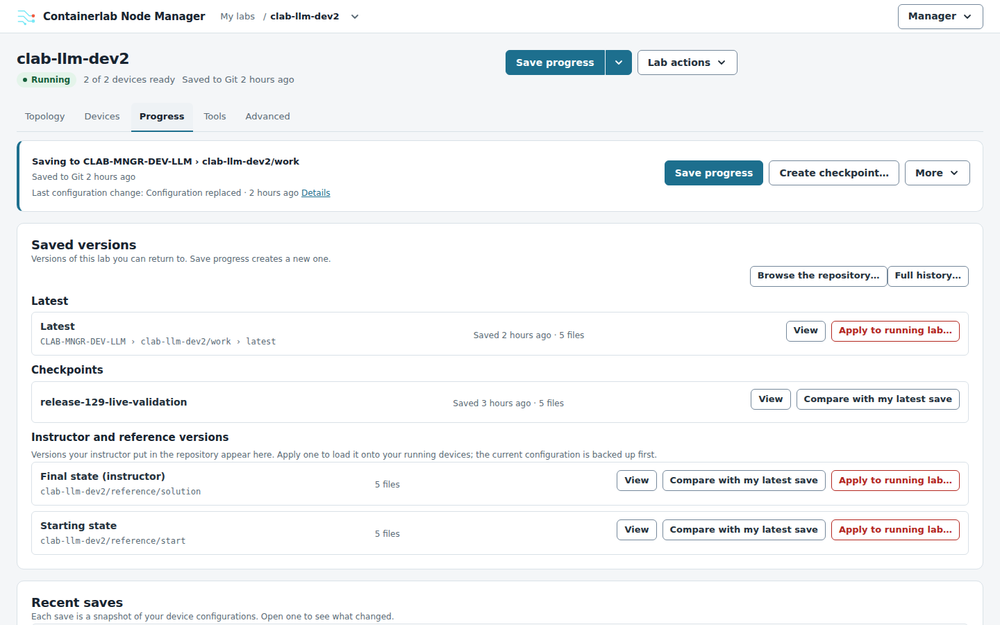
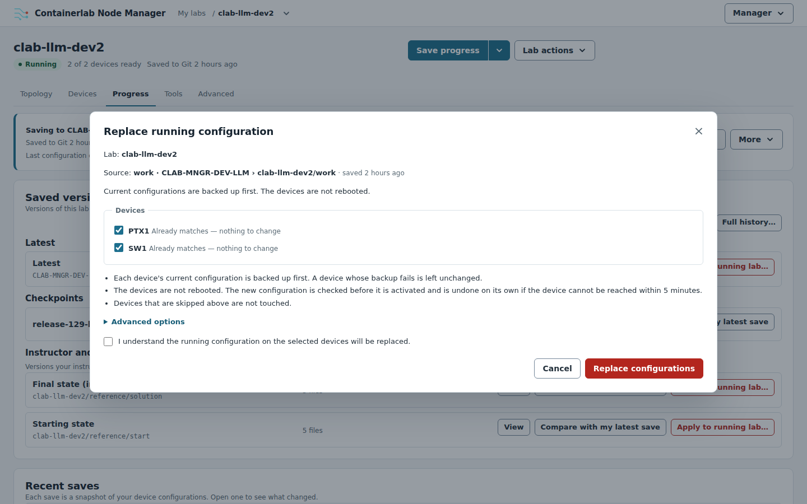
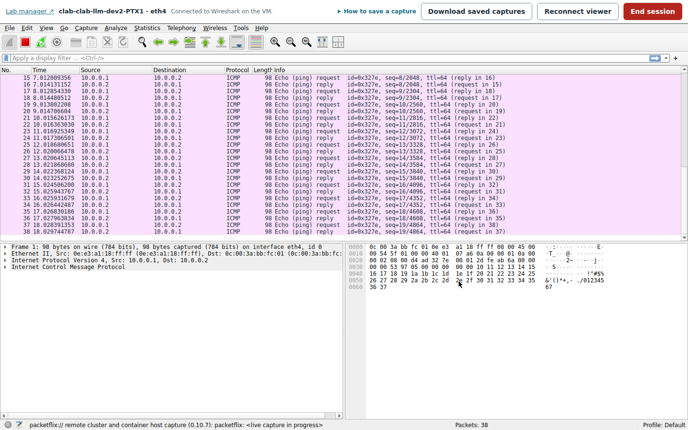
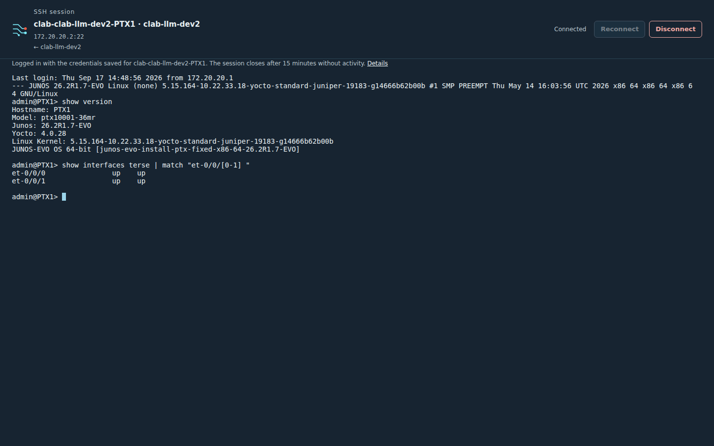
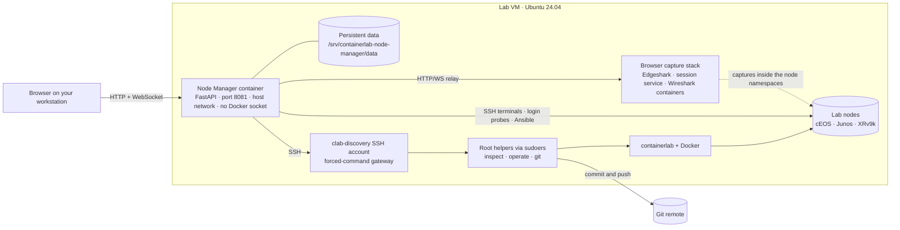

# Containerlab Node Manager

[](https://github.com/ArchRuger/CLAB-BACKUP-WORKER-v2/actions/workflows/release-check.yml)

A browser workspace for engineers who run network labs with
[containerlab](https://containerlab.dev). One small container on the lab VM lets you
deploy a topology, watch the devices boot, open SSH to every node, capture packets in
Wireshark from the browser, back up device configurations and save lab progress to
Git. Nothing is installed on your workstation; you only need a browser.

Current release: **1.30.41** · [changelog](docs/CHANGELOG.md) · [all documentation](docs/README.md)

## What it does

- **Deploy and manage labs** from the topology files on your VM, from a file you upload
  from your workstation, or from a lab you draw in the visual lab builder: deploy, redeploy,
  start, stop, destroy and inspect, each shown for review before it runs. The
  workspace, map and node logins are ready as soon as you click *Deploy lab*.
- **Know when a lab is really up.** Containers run long before a network OS is
  usable, so the manager logs in to every node and asks for `show version` until it
  answers, then opens SSH and runs a login test by itself.
- **Work on the nodes**: browser SSH terminals, a topology map with right-click
  actions, a map editor (*Edit map*: the drawing only, never the topology) with draw.io
  export, SuperPuTTY session export.
- **Keep configurations**: on-demand and scheduled backups over Ansible for EOS,
  Junos and IOS-XR, per-device history and downloads, and *Save progress* that commits
  on the VM and, after you have reviewed the changes, pushes to your Git repository with
  your existing login.
- **See the packets**: Wireshark runs on the VM in an isolated container and streams
  to your browser. Pick a node's port on the map and start.
- **Stay in step with the VM**: read-only discovery every 30 seconds over a
  restricted SSH account, automatic node addresses, VM file sync, a health report and
  a Diagnostics page.

Device kinds with backup and login-test drivers: Arista cEOS, Juniper cJunosEvolved,
vJunos-switch and vQFX, Cisco XRv9k. Any node that speaks SSH gets a terminal.

## A quick look


*The manager showing the project's example course lab `BGP_TheoryToPractice` (13 devices), rendered from its topology and map files; the device states in this picture are simulated for the documentation. The other pictures are from a running lab.*

| | |
|---|---|
|  |  |
| *Save progress to Git, keep checkpoints, and apply the instructor's reference states to the running lab.* | *Every operation is reviewed first: each device's outcome, the safety rules, and an acknowledgement before anything changes.* |
|  |  |
| *Wireshark runs on the VM and streams to the browser: a ping crossing the captured link.* | *SSH to any node in a browser tab with the credentials the manager already holds.* |

More in the [tour](docs/TOUR.md).

## Quick start on a fresh VM

You need Ubuntu Server 24.04, your ordinary account (not root), internet access and
a correct clock. The guided installer adds Docker, containerlab, the restricted
`clab-discovery` account, the manager and the browser Wireshark stack. Every
command in this project works from any directory; the guides keep the source in
`~/projects/clab-manager`, so replace that path if you clone elsewhere.

1. Get the source and start the installer:

   ```bash
   command -v git >/dev/null || sudo apt-get install -y git
   git clone https://github.com/ArchRuger/CLAB-BACKUP-WORKER-v2.git "$HOME/projects/clab-manager"
   bash "$HOME/projects/clab-manager/deploy/install.sh"
   ```

2. Answer the prompts. `1` at *Setup menu*, *Manager bind/port settings*, *Lab
   operation access* and *VS Code / Containerlab extension access* takes the
   defaults; say `y` to the plan, enter your sudo password, and create a password for
   `clab-discovery` when asked (write it down). Choose `2` at *Next step* to set up
   Git later. The image build and the capture stack take a few minutes; the installer
   ends with `Manager 1.30.41: running; HTTP and version checks passed.`

3. Open `http://VM_IP:8081`. The VM connection dialog opens on its own: enter the
   `clab-discovery` password and click **Save and test connection**.

4. On Home, under **Deploy › Choose a file on the lab VM…**, expand `/etc/containerlab`, pick a `.clab.yaml` and
   choose **Deploy lab**. The lab appears under My labs at once; its header reads
   *Starting* and counts the devices that are ready, **Open CLI** enables on each
   device as it answers, and the login check runs by itself.

5. On the lab's map, right-click a device or click a link for **Capture traffic…**:
   Wireshark opens in a browser tab.

6. Check the installation at any time:

   ```bash
   bash "$HOME/projects/clab-manager/deploy/check-install.sh"
   ```

To upgrade later, pull the new source into the same folder and run the installer
again. It rebuilds the manager, refreshes the capture stack and keeps your data,
passwords and settings:

```bash
git -C "$HOME/projects/clab-manager" pull --ff-only
bash "$HOME/projects/clab-manager/deploy/install.sh"
```

The [quick install](docs/QUICK-INSTALL.md) lists the same route step by step, the
[fresh VM guide](docs/FRESH-VM-GUIDE-V2.md) starts before Ubuntu is installed, and
[Git setup](docs/GIT-SETUP.md) connects a repository for *Save progress*.

## How it fits together



The manager never gets a Docker socket or root on the VM. Everything it does on
the host goes through one SSH account whose only command is a gateway that starts
three exact helper programs (`sudoers` lists them), and lab commands touch only
the topology folders you trusted at install time. More diagrams (the VM access
boundary, the deploy-to-ready sequence, the capture stack and where data lives)
and a module map are in [docs/ARCHITECTURE.md](docs/ARCHITECTURE.md).

## Documentation

| Read this | When you want to |
|---|---|
| [Tour](docs/TOUR.md) | See the student UI — My labs, the lab workspace, Progress and Tools — in screenshots |
| [Quick install](docs/QUICK-INSTALL.md) | Follow the shortest route: paste, type, click |
| [Fresh VM guide](docs/FRESH-VM-GUIDE-V2.md) | Build a VM from Proxmox settings to the first Git save, with recovery steps |
| [Guided installation](docs/INSTALL.md) | Understand the installer's menu and phases, upgrades and the capture stack |
| [VM connection](docs/VM-CONNECTION.md) | Set up or repair the `clab-discovery` account and password |
| [Lab operations](docs/LAB-OPERATIONS.md) | Start, stop, redeploy and destroy labs, edit the map, read device readiness |
| [Lab builder](docs/LAB-BUILDER.md) | Draw a new lab in the browser, save it to the VM and deploy it, or edit the topology of a lab that is not deployed |
| [Git setup](docs/GIT-SETUP.md) and [Save progress](docs/GIT-PROGRESS.md) | Register a checkout, then save, checkpoint, compare, apply and push from the Progress tab |
| [Browser Wireshark](docs/CAPTURE.md) | Run capture sessions, download captures, repair or remove the capture stack |
| [Network telemetry](docs/TELEMETRY.md) | Read the retirement notice for the removed telemetry feature and Grafana dashboards |
| [Health check](docs/HEALTH-CHECK.md) and [Diagnostics](docs/DEBUG-PANEL.md) | Read `check-install.sh` results and diagnose the VM connection from the browser |
| [Architecture](docs/ARCHITECTURE.md) | See how the pieces connect and which module does what |
| [Changelog](docs/CHANGELOG.md) | Read what changed in each release |

The [documentation index](docs/README.md) lists everything, including the manual
setup and migration guide, the Wiki.js master guide, the release rules and the archive.

## Repository layout

```text
├── README.md                this page
├── LICENSE                  MIT
├── docs/                    guides, architecture, changelog, tour (docs/README.md is the index)
│   ├── images/              screenshots used by the README and the tour
│   └── archive/             superseded guides kept for history
├── deploy/                  installer, VM setup scripts, health check, capture stack, release checks, CI smoke tests
├── clab-backup-ui/          the manager: FastAPI app, static UI, Dockerfile, Compose file, tests
│   ├── app/                 application modules; host_*.py are the helpers installed on the VM
│   ├── app/static/          the UI (vanilla JavaScript, no build step)
│   ├── tests/               unittest and node:test suites
│   └── VALIDATION.md        what was actually tested for each release
└── agent instructions.md    handoff notes for coding agents, newest release first
```

## Development

Tests run without a VM. The unit tests import the application from the folder they
live next to, so the one command that needs a working directory changes into it
itself:

```bash
python3 -m venv "$HOME/projects/clab-manager/clab-backup-ui/.venv"
"$HOME/projects/clab-manager/clab-backup-ui/.venv/bin/pip" install -r "$HOME/projects/clab-manager/clab-backup-ui/requirements.txt" httpx
(cd "$HOME/projects/clab-manager/clab-backup-ui" && .venv/bin/python -m unittest discover -s tests -t tests && node --test tests/*.js)
```

`python3 deploy/verify-release.py` checks that every file carrying the release
number agrees with `clab-backup-ui/VERSION` and that the guides name only the current
release; `python3 deploy/set-release.py NEW` moves every marker for the next release.
The CI workflow runs the checks, the test suites and real browser-capture
smoke tests on every push. Release rules, the documentation conventions and
the version-bump checklist are in
[docs/REPOSITORY-MAINTENANCE.md](docs/REPOSITORY-MAINTENANCE.md); each release's
evidence is in [clab-backup-ui/VALIDATION.md](clab-backup-ui/VALIDATION.md).
Agents working on the code start with [agent instructions.md](agent%20instructions.md).

## License

[MIT](LICENSE). The browser capture stack adapts Siemens Edgeshark (MIT) and runs the
SR Labs Wireshark container; the UI vendors xterm.js (MIT); the lab builder embeds
the SR Labs containerlab topology editor (Apache-2.0) with its bundled dependencies.
Their notices are in
[deploy/CAPTURE-THIRD-PARTY-NOTICES.md](deploy/CAPTURE-THIRD-PARTY-NOTICES.md),
[deploy/LAB-BUILDER-THIRD-PARTY-NOTICES.md](deploy/LAB-BUILDER-THIRD-PARTY-NOTICES.md) and
[clab-backup-ui/app/static/vendor/](clab-backup-ui/app/static/vendor/README.md).
Vendor network OS images are licensed separately by their vendors.
