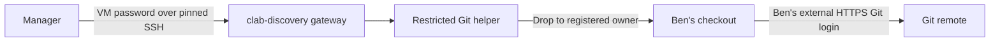
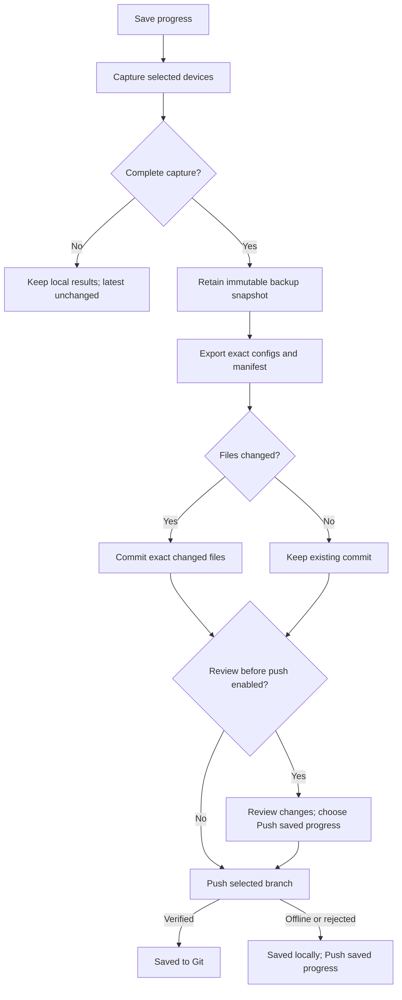

# proxmox/containerlab - VM Setup Instructions | Master Build & Operations Guide
This guide covers the end to end process of preparing a fresh Ubuntu VM to be used as a virtual lab environment paired with a custom docker container used for managing Containerlab deployed labs.


This page combines the Ubuntu/Proxmox build notes, the installation walkthrough and the current manager documentation. Follow it from the beginning for a fresh VM. If Docker and Containerlab already work, start at **Part 6**.

> **Release baseline:** 1.16.0 prepared locally from local 1.15.3 commit `e64790a` (GitHub main last checked at `0658562`) on 11 September 2026; commit/push is pending. Source VERSION, application, helpers and image metadata agree on **1.16.0**. Build locally as `clab-backup:1.16.0`; a Docker Hub publication has not been verified.
{.is-info}

## Reference environment

| Setting | Example / standard |
|---|---|
| Hypervisor | Proxmox VE |
| Guest OS | Ubuntu Server 24.04 LTS |
| Current example hostname | `clab-3` |
| Current example VM address | `10.150.2.213` |
| Subnet / gateway | `10.150.2.0/24` / `10.150.2.1` |
| Example DNS | `8.8.8.8` |
| VM administrator | `archtop` |
| Proxmox VM ID | Look up with `qm list`; do not infer it from the hostname |
| Earlier reference hosts | `clab-1`: `10.150.2.211`; `clab-2`: `10.150.2.212` |
| Manager UI | `http://10.150.2.213:8081` |
| Release files | `/home/archtop/projects/v1.16.0/` |
| Persistent manager data | `/srv/containerlab-node-manager/data/` |
| Lab projects | `/etc/containerlab/<project>/` |
| VM helper account | `clab-discovery` |
| Git execution owner / checkout | Existing VM account, for example `archtop` / `/home/archtop/labs/my-lab` |

Replace these example addresses and usernames for each engineer. The old build's VM ID `101` belongs to that example; it is not a universal value. This guide assumes a normal rootful Docker Engine installation without user-namespace remapping.

## Where commands run

| Label | Terminal |
|---|---|
| **Proxmox host** | Proxmox node shell; `qm` commands run here |
| **Ubuntu VM** | Console or SSH session logged in as your normal administrator |
| **Workstation** | Your Windows/Linux/macOS computer, where the browser runs |
| **Manager UI** | The web application at the VM address |

All manager installation and maintenance commands run in the **Ubuntu VM** unless stated otherwise. Do not run `qm` inside Ubuntu, or Linux `sudo` commands in Windows PowerShell. Code blocks contain commands without shell prompt prefixes.

## How the pieces connect

```text
Engineer workstation
  Browser -------- TCP 8081 --------> Node Manager container
                                        | /data bind mount
                                        +--> /srv/containerlab-node-manager/data
                                        |
                                        +-- SSH --> VM helper (clab-discovery)
                                        |          discovery, files, lab commands
                                        |          Git helper -> engineer-owned checkout -> HTTPS Git remote
                                        |
                                        +-- SSH --> network nodes

Proxmox --> Ubuntu VM --> Docker / Containerlab --> training devices
                         independent manager       lab deployments
```

The manager keeps running when a lab is stopped or destroyed. Deployed labs remain on the VM; importing a lab creates a saved manager workspace. The two have different lifecycles.

> **Access model:** 1.16.0 opens directly without a UI login. Give access to TCP 8081 only to the intended engineers. VM discovery authentication and device SSH credentials are still required and are stored in the persistent manager data.
{.is-warning}

## Page contents

| Part | Topic |
|---|---|
| [1](#part-1) | Build the Ubuntu VM |
| [2](#part-2) | Enable nested virtualization when required |
| [3](#part-3) | Make the intended disk space available |
| [4](#part-4) | Install Docker, Compose and Containerlab |
| [5](#part-5) | Engineer access, WinSCP and VS Code |
| [6](#part-6) | Get the release source and matching host files |
| [7](#part-7) | Prepare persistent storage |
| [8](#part-8) | Create the VM connection password |
| [9](#part-9) | Install discovery, file-transfer and operations helpers |
| [10](#part-10) | Launch Containerlab Node Manager |
| [11](#part-11) | Connect the UI to the VM |
| [12](#part-12) | Deploy, discover and import labs |
| [13](#part-13) | Node inventory, maps, SSH and backups |
| [14](#part-14) | Lab commands, VM projects and diagram editing |
| [15](#part-15) | Everyday container management |
| [16](#part-16) | Upgrade without losing data |
| [17](#part-17) | Backups, recovery and manager-only removal |
| [18](#part-18) | VM connection repair and password recovery |
| [19](#part-19) | Troubleshooting and lessons from the first install |
| [20](#part-20) | Airgapped installation and handoff checklist |
| [21](#part-21) | Save lab progress to the engineer's Git repository |

---

# Part 1 — Build the Ubuntu VM {#part-1}

## Step 1.1 — Create and install the guest

On Proxmox, create a VM using the Ubuntu Server 24.04 LTS ISO. Allocate CPU, memory and disk for the **whole training lab**, particularly VM-based network images. There is no single sizing value that fits every topology. Attach its network interface to the bridge/VLAN reachable by your workstation.

During Ubuntu installation:

1. Select the normal server installation and your keyboard settings.
2. Configure the network interface, commonly `ens18`, with **Manual IPv4**.
3. Enter your assigned subnet, address, gateway and DNS from the reference table.
4. Leave the proxy empty unless your environment requires one.
5. Select the intended virtual disk; use LVM if following Part 3.
6. Set the hostname and normal administrator account. Use your chosen password.
7. Enable **Install OpenSSH server**. Extra server snaps and Ubuntu Pro enrollment are optional.
8. Complete installation, detach the ISO if needed and boot from the installed disk.

> Confirm the IP allocation in your network records before assigning it. A successful ping indicates the address is in use; no ping response does not prove it is free.
{.is-info}

## Step 1.2 — Verify connectivity

**Ubuntu VM:**

```bash
hostnamectl
ip -br address
ip route
getent hosts download.docker.com
sudo systemctl status ssh --no-pager
```

**Workstation:**

```text
ssh archtop@10.150.2.213
```

Verify the new VM's SSH fingerprint through its console before accepting it. Continue installation in this SSH session if preferred.

**Ubuntu VM:**

```bash
sudo apt update
sudo apt install -y ca-certificates curl git openssh-server python3 sudo
sudo systemctl enable --now ssh
```

> **Checkpoint:** you can log in from the workstation using the normal VM account, resolve package hosts and run `sudo`.
{.is-success}

---

# Part 2 — Enable nested virtualization when required {#part-2}

VM-based NOS images, including cJunosEvolved, need virtualization support inside the Ubuntu guest. Containerlab and Node Manager themselves do not require nested KVM merely to run ordinary containers.

```text
Physical CPU -> Proxmox/KVM (L0) -> Ubuntu VM (L1)
                                  -> device container -> internal QEMU/KVM VM (L2)
```

## Step 2.1 — Check the Proxmox host

**Proxmox host:**

```bash
qm list
```

Identify the correct VM and CPU vendor. Check the relevant module:

## CPU vendor {.tabset}

### Intel

```bash
cat /sys/module/kvm_intel/parameters/nested
```

Expected: `Y` or `1`. If disabled, review existing module settings and configure `options kvm_intel nested=1` in the host's modprobe configuration. Apply during planned host maintenance; do not unload an in-use KVM module.

### AMD

```bash
cat /sys/module/kvm_amd/parameters/nested
```

Expected: `Y` or `1`. If disabled, review existing module settings and configure `options kvm_amd nested=1` in the host's modprobe configuration. Apply during planned host maintenance.

## Step 2.2 — Expose the host CPU to the guest

**Proxmox host:** Find the ID of the new VM:

```bash
qm list
```

Confirm this is the intended VM. Shut it down.:

```bash
qm stop 102
```

Only after the status is **stopped**, change the CPU type and start it:

```bash
qm set 102 --cpu host
qm start 102
```

The change requires a full guest stop/start. This is not an instruction to reboot the entire Proxmox host. Nested KVM behavior is described in the [Linux KVM documentation](https://docs.kernel.org/virt/kvm/x86/running-nested-guests.html).

## Step 2.3 — Verify inside Ubuntu

**Ubuntu VM:**

```bash
lscpu
ls -l /dev/kvm
lsmod | grep kvm
```

If `/dev/kvm` is missing, revisit host nesting and the guest CPU type. Device boot logs reporting KVM failures are a direct clue; `tap0`/`tap1` or EVO startup waits alone are not proof of a KVM problem. Check the device image's own boot requirements as well.

---

# Part 3 — Make the intended disk space available {#part-3}

The example build had a large virtual disk but a 100 GiB root logical volume. A large disk in Proxmox does not automatically mean the Ubuntu filesystem uses all of it.

## Step 3.1 — Inspect before resizing

**Ubuntu VM:**

```bash
lsblk -f
sudo pvs
sudo vgs
sudo lvs
findmnt -no SOURCE,FSTYPE /
df -h /
```

Confirm the root LV name, filesystem type and **VFree** in its volume group. The commands below apply only when the root is `/dev/ubuntu-vg/ubuntu-lv` and that volume group already has free extents.

## Step 3.2 — Extend the logical volume

If this training VM should allocate all remaining VG space to its root LV:

```bash
sudo lvextend -l +100%FREE /dev/ubuntu-vg/ubuntu-lv
```

This consumes the VG's unallocated space. Leave space unallocated instead if you plan other logical volumes. The allocation syntax is documented in [Ubuntu's lvextend manual](https://manpages.ubuntu.com/manpages/noble/man8/lvextend.8.html).

## Root filesystem {.tabset}

### ext4

```bash
sudo resize2fs /dev/ubuntu-vg/ubuntu-lv
df -h /
```

### XFS

```bash
sudo xfs_growfs /
df -h /
```

## Step 3.3 — Confirm the result

Compare `df -h /` with your intended allocation. The old build reached approximately 982 GiB usable filesystem capacity; your result depends on disk size and filesystem overhead.

If **VFree is zero**, these commands cannot create additional space. Determine whether the virtual disk, partition or physical volume needs expansion first. Do not guess a partition name or apply a partition-resize command from another host. Non-LVM installations need their filesystem's own expansion procedure.

---

# Part 4 — Install Docker, Compose and Containerlab {#part-4}

## Step 4.1 — Install Docker on a fresh Ubuntu VM

**VM:** these commands use Docker's official Ubuntu APT repository. They assume
the fresh VM has no previous Docker installation. If it does, follow the
[official Docker installation instructions](https://docs.docker.com/engine/install/ubuntu/)
to resolve conflicting packages first.

```bash
sudo install -m 0755 -d /etc/apt/keyrings
sudo curl -fsSL https://download.docker.com/linux/ubuntu/gpg -o /etc/apt/keyrings/docker.asc
sudo chmod a+r /etc/apt/keyrings/docker.asc
sudo tee /etc/apt/sources.list.d/docker.sources > /dev/null <<EOF
Types: deb
URIs: https://download.docker.com/linux/ubuntu
Suites: $(. /etc/os-release && echo "${UBUNTU_CODENAME:-$VERSION_CODENAME}")
Components: stable
Architectures: $(dpkg --print-architecture)
Signed-By: /etc/apt/keyrings/docker.asc
EOF
sudo apt update
sudo apt install -y docker-ce docker-ce-cli containerd.io docker-buildx-plugin docker-compose-plugin
sudo systemctl enable --now docker
sudo docker run --rm hello-world
sudo docker compose version
```

Manager administration uses `sudo docker` consistently. Part 5 adds engineer groups for VS Code when needed. Use normal rootful Docker Engine; rootless Docker or user
namespace remapping requires different persistent-directory ownership.

## Step 4.2 — Install Containerlab

**VM:** download the official installer, inspect it with `less` (press `q` to exit),
then run it. These commands do not deploy a lab.

```bash
curl -fsSL https://get.containerlab.dev -o /tmp/install-containerlab.sh
less /tmp/install-containerlab.sh
sudo bash /tmp/install-containerlab.sh
containerlab version
sudo containerlab inspect --all --format json
sudo usermod -aG clab_admins $USER && newgrp clab_admins
```

An empty inspection is expected before deploying any labs. Containerlab must be
installed as a root-owned executable in `/usr/bin` or `/usr/local/bin`. The
helper setup checks this. See [Containerlab installation](https://containerlab.dev/install/)
for other distributions or offline packages.

> Press <kbd>q</kbd> to exit `less`. <kbd>Ctrl</kbd>+<kbd>Z</kbd> suspends it instead. If you see `[1]+ Stopped less ...`, use `fg` to return to that job, then press <kbd>q</kbd>.
{.is-info}

If Docker already works, verify it and skip its installation block. Do not run Containerlab's separate “install everything” setup over this sequence; Docker is already installed here.

---

# Part 5 — Engineer access, WinSCP and VS Code {#part-5}

## Step 5.1 — Allow the engineer to use Docker and Containerlab

**Ubuntu VM:** the optional VS Code workflow needs the normal engineer account in both groups:

```bash
getent group docker
getent group clab_admins
sudo usermod -aG docker,clab_admins archtop
```

If `clab_admins` is absent, check the Containerlab installation before continuing. Log out and establish a fresh SSH session, then verify:

```bash
id
docker ps
containerlab inspect --all
```

These groups grant elevated host capabilities. Add the normal training administrator, **not** the restricted `clab-discovery` account. The [Containerlab VS Code setup guide](https://containerlab.dev/manual/gui/vsc-extension/) describes the required access.

## Step 5.2 — Create a writable lab workspace

On a fresh VM:

```bash
sudo install -d -o archtop -g archtop -m 0755 /etc/containerlab
mkdir -p /etc/containerlab/BGP_TheoryToPractice
```

Copy the complete project into that folder, including referenced startup configurations. Existing root-owned project folders need ownership corrections scoped to the intended project. Group membership alone does not grant write access to every directory.

> Lab source folders and manager storage have different owners. The engineer can own their lab project. `/srv/containerlab-node-manager/data` stays `10001:10001`, mode `700`.
{.is-warning}

## File transfer {.tabset}

### Normal WinSCP session

Connect using SFTP, host `10.150.2.213`, port `22`, user `archtop`, and your normal VM login. Upload projects to the engineer-owned directory above. Use the normal account for key transfers as well.

### Optional administrative SFTP

Only if you need root-level file administration, first verify the server binary on Ubuntu:

```bash
ls -l /usr/lib/openssh/sftp-server
sudo visudo -f /etc/sudoers.d/archtop-sftp
```

Add the following rule, adjusting the username if needed:

```text
archtop ALL=(root) NOPASSWD: /usr/lib/openssh/sftp-server
```

Validate with `sudo visudo -c`. In WinSCP, open **Advanced → Environment → SFTP** and set the server to:

```text
sudo /usr/lib/openssh/sftp-server
```

This session can modify root-owned files. It is optional and not needed for the normal project upload workflow. Do not add the old example's blanket `NOPASSWD: ALL` rule just to transfer files. See [WinSCP's sudo/SFTP guidance](https://winscp.net/eng/docs/faq_su).

## Step 5.3 — Connect VS Code to the VM

Install **Remote - SSH** on the workstation, connect to `archtop@10.150.2.213`, and open the VM project folder. Install the Containerlab extension in that **remote VM context**. Check `id`, `docker ps` and `containerlab inspect --all` in the integrated remote terminal.

If an old VS Code server process retains the previous groups, close the connection and restart that remote server/session. A VM reboot is a fallback after saving work; a Proxmox host reboot is not required for group changes.

## Step 5.4 — Obtain required device images

Node Manager's image does not contain the router/switch images. Read the topology's `image:` entries and pull or load each required image. Log in to Docker Hub only when needed for private access or authenticated pulls:

```bash
sudo docker login
sudo docker image ls
```

Use the same account context for login and image pulls: `sudo docker login` stores credentials for root, while `docker login` uses your normal user's configuration. Enter a registry token/password at the prompt. Registry credentials, the VM login and device credentials are separate.

---

# Part 6 — Get the release source and matching host files {#part-6}

## Recommended shortcut — the terminal installer

After obtaining the matching source below, run as your **ordinary Ubuntu VM
account**, without sudo:

```bash
bash deploy/install.sh
```

Choose **Install or update manager, then set up Git**. The menu combines missing
prerequisites, approved APT media repair with backups, password/helpers, persistent
storage, image build/start and running-container/HTTP checks. It then opens Git
setup as the same ordinary owner. Existing `.env` is retained; a new source
folder offers to copy your previous `.env`. Existing passwords/data are kept.

Menu **Git setup / repair only** reopens the Git wizard without rebuilding.
**Check running installation** repeats readiness checks. The terminal interface
uses numbered choices, works over SSH and needs no extra UI package. After a
successful full run, the manual installation commands in Parts 7–10 do not need
to be repeated. Continue with the browser VM connection and lab setup in Part 11.
See [INSTALL.md](INSTALL.md) for the full shortcut, recovery and provider details.

## Step 6.1 — Obtain version 1.16.0

After the prepared 1.16.0 changes have been merged into GitHub main, obtain that source. On a fresh VM, clone into a new source
folder as your ordinary VM account, then check the complete release:

```bash
mkdir -p "$HOME/projects"
cd "$HOME/projects"
git clone https://github.com/ArchRuger/CLAB-BACKUP-WORKER-v2.git v1.16.0
cd v1.16.0
cat clab-backup-ui/VERSION
python3 deploy/verify-release.py
```

Expect **1.16.0** and **Source release verified: 1.16.0**. A directory name does
not select a release. Future `main` changes may be newer; use a complete matching
release and its guide. Stop if the consistency check fails.

If this directory already exists, do not clone over it. Inspect `git status`
before updating, preserving local changes and `clab-backup-ui/.env`. Alternatively,
extract the cleaned source ZIP into a separate folder with `deploy/` and
`clab-backup-ui/` directly inside it. No Docker Hub tag is assumed to exist.

## Step 6.2 — Check the host setup files

```bash
cd "$HOME/projects/v1.16.0"
ls deploy/setup-vm.sh deploy/setup-discovery.sh deploy/setup-password.sh \
  deploy/clab-manager-gateway deploy/clab-manager-password.conf \
  deploy/setup-operations.sh deploy/verify-helper.py deploy/verify-operations.py \
  deploy/verify-ssh-password.py clab-backup-ui/app/host_files.py \
  clab-backup-ui/app/host_operations.py deploy/setup-git.sh \
  clab-backup-ui/app/host_git.py
```

Keep this directory for upgrades and maintenance. The resulting layout is:

```text
/home/archtop/projects/v1.16.0/          source and host setup scripts
/etc/containerlab/<project>/           lab sources and deployment artifacts
/srv/containerlab-node-manager/data/   persistent manager state and backups
```

Docker, Compose, Python 3 and the VM's OpenSSH server must be installed first
(Parts 1 and 4). The build downloads its base image and dependencies. For an
offline VM, prepare the image on a connected machine using [Part 20](#part-20).

---

# Part 7 — Prepare persistent storage {#part-7}

From `~/projects/v1.16.0`:

```bash
sudo bash deploy/setup-vm.sh
sudo stat -c '%u:%g %a %n' /srv/containerlab-node-manager/data
```

Expected output starts with **`10001:10001 700`**. The container's worker user has
UID/GID 10001. You do not need to create a matching host login or use `chmod 777`.

This directory will hold imported labs, encrypted credentials/settings, schedules,
operation history, logs and configuration backup files. Keep `state.key` with
`state.enc`; restoring the encrypted state without its key will not work.
Removing or replacing the container does not remove this bind-mounted directory.

On an existing machine, migrate any old container-only data using
[the migration subsection](#part-7) before starting a new manager. Run only
one manager process/container against a data directory.

## Existing lab-embedded worker only

Skip this subsection on a fresh VM. If an old worker kept its only copy of `/data` inside its container, migrate it **before** removing that container or starting the new manager:

```bash
# Replace this example with the actual old worker container name.
sudo bash deploy/migrate-worker-data.sh clab-BGP_TheoryToPractice-Backup-Worker
```

The script stops that worker, copies its data and keys, checks the copy and retains a recovery copy. It refuses a nonempty destination. After validating the new manager, remove the worker definition from the lab YAML so a later deployment does not recreate it. Keep the old stopped container until its history and backups are verified in the new manager.

---

# Part 8 — Create the VM connection password {#part-8}

Create this password during **host setup, before the first manager launch**.
It belongs to the VM's Linux `clab-discovery` account, so it must be set on the
VM rather than in a Dockerfile or image build. Each VM owner chooses their own
password; the application does not ship a default password.

From a normal administrator's terminal on the **Ubuntu VM**:

```bash
cd "$HOME/projects/v1.16.0"
sudo bash deploy/setup-discovery.sh
```

Setup creates the restricted account and asks you to enter and confirm its new
password using the VM's `passwd` command. Typed characters are hidden. Follow
any password-quality rules configured on Ubuntu. Do not supply the password in
a command argument, environment variable, source file or image configuration.

The VM stores the **password hash in `/etc/shadow` on its persistent system disk**.
After you enter the same password in the manager's VM connection form (Part 11),
the manager stores its connection credential encrypted in
`/srv/containerlab-node-manager/data/state.enc`, protected by `state.key`.
These two stores serve different purposes: Ubuntu verifies the hash; the manager
needs the saved credential to authenticate automatically after restarting.

Setup restricts this account to the installed command gateway. Password login
does not grant an interactive shell, PTY, forwarding or arbitrary commands.
The SSH policy applies specifically to `clab-discovery`. Normal administrator
accounts and device SSH credential profiles keep their existing authentication.

## Existing key-based installation

Run the same command from the **new release**. It prompts for a password on a
key-only account, verifies the SSH policy and disables key authentication for
`clab-discovery`. On success it clears that dedicated account's old
`authorized_keys` file. It does not remove your administrator's keys or the
VM's SSH host keys. A cancelled/failed password setup does not complete the
authentication migration; correct the reported problem and rerun it.

Open **VM connection** after launching the updated manager and enter this new
password. The old saved client key cannot be used by the updated manager; saving
the password removes the obsolete saved key fields while retaining the pinned
VM host fingerprint. Keep an administrator session available during migration.

## Routine upgrades and password changes

Rerunning setup preserves an existing usable password and does not prompt on
ordinary upgrades. `--update-helper` remains an accepted compatibility option.
To choose a replacement password deliberately, use:

```bash
sudo bash deploy/setup-discovery.sh --reset-password
```

Then update **VM connection** with the same password and save/test. See
[Part 18](#part-18) for recovery. Never copy a password into this wiki.

---

# Part 9 — Install discovery, file-transfer and operations helpers {#part-9}

Part 8 installs discovery and file-transfer support. Enable lab operations on
the **Ubuntu VM** using the matching source:

```bash
cd "$HOME/projects/v1.16.0"
sudo bash deploy/setup-operations.sh --lab-root /etc/containerlab
sudo /usr/local/sbin/clab-manager-inspect | python3 deploy/verify-helper.py 1.16.0
printf '%s\n' '{"mode":"capabilities"}' | sudo /usr/local/sbin/clab-manager-operate \
  | python3 deploy/verify-operations.py 1.16.0
```

Both verifiers must successfully report **1.16.0**. They avoid printing imported
file contents, which may contain device passwords. If a check fails, repair the
helper before continuing; see [Part 18](#part-18).

For projects elsewhere, add the actual parent directory using
`sudo bash deploy/setup-operations.sh --lab-root /your/project/directory`.
Use real directories without symlink components. The manager needs no Docker
socket mount and no mount of host lab directories; helpers access them over SSH.

---

# Part 10 — Launch Containerlab Node Manager {#part-10}

The launcher checks source consistency before updating the host, verifies the
installed helpers, then builds the image and creates the manager container.
A failure before the build leaves no manager image or container on a fresh VM.

From the matching source directory on the **Ubuntu VM**:

```bash
cd "$HOME/projects/v1.16.0"
sudo bash deploy/start-manager.sh --enable-operations --lab-root /etc/containerlab
sudo docker compose -f clab-backup-ui/compose.yml ps -a
sudo docker compose -f clab-backup-ui/compose.yml logs --tail=50 backup-ui
```

The launcher refreshes and verifies the host helpers, prepares persistent
storage, builds `clab-backup:1.16.0` and recreates the manager. It retains an
existing `clab-discovery` password. If Parts 7–9 were skipped, the first launch
prompts for the password before building or starting the container.

The Compose service mounts `/srv/containerlab-node-manager/data` at `/data`, runs
one worker and restarts after a VM reboot or unexpected exit. Run only one manager
against this directory. Stop and migrate an old standalone `docker run` worker
before launching the replacement; the launcher rejects a conflicting container.

Continue to the checks below only after the launcher succeeds and `ps -a` shows
`backup-ui` running. If it fails, read the first launcher error. Empty Compose
logs mean the container may not have been created; logs cannot explain an earlier
host-helper failure. `service "backup-ui" is not running` and `HTTP 000` are
consequences of the incomplete launch.

An older upload (`b0389ba`) had source VERSION **1.15.0** with helper **1.15.1**.
This is fixed in the current source. Prefer obtaining the corrected source; for
that exact mismatch only, the repair was:

```bash
printf '1.15.1\n' > clab-backup-ui/VERSION
sudo bash deploy/start-manager.sh --enable-operations --lab-root /etc/containerlab
```

For other mismatches, obtain matching source rather than changing version numbers.
Do not bypass helper verification. An empty lab inventory (`{}` or `[]`) is valid
and does not prevent launch.

Check the running release and HTTP endpoint using the code block exactly as shown.
The Python name has **double underscores** (`__version__`); do not replace them
with Markdown asterisks, and do not paste Markdown link syntax into the curl URL:

```bash
sudo docker compose -f clab-backup-ui/compose.yml \
  exec backup-ui python -c 'from app import __version__; print(__version__)'
curl -fsS -o /dev/null -w 'HTTP %{http_code}\n' http://127.0.0.1:8081/
```

Expect **1.16.0** and **HTTP 200**. Optional `UI_BIND` and `UI_PORT` settings belong
in `clab-backup-ui/.env`; retain that file across source-folder upgrades and use
your chosen port in browser and health checks.

An image-only build needs the final build context argument:

```bash
sudo docker build --pull --no-cache -t clab-backup:1.16.0 ./clab-backup-ui
```

Building an image alone neither configures the Linux account nor starts the
manager. The password must never be baked into the image.

## Alternative — run a prepared image

If an image was built elsewhere or obtained from a verified matching release,
install the host helpers and password first (Parts 7–9), then use
`deploy/compose.image.yml` with `MANAGER_IMAGE` set to the exact local image.
[Part 20](#part-20) provides the complete image-only launch commands. For that
installation, consistently use its `--env-file deploy/image.env -f
deploy/compose.image.yml` arguments for maintenance. The rest of this guide uses
the default source-build Compose file.

---

# Part 11 — Connect the UI to the VM {#part-11}

On your workstation, open **`http://VM_IP:8081`**. There is no access-token login.
Choose **VM connection** and enter:

| Field | Value for this deployment |
|---|---|
| VM address | `127.0.0.1` |
| SSH port | `22`, unless your VM SSH server uses another port |
| VM username | `clab-discovery` |
| VM password | The password you created for `clab-discovery` in Part 8 |
| Inspection method | Installed discovery and file helper |
| Enable automatic discovery | Checked |

The password input is masked. On first setup or key migration, enter the password; on later edits, leaving it blank retains the saved password.

Click **Save and test connection**. The first successful connection records the
VM's SSH host fingerprint. The sidebar should report **VM connected**.
Later host-key changes need explicit verification and acceptance in the UI.

## Why there is no Docker port mapping

This deployment uses Linux **host networking**. The manager listens directly on
the VM's TCP port 8081 and can reach the lab management addresses on that VM.
`127.0.0.1` in VM connection therefore reaches the VM's SSH service.
Do not add `-p 8081:8081`: Docker ignores published ports in host mode.
[Docker host networking documentation](https://docs.docker.com/engine/network/drivers/host/).

Your workstation's `127.0.0.1` is your workstation, so use the **VM's reachable
IP** in the browser. If the VM sits behind hypervisor NAT, configure a hypervisor
forward from your chosen workstation/host port to **VM port 8081**, or use a
reachable bridged VM address. This is separate from Docker port publishing.

If a VM firewall is active, permit TCP 8081 from the intended workstation/network.
For example, after substituting the actual workstation address on an existing UFW setup:

```bash
sudo ufw allow from WORKSTATION_IP to any port 8081 proto tcp
```

A browser SSH session uses the same UI port via WebSocket; it needs no extra
published port. Exported SuperPuTTY sessions connect directly from the workstation
to the exported device addresses, so those addresses need workstation reachability.

## Three separate connections

| Connection | Account / credential |
|---|---|
| Workstation → Ubuntu administration | Normal VM login, such as `archtop` |
| Manager → VM discovery and commands | `clab-discovery` + user-created VM password |
| Manager → lab device | Device username/password or assigned SSH profile |

The browser uses `http://10.150.2.213:8081` in this example; the VM connection form uses `127.0.0.1`. A working VM connection does not prove a router's password is correct.

---

# Part 12 — Deploy, discover and import labs {#part-12}

Copy a complete training project onto the VM, including its original `.clab.yaml`,
referenced startup configs and optional `.clab.yaml.annotations.json`. Put it under
your configured trusted root and load its required device images. Deploy from the
VM terminal using the actual topology filename, for example:

```bash
cd /etc/containerlab/YOUR_PROJECT
sudo containerlab deploy -t YOUR_LAB.clab.yaml
sudo containerlab inspect --all
```

The command deploys the training devices; the manager stays running independently.
Alternatively, use **Deploy New Lab** to browse an undeployed project and review its
deployment through the UI once the VM connection works.

In the manager:

1. Click **Refresh discovery**, or wait for the next 30-second check.
2. Click the discovered lab labelled **Ready to import**.
3. Review its name, node counts, files and warnings, then click **Import lab**.
4. Confirm the lab appears in the sidebar and its nodes have management addresses.
5. Review device credentials. Use the imported inventory accounts or add a NOS
   credential profile. Test one device after it finishes booting.
6. Open its SSH tab and run a configuration backup. Confirm the result appears
   in **Backup history**, then download a configuration to verify the workflow.

Discovery starts with the original YAML path returned by Containerlab inspect.
It also reads the adjacent annotations and the generated lab directory's
`ansible-inventory.yml` and `topology-data.json`. No running labs means there is
nothing to discover yet. Manual file upload is the fallback for missing/unreadable
files. Device running state alone does not mean the network OS is ready for SSH.

## Expected files for the example BGP lab

```text
/etc/containerlab/BGP_TheoryToPractice/
  BGP_TheoryToPractice.clab.yaml
  BGP_TheoryToPractice.clab.yaml.annotations.json
  clab-BGP_TheoryToPractice/
    ansible-inventory.yml
    topology-data.json
    ...device folders...
```

The original YAML path is the **Topology** column in `clab inspect --all`. The helper uses JSON inspection to find that path, then reads the corresponding original and generated files. It does not scrape the visual table or recursively search the whole disk.

| Input | What it provides |
|---|---|
| Original `.clab.yaml` | Lab definition, node kinds and links |
| Adjacent `.clab.yaml.annotations.json` | Saved map positions, shapes, notes and styling |
| Generated `ansible-inventory.yml` | Device endpoints and available inventory credentials |
| Generated `topology-data.json` | Deployed identities, short names and topology metadata |

Automatic import is preferred. Review the preview before saving; cancelling leaves the new lab unsaved. For existing saved labs, review **Sync from VM** when imported files change. Saved connection settings and history are retained, but a topology reimport can replace a manager-edited layout.

## Manual fallback

If automatic file reading fails, check **Discovery file details** for attempted paths and errors. Choose **Manual discovery** in the sidebar, then upload the original YAML, inventory and topology/annotations files through the relevant import forms. Annotations alone describe a drawing; supply YAML or topology data for wiring. Missing files, symlinks, oversized files and unusual unresolved definitions can require correction or manual import.

The helper accepts regular files without symlink components, with limits of 1 MiB per file, 8 MiB of file content per inspection and 100 labs. A root-owned generated inventory should work with the installed helper; do not make the lab tree world-writable to fix it.

---

# Part 13 — Node inventory, maps, SSH and backups {#part-13}

## Node inventory

Selecting a saved lab opens **Topology**. The main tabs are **Topology**, **Nodes**, and **Backup history**, in that order. Open **More** for **Credentials**, **Action logs** or **Git repository**. Select **Nodes** to see the inventory. Open **Node details** for the endpoint, credential/profile settings, latest SSH check and saved configuration history. Test a node after its NOS completes booting. Configure the correct backup driver for supported devices; generic SSH access does not imply configuration-backup support.

The list remains available even when a topology map is imported. The current MVP has no host CPU/memory utilization collector to configure.

## Map and right-click actions

Open **Topology** and import the corresponding annotations and topology if automatic import did not already supply them. Pan by dragging the background; use **Fit map**, zoom and expanded view.

Right-click a matched node for **SSH**, **Back up configuration** and **Node details**. Keyboard users can focus a node and press <kbd>Shift</kbd>+<kbd>F10</kbd>. Use <kbd>Esc</kbd> to dismiss the menu.

Map actions use the same node connection as the inventory. Unknown or ambiguous node names cannot receive live actions; correct the short-name mapping or reimport the matching topology data. Links show imported wiring, not measured live connectivity. Custom artwork and unsupported annotation types may differ from VS Code.

For older stored maps, reimport the original files to recover metadata that earlier importers did not retain. Refresh the browser after an image upgrade before diagnosing a stale right-click menu.

## Browser SSH

**SSH** opens a terminal in a new browser tab. **SSH all nodes** opens a launcher with individual links and an option to open ready sessions. Allow browser popups; the manager permits at most 32 concurrent terminals/checks. Closing the terminal or restarting the manager disconnects the session.

Browser SSH runs from the manager to the device. Test the saved management address, port and credentials from that network perspective. Action logs record session events, not a full transcript of typed commands and terminal output.

## Configuration backups

| Action | Scope |
|---|---|
| Per-node backup | The named node, regardless of its scheduled-selection checkbox |
| Regular lab backup / schedule | Nodes selected for the normal backup workflow |
| Back up all configs | Reviews all ready nodes, including unchecked ones; lists skipped nodes |
| Backup history download | Saved configuration snapshot from the selected job |
| Containerlab Save configurations | Separate host operation; behavior depends on the device kind |

Review readiness, choose a backup, then inspect its outcome in **Backup history** and download a configuration. Configure a schedule only after a manual backup works. Linked discovery pauses automatic work when its lab is unavailable; a running container alone is not proof of SSH readiness.

## Save progress to Git

**Save progress** captures the selected devices, exports the completed snapshot
into the engineer's registered VM repository, commits changed configuration files
and pushes. Set this up once using [Part 21](#part-21). An ordinary backup or
schedule does not publish to that repository automatically.

## SuperPuTTY session export

Choose **Export sessions** in the lab toolbar. The file is named `<lab-name>.xml` and organizes sessions as **Lab name → node short name**. Import it through SuperPuTTY's session import feature.

Saved profile/inventory usernames take priority. Known-kind fallbacks include `clab` for IOS-XR and `admin` for cJunosEvolved/cEOS. Check custom usernames before exporting. All inventory nodes are included, even when excluded from scheduled backups.

Passwords are omitted by default. **Include saved passwords as plain text** optionally adds available saved login passwords through PuTTY `-pw` arguments; it does not invent passwords or export private keys, passphrases or enable passwords. If the receiving SuperPuTTY/PuTTY setup does not accept the argument, enter the password interactively.

Exported sessions connect from the **workstation** to device addresses. Browser SSH working does not guarantee direct workstation routing to those addresses.

---

# Part 14 — Lab commands, VM projects and diagram editing {#part-14}

Open **Lab actions** or right-click a saved lab (keyboard: Shift+F10).

| Action | Behavior |
|---|---|
| Deploy / redeploy / destroy | Operates on the original VM topology; compatible cleanup variants are offered separately. Redeploy falls back to destroy then deploy when necessary. |
| Apply | Applies the original VM YAML when supported by installed Containerlab. |
| Start / stop / restart | Applies to every node in the selected lab. Stop retains containers; destroy removes them. |
| Inspect lab / View running lab details | Readable table of topology, lab, node, kind/image, state/health and IPv4/IPv6. Failed or incomplete output remains visible for diagnosis. |
| Save configurations | Containerlab's kind-dependent save command. Manager backups are separate. |
| SSH all nodes | Opens a launcher tab with individual links and Open all ready sessions. Allow browser popups; at most 32 concurrent terminals/checks. |
| Favorite | Sorts this saved lab above other labs. |
| Edit topology diagram | Move nodes and annotations; add text, boxes, circles and lines; edit styling; save or export JSON/draw.io. |
| Delete undeployed VM YAML | Separate source deletion; refused while its deployment exists. Keeps a VM recovery copy. |
| Deploy New Lab | Global sidebar browser in a new tab; one expandable vertical folder tree. Existing files are read-only. |
| New topology | Creates a new VM YAML after structure preview and confirmation; never replaces an existing file. |
| Add project / deploy project | Read an existing file, add a saved manager workspace, or separately review deployment. |
| Clone repository / popular labs | Optional HTTPS project acquisition, followed by review of files and separate deployment. |

## Edit the diagram and export

Choose **Edit diagram** in the topology toolbar, or **Edit topology diagram**
from Lab actions. Select a node or annotation on the canvas or from the item
list. Drag it to move it, or enter coordinates. Add text, boxes, circles or lines;
edit text, size, colors, opacity and border style in the properties panel.
**Undo** reverses edits and **Fit diagram** fits the current content.

**Save diagram** persists positions and annotations in the manager's data.
Closing with unsaved edits offers **Keep editing** or **Discard changes**. If
another session changed the saved map, saving is rejected; reopen the editor
to load that version before editing again.

**Download annotations JSON** exports the `.clab.yaml.annotations.json` format
for use alongside the VM topology in VS Code. **Export draw.io** exports editable
XML with nodes, connections, interface labels, notes, groups and shapes. Both
exports include current unsaved edits without saving them to the manager.
Open `.drawio` files in diagrams.net or its desktop application.

This is a basic visual editor. Structural lab changes still belong in the
original VM YAML. Saving or exporting does not rewrite VM files. To reuse the
JSON on the VM, retain a copy of its original annotations file, then transfer
the downloaded JSON alongside the matching YAML using your normal VM account.
A later topology import or Sync from VM can replace the manager's edited map.

Contained nodes are grouped with their surrounding annotation in draw.io.
Router, switch and server symbols use native editable elements; unsupported
custom artwork uses a generic network symbol. Exports run locally without an
external diagram service. SSH and backup actions remain in Node Manager.

The topology toolbar also provides **SSH all nodes** and **Back up all configs**,
including expanded view. Backup all reviews ready nodes and lists skipped nodes.
Per-node right-click SSH, backup and details remain available.

## Sidebar and running lab details

Sidebar actions appear in this order: **Deploy New Lab**, **View running lab
details**, **VM connection**, **Refresh discovery**, **Operation history**, and
**Manual discovery**. Deploy New Lab opens the VM project browser with the
description “Choose a lab topology from your VM to launch”.

View running lab details shows the inspection output in a wider dialog. Long
topology paths wrap; the other columns retain room for readable values. Narrow
screens can scroll the table. The supported-device caption displays the active
application release.

## Review commands before execution

Every submitted host command requires a preview and confirmation. Review tokens
expire after five minutes and bind the VM connection, original file digest and
relevant deployment state. A change requires another preview. Output and outcome
persist in operation history; interrupted jobs require inspection before retrying.
Lifecycle commands can interrupt node sessions. Manager backups/import changes
are blocked during an active lab operation.

Discovery matches imported lab names to the original VM topology path. Browse
VM projects to add an undeployed project. Sync from VM refreshes imported data
without overwriting saved connection settings. Saving a manager layout never
rewrites the original annotations file; a later topology import can replace it.

## Project roots and optional downloads

The root-owned `/etc/clab-manager/operations.json` records trusted roots, fixed
binaries and optional network permission. Defaults include `/etc/containerlab`
and `/srv/containerlab-node-manager/projects`. Add a real directory with:

```bash
sudo bash deploy/setup-operations.sh --lab-root /your/lab/projects
```

Browse is limited to these roots, rejects symlink paths and caps each folder at
500 entries. File reads are capped at 1 MiB. Topologies are trusted VM code:
Containerlab can execute hooks, mount files and pull images. Everyone who can
reach this manager's port has access to its enabled lab operations.

Optional cloning/catalog downloads require Git and network access on the VM:

```bash
sudo apt install -y git
sudo bash deploy/setup-operations.sh --allow-downloads
```

They are disabled by default. To revoke downloads or remove a trusted root, use
`sudoedit /etc/clab-manager/operations.json`; set `network` to false or remove the
root. Setup preserves existing roots and network permission unless you edit them.
Offline users can copy complete lab projects into a trusted root and browse them.

## Recovery after deleting an undeployed YAML

The operation result records a recovery copy under `.clab-manager-history` beside the source. Restore that file manually on the VM if needed. This is different from **Remove lab**, which affects manager storage only.

---

# Part 15 — Everyday container management {#part-15}

Run these from your installation directory. Restarting/stopping the manager does
not stop the training lab containers. It does disconnect active browser SSH sessions.

```bash
cd "$HOME/projects/v1.16.0"

# View status and recent logs
sudo docker compose -f clab-backup-ui/compose.yml ps
sudo docker compose -f clab-backup-ui/compose.yml logs --tail=100 backup-ui

# Restart only the manager
sudo docker compose -f clab-backup-ui/compose.yml restart backup-ui

# Stop it deliberately; start it again when ready
sudo docker compose -f clab-backup-ui/compose.yml stop backup-ui
sudo docker compose -f clab-backup-ui/compose.yml start backup-ui
```

After an intentional stop, use `start`/`up` to resume it; `unless-stopped` does not
undo an intentional stop on reboot. [Docker restart policies](https://docs.docker.com/engine/containers/start-containers-automatically/). Keep any custom `clab-backup-ui/.env` when changing version folders. VM credentials are stored in the persistent data directory.

---

# Part 16 — Upgrade without losing data {#part-16}

1. Back up the persistent manager directory using [Part 17](#part-17).
2. Extract or clone the matching source into its own folder. Run
   `python3 deploy/verify-release.py`; for this delivery it must report **1.16.0**.
3. Retain any customized `clab-backup-ui/.env` from the previous installation.
4. From the new release's root, run:

```bash
sudo bash deploy/start-manager.sh --enable-operations --lab-root /etc/containerlab
```

This updates and verifies the helpers, builds the matching image and recreates
the manager using the existing persistent data. Existing passwords are retained.
If Git repositories are already registered, the launcher also refreshes and
verifies the Git helper while preserving those registrations.
A key-only installation prompts once to create the `clab-discovery` password;
after launch, enter that same password in **VM connection** and save/test.

Check the running version and refresh the browser. Confirm saved labs and
credentials, a node SSH session and a backup download. Keep the prior image and
pre-upgrade archive until verification finishes. A downgrade may need the earlier
data snapshot. A plain `docker restart` does not install a newly built image.

## Prepared-image upgrades

Install the new source's helpers with `sudo bash deploy/setup-discovery.sh` and
`sudo bash deploy/setup-operations.sh --lab-root /etc/containerlab`. Verify both
helpers against the new release as in Part 9. Load the matching image, retain
`deploy/image.env` with your bind/port settings, and change its `MANAGER_IMAGE`.
If Git repositories are already registered, also run
`sudo bash deploy/setup-git.sh --refresh` from the matching source before
recreating the container. This preserves the registered repository bindings.
Then recreate using the image Compose file:

```bash
sudo docker compose --env-file deploy/image.env -f deploy/compose.image.yml \
  up -d --no-build --pull never --force-recreate
```

This path also retains the password and fixed data directory. Do not assume a
registry tag exists until you have obtained that exact image.

---

# Part 17 — Backups, recovery and manager-only removal {#part-17}

Close terminals and let jobs finish, then stop the manager for a consistent copy.
From the installation directory:

```bash
sudo docker compose -f clab-backup-ui/compose.yml stop backup-ui
sudo install -d -m 0700 /srv/containerlab-node-manager/archive
sudo sh -c 'umask 077; tar -czf "/srv/containerlab-node-manager/archive/manager-$(date -u +%Y%m%dT%H%M%SZ).tgz" -C /srv/containerlab-node-manager data'
sudo docker compose -f clab-backup-ui/compose.yml start backup-ui
```

Copy the archive off the VM and retain the image reference and install settings.
The archive contains the encryption key and credentials, so keep it private.
It covers manager data, not the original VM projects or device images; back those
up separately if you need to recreate the entire training VM.

When Git publishing is configured, separately retain each engineer's complete
checkout, including `.git/clab-manager/`, and the root-owned
`/etc/clab-manager/git.json` registration. Coordinate the copy with its owner so
no Git operation is running. The manager archive does not contain that checkout,
its unpublished commits or the owner's Git login. See [Part 21](#part-21).

To recover, stop the manager, preserve the existing data directory separately,
and extract the saved archive under `/srv/containerlab-node-manager` so it restores
`data/` with its original numeric ownership. Keep `state.key` and `state.enc`
together, verify UID/GID 10001 and directory mode 700, then start the matching
manager image. A replacement VM also needs the helper/account/password installation.

**Remove lab** removes one saved workspace. **Start fresh** deletes all manager
workspaces and backup files after confirmation while retaining VM connection
settings. Neither is required for an image upgrade. Neither destroys live labs.

## Choose the correct removal action

| Action | Manager data | VM lab/source files |
|---|---|---|
| Stop/recreate manager container | Retained in the bind mount | Unchanged |
| Remove lab | Removes one saved workspace/history entries; backup files and audit logs remain | Unchanged |
| Clear exclusion | Allows discovery to offer that lab again; does not import it | Unchanged |
| Start fresh, type `RESET` | Clears workspaces, device credentials, schedules, backups, jobs/logs and exclusions; retains VM connection and `state.key` | Unchanged |
| Lab Stop | Workspace retained | Stops the selected lab's nodes; containers remain |
| Lab Destroy | Workspace retained | Removes the selected deployment; cleanup variants have additional reviewed effects |
| Delete undeployed VM YAML | Separate operation | Removes original source only when undeployed; saves a recovery copy |

After **Remove lab**, the default exclusion prevents immediate reappearance. Right-click the excluded lab and choose **Clear exclusion** to test discovery again. The next import still needs confirmation.

Close active terminals and wait for jobs before **Start fresh**. Resolve pending
Git saves, or explicitly choose **Keep snapshot only** to dismiss their export
while retaining the local snapshot and any Git commit. Start fresh still removes
manager backups; it does not delete the engineer's Git checkout or remote.
Back up that checkout independently.

Start fresh is not part of a normal upgrade. If interrupted by disk/permission
problems, fix the cause and retry or restart; the reset journal resumes the operation.

## Rebuilding an entire VM

A manager data archive is only one part of recovery. Retain the complete VM projects, referenced startup configs, device images, manager image/version, helper source package and your password-recovery procedure. Reinstall the host helpers on the replacement VM, create the `clab-discovery` password and verify its new host fingerprint. If you choose a different password, update the restored manager connection to match. Administrator SSH keys, if used, are a separate part of VM recovery. Restoring only `state.enc` without `state.key` cannot recover saved credentials.

---

# Part 18 — VM connection repair and password recovery {#part-18}

## Repair helpers without rebuilding the image

Use the source that matches the running application:

```bash
cd "$HOME/projects/v1.16.0"
sudo bash deploy/setup-discovery.sh
sudo bash deploy/setup-operations.sh --lab-root /etc/containerlab
sudo /usr/local/sbin/clab-manager-inspect | python3 deploy/verify-helper.py 1.16.0
printf '%s\n' '{"mode":"capabilities"}' | sudo /usr/local/sbin/clab-manager-operate \
  | python3 deploy/verify-operations.py 1.16.0
```

An existing usable password is preserved. Setup verifies the effective SSH
policy for `clab-discovery` before reloading SSH. If it reports conflicting SSH
configuration, review the named setting from your normal administrator session
and rerun setup. The helper verifiers display compatibility information without
dumping inventories that may contain credentials.

## Forgotten or rotated password

Use the VM console or your normal administrator login; `clab-discovery` is not
an administrative shell account:

```bash
cd "$HOME/projects/v1.16.0"
sudo bash deploy/setup-discovery.sh --reset-password
```

Enter and confirm a new password at the hidden prompts. In **VM connection**,
enter the same new password and click **Save and test connection**. A password
reset does not require accepting a new host fingerprint. Close existing
authenticated connections if immediate revocation is required.

For a restored/recreated VM, run setup to create its account/password again.
Keep the restored manager credential in sync by choosing the same known password
or updating the manager to the newly chosen one. Never copy the manager's
encrypted credential into `/etc/shadow`; it is not a Linux password hash.

## Migration from SSH client keys

Follow Part 8 using the new release. The manager no longer accepts a client
private key or key passphrase for VM discovery. Saving a password removes the
old stored key fields. Password-only SSH policy disables keys for the dedicated
account; setup clears its old `authorized_keys` after successful migration.
Retained historical archives may still contain old encrypted key credentials.

Each VM should have its own owner-chosen password. The current manager stores
one VM connection; this change does not add separate engineer UI accounts.
Device SSH keys and administrator SSH access remain separate from this change.

## VM host fingerprint changes

The password authenticates the manager; SSH host keys identify the VM. Host
keys are still required. On the VM console, inspect the relevant public key:

```bash
sudo ssh-keygen -lf /etc/ssh/ssh_host_ed25519_key.pub
```

If SSH negotiated RSA/ECDSA, inspect that host public key instead. After
verifying an expected change, use **Trust a replacement SSH host key** in VM
connection and save/test. Resetting the password does not fix a host-key mismatch.

## Persistent connection storage

| Location | Contents / recovery role |
|---|---|
| `/etc/shadow` on the VM | Linux account password hash; persists across reboots and container upgrades |
| `/etc/ssh/clab-manager-password.conf` | Account-specific password-only policy and forced gateway, included by sshd_config |
| `/usr/local/sbin/clab-manager-gateway` | Routes permitted SSH requests to installed helpers |
| `/usr/local/sbin/clab-manager-inspect` | Discovery and file-reading helper |
| `/usr/local/lib/clab-manager/` | Installed Python helpers |
| `/etc/sudoers.d/clab-manager-discovery` | Exact discovery commands allowed through sudo |
| `/etc/clab-manager/operations.json` | Trusted project roots and optional download permission |
| `/srv/containerlab-node-manager/data/state.enc` | Encrypted VM credential, labs and settings |
| `/srv/containerlab-node-manager/data/state.key` | Encryption key; retain with state.enc |
| `/srv/containerlab-node-manager/data/backups/` | Saved configuration backups |

The container uses UID/GID `10001:10001`; the data directory must have mode 700.
Run `sudo bash deploy/setup-vm.sh` to create/repair the directory and check
`sudo stat -c '%u:%g %a %n' /srv/containerlab-node-manager/data`. Keep the entire
data directory for upgrades and backups. A manager archive does not include the
VM's Linux account database; account recovery is a separate step above.

---

# Part 19 — Troubleshooting and lessons from the first install {#part-19}

| Symptom | Next step |
|---|---|
| MANAGER_IMAGE is required / image not found | Set the exact local repository:tag in deploy/image.env; confirm with docker image ls. |
| Bind source path does not exist | Run setup-vm.sh; verify the exact persistent path. |
| Permission denied writing /data | Verify 10001:10001 ownership and mode 700. For migrated data, check ownership of existing files too; setup-vm repairs the directory, not every old file. |
| Address already in use | Check `sudo ss -lntp` for port 8081 and stop a duplicate manager, or change UI_PORT and recreate the service. |
| Local HTTP 200 but workstation cannot open UI | Check VM IP, UI_BIND, firewall and hypervisor NAT forwarding. Docker -p is not used with host networking. |
| UI opens but discovery cannot connect | Check SSH service/port, clab-discovery username and saved password; rerun the matching password setup if SSH policy is wrong. |
| Shell denied during manual SSH testing | Expected for the restricted account. Use the manager's connection test. |
| Lab detected but files will not import | Run helper verifiers; ensure image/helpers match and original/generated lab files exist. |
| Discovery works but lab commands fail | Install setup-operations.sh, use helper mode and add the actual project root. |
| No discovered labs | Deploy a lab on this VM, check inspect --all, refresh discovery and clear any matching exclusion. |
| Nodes discovered but SSH/backup fails | Wait for NOS boot, verify credentials/driver and management address/port. |

For fingerprint changes, password recovery, key migration and helper repair, use [VM connection repair](#part-18).

## VM connection diagnostics

| Symptom | Check / fix |
|---|---|
| Cannot reach the UI | Check Compose status and logs. Browse VM_IP:8081, and check VM firewall/NAT forwarding for TCP 8081. |
| VM connection refused or timed out | Verify the address and SSH port; run `sudo systemctl status ssh` and `sudo ss -lntp`. Supplied host-network Compose can use 127.0.0.1; bridge containers cannot use that address to reach the VM. |
| Authentication failed | Use username clab-discovery and the password created during host setup. Reset it with setup-discovery.sh --reset-password if needed, then update VM connection. |
| An interactive SSH test refuses a shell | Expected for the helper account. It only accepts fixed discovery/operation requests; use Save and test connection. |
| Fingerprint mismatch | Verify the VM's host key independently. If the VM was rebuilt and the new key is expected, check Trust a replacement SSH host key in VM connection, then save and test. Resetting the password does not resolve a fingerprint mismatch. |
| Lab discovered but automatic import asks for helper update | Repair both helpers using Part 18; a Hub image installation does not need a source rebuild. Refresh discovery and retry the lab. |
| Read/import permission error | Use Installed discovery and file helper; it can read root-owned lab artifacts. Direct mode uses the selected account's ordinary SFTP permissions and cannot read files that account cannot access. |
| Commands unavailable or operations helper error | Enable/repair setup-operations and include the lab's trusted root. The helper tests the installed Containerlab command support. Older Containerlab versions may lack some commands. |
| Path outside trusted roots | Run setup-operations with `--lab-root /actual/project/root`. Use the parent directory containing your lab projects, not filesystem root. |
| Cannot browse a symlink path | Use a real directory path. Helpers deliberately refuse symlink components. |
| Save fails / Start fresh cannot finish | Check free disk space and data ownership. Repair permissions, then retry Start fresh or restart; its journal resumes the reset. |
| Deployed lab missing | Run `sudo containerlab inspect --all --format json` on the same VM and check VM connection is enabled. Refresh discovery; clear any matching exclusion. |


## Errors seen in the installation walkthrough

| Message / symptom | Cause and correction |
|---|---|
| Cannot find the Proxmox VM ID | Run `qm list` in the Proxmox host shell; match the VM name. |
| First launch requires a public key | This is an old setup script. Obtain the matching 1.16.0 source and follow Part 8; current setup prompts for a password. |
| Compose says service is not running during `exec` | The earlier launch failed or was skipped. Read the launcher error first; version verification happens before the image is built. Fix it, rerun the launcher, then verify `ps` before `exec`. |
| Source VERSION expects 1.15.0, installed helper reports 1.15.1 | The affected GitHub 1.15.1 checkout retained an old VERSION file. See the repository repair above. For other mismatches, obtain a complete matching source release. |
| `docker build` requires an argument | Include the build context: `./clab-backup-ui` from the repo root or `.` from its Dockerfile folder. |
| `[1]+ Stopped less ...` | Ctrl+Z suspended the viewer. Run `fg`, then press `q`. |
| Lab discovered but upload is still manual | Verify both installed helpers match the image; image replacement alone does not update host file-transfer support. |
| Old instructions request a UI access token | That login was removed in 1.12.0. Check the actual running version instead of searching for a new token. |
| Map layout or right-click behavior looks like the old version | Verify the running image, refresh browser assets and reimport original map files if earlier imports discarded metadata. |
| VS Code extension sees permission errors | Check both groups in a fresh remote session and write permissions on the exact project directory. |
| Junos/EVO remains in startup waits | Check device logs, `/dev/kvm`, guest CPU exposure and the image's resource/boot requirements. |
| Disk still appears around 100 GiB | Compare `vgs`, `lvs` and `df`; the LV and filesystem are separate expansion steps. |

## A useful support report

Include the manager version, Containerlab version, Compose status, helper verification results, the specific UI error and whether ordinary node SSH works. Avoid sending private keys, raw inventories or full discovery JSON: they can contain credentials. Use the provided verifiers to report helper compatibility without dumping file contents.

Older installation logs may reference client keys. Those steps are superseded by the password setup in Part 8. A setup script that requests a public-key argument is from an older release; obtain the matching source instead of generating a key.

---

# Part 20 — Airgapped installation and handoff checklist {#part-20}

Bring the matching source, prepared manager image, VM package prerequisites and
device images onto the VM. OS, Containerlab and device-image installation still
need offline packages or approved internal mirrors. Optional clone/catalog
downloads remain disabled by default.

## Build and transfer the manager image

On a **connected Linux staging machine**, from the 1.16.0 source root, build for
the target VM's architecture:

```bash
docker build --pull --no-cache -t clab-backup:1.16.0 ./clab-backup-ui
docker image save -o clab-backup-1.16.0.tar clab-backup:1.16.0
```

Transfer the image archive, source ZIP and other offline prerequisites. On the
**Ubuntu VM**, load the archive and verify its version:

```bash
sudo docker image load -i clab-backup-1.16.0.tar
sudo docker run --rm --entrypoint python clab-backup:1.16.0 \
  -c 'from app import __version__; print(__version__)'
```

Expect **1.16.0**. Complete Parts 7–9 from the transferred source, including the
interactive password prompt. Then from `~/projects/v1.16.0`:

```bash
cat > deploy/image.env <<'EOF'
MANAGER_IMAGE=clab-backup:1.16.0
UI_BIND=0.0.0.0
UI_PORT=8081
EOF
sudo docker compose --env-file deploy/image.env -f deploy/compose.image.yml config
sudo docker compose --env-file deploy/image.env -f deploy/compose.image.yml \
  up -d --no-build --pull never
sudo docker compose --env-file deploy/image.env -f deploy/compose.image.yml ps
```

This Compose file has no build section and uses only the prepared local image.
For image-only installations use these same env-file/Compose arguments for
status, logs, stop, start, backups and upgrades. Continue with Part 11 to save
the VM password in the manager. Do not run the source-build launcher offline.

## Engineer handoff record

| Record | Value to fill in |
|---|---|
| Engineer / VM owner | |
| Proxmox node and VM ID | |
| Ubuntu hostname / address | |
| Manager URL | |
| Manager image tag / digest | |
| Matching host-helper version | |
| Installation method and source folder | |
| Trusted lab project roots | |
| Verified VM SSH host fingerprint | |
| Password recovery owner / private storage location — never paste the password | |
| Data archive location / last successful restore check | |
| Git owner / registration ID / checkout / selected branch | |
| Git credential recovery owner — never paste a token | |
| Unpublished Git snapshots/commits resolved or preserved | |

## Completion checklist

- [ ] Workstation reaches Ubuntu over SSH and the manager at TCP 8081.
- [ ] Nested KVM works if required by the training devices.
- [ ] Root filesystem has the intended capacity.
- [ ] Docker, Compose and Containerlab work on the VM.
- [ ] Required network device images are available locally.
- [ ] Source package, image and enabled discovery/operations/Git helpers match.
- [ ] Manager data is outside version/lab folders, owned by `10001:10001`, mode `700`.
- [ ] User-created clab-discovery password is set; VM connection reports connected.
- [ ] Password-only migration and unchanged administrator access have been checked where upgrading.
- [ ] A deployed lab is discovered; its automatic import preview has been confirmed.
- [ ] Node inventory and topology names map correctly.
- [ ] One node opens through inventory SSH and map right-click SSH.
- [ ] A configuration backup succeeds and its saved file downloads.
- [ ] Diagram edits persist; annotations JSON and editable draw.io exports have been checked.
- [ ] SuperPuTTY session export has been checked where used.
- [ ] Manager restart retains the workspace and credentials.
- [ ] A complete manager data archive has been copied off the VM.
- [ ] If Git publishing is enabled, the chosen owner can authenticate without an interactive prompt.
- [ ] Save progress, a pending push retry and a version ZIP download have been checked on a test repository.
- [ ] The Git checkout and helper registration/journal have an independent backup.

## Documentation baseline

Updated against published GitHub source `77d3c76` on 11 September 2026, using
the supplied master guide as the base. The Proxmox, storage, administrator-access and VS Code build notes
are retained. Manager procedures reflect password-only VM authentication,
persistent storage, the revised sidebar/tabs, diagram editing and registered Git
repository saves. Version retrieval downloads files; it does not restore live NOS
configurations. Git-owner execution is not browser-user authentication.
The published source passes all seven release-consistency and four helper-preflight
tests locally. Earlier application tests and browser checks remain documented in
the validation record. The user's log confirms a successful 1.15.0 HTTPS Git push;
the new clab-3 full launch and a Docker Hub publication have not been confirmed.

### Repository upload completion

At this audit, the corrected VERSION and both obsolete-patch deletions are on
GitHub. These four files were still missing from the web upload:

```text
.gitignore
.gitattributes
.github/workflows/release-check.yml
clab-backup-ui/.dockerignore
```

Upload them with their exact paths, or use GitHub **Add file → Create new file**
and paste each file's contents. Verify them individually after committing. The
Actions check cannot run until its workflow file is present; once added, verify
the **Release consistency** run. Requiring it for merges is a separate branch
protection setting.

The unused `deploy/clab_manager_files.py` development launcher was also still
present and can be deleted. Keep the production `clab-backup-ui/app/host_files.py`;
setup installs it under the VM's existing helper path. Restore `LAB-OPERATIONS.md`,
which current setup and feature guides still reference. The deleted historical
`LAB-COMMANDS-PLAN.md` is not required for running the current manager.

The completion bundle accompanying this wiki includes the missing files and the
updated operational guide. These documentation/upload corrections are local until
uploaded. They do not imply a Docker deployment or an Actions run has occurred.

---

# Part 21 — Save lab progress to the engineer's Git repository {#part-21}

Once configured, **Save progress** captures the lab's chosen devices, commits a
complete configuration set in the engineer's repository and pushes it. The goal
is one daily action after a lab experiment. Setup happens once for each checkout.

## Step 21.1 — Run guided Git setup

The full terminal installer opens this wizard after manager verification. To
return later, select **Git setup / repair only** in `bash deploy/install.sh`, or
run `bash deploy/install.sh --git`. Git has six numbered phases with retry,
GitHub sign-in recovery and cancel/resume. It preserves the chosen existing
registration's remote, label, prefix and branch; multiple managed prefixes are
selected explicitly. Reading those protected settings and registering require
sudo, but Git login and repository commands run as the original ordinary owner.

Use your **existing ordinary Ubuntu VM account**. A standalone VM does not need
an additional engineer account. The Linux username and GitHub username can differ.
If an existing installation already works under another account, keep that owner.

On GitHub, create the destination repository with a README so that it has an
initial commit. Copy its HTTPS clone URL. From the new source directory on the
**Ubuntu VM**, run **without sudo**:

```bash
cd "$HOME/projects/v1.16.0"
bash deploy/setup-git.sh
```

The wizard shows the Linux owner, installs missing Git/GitHub CLI packages through
sudo if selected, clones or reuses a checkout, sets up GitHub authentication and
asks for missing commit name/email. Existing author settings are retained. The
suggested checkout is `~/labs/REPOSITORY` in the owner's persistent home directory.

The checkout directory is your local lab-config repository on the VM; it is
separate from the manager source in `~/projects/`. Copy the URL using GitHub's
**Code → HTTPS**, for example `https://github.com/OWNER/REPOSITORY.git`.
Do not paste a branch page URL ending in `/tree/main`.

**Use the right folder and account.** The setup script is in the manager source
under `~/projects/v1.16.0/deploy/`, not the lab-config checkout. Running it from
`~/labs/...` by its relative path produces `No such file or directory` before
the script starts. The launcher prints an absolute setup command that works from
any directory. Guided setup selects your current Linux owner automatically.
For explicit sudo registration, omit `--owner` to use the account invoking sudo;
do not copy `--owner patrick` if your actual VM account is `archtop`.

**Complete registration before using Connect Git repository.** A clean checkout
and successful GitHub login do not supply Git commit author name/email. Guided
setup prompts for them, stores new values in this checkout only, and checks both
author and committer identities. Wait for **Registered** and **Ready** before
selecting the checkout in the UI.

If a checkout already exists but registration failed, resume as its owner
without sudo (replace `my-lab` with the actual folder):

```bash
bash "$HOME/projects/v1.16.0/deploy/setup-git.sh" --guided --repo "$HOME/labs/my-lab"
```

This reuses the existing checkout and prompts to repair missing/invalid identity.
On 1.15.2, run the wizard without arguments and choose **existing** instead.
Direct sudo registration checks existing identity/login but does not configure
them. See [existing-checkout recovery](GIT-SETUP.md#recover-an-existing-checkout-that-will-not-register)
for manual identity commands and custom remote/prefix registration. Fixing
identity or registration does not require rebuilding the manager.

If package installation stops with `file:/cdrom ... Release`, disable the obsolete
installation-media APT entry before rerunning. Locate it with:

```bash
sudo grep -nHE 'file:/+cdrom|cdrom:' /etc/apt/sources.list /etc/apt/sources.list.d/*.list /etc/apt/sources.list.d/*.sources
```

Open the matching file with `sudo nano /actual/path/from/output`. In a `.list`
file, comment out only the media `deb` line with `#`. In a `.sources` file, set
`Enabled: no` in the media-only stanza; if it also includes network URIs, remove
only the media URI. Keep Ubuntu, security and Docker network sources enabled.
These `.list` and `.sources` instructions are alternatives, not two required
edits or shell commands. If the media entry was in `.list`, commenting it out is
enough. Use `sudo nano` to edit these root-owned files.
Save with **Ctrl+O**, **Enter**, **Ctrl+X**. Run each command successfully before
continuing to the next:

```bash
sudo apt-get update
sudo apt-get install -y git gh
bash deploy/setup-git.sh
```

Missing-file notices for unused `.list`/`.sources` formats during the search are
harmless. Follow [package installation recovery](GIT-SETUP.md#package-installation-recovery)
for details. If setup stopped before cloning, choose **clone** again; choose
**existing** only once a checkout exists. No manager rebuild is needed for this
package-source repair, and repository signature checks stay enabled.

During GitHub browser authorization, copy the one-time code, press Enter, and
open the displayed URL on your workstation. **A missing browser on the VM is
normal. Keep the terminal open until authorization succeeds; do not cancel it.**
The GitHub website password cannot authenticate an HTTPS Git push.

## Step 21.2 — Review and register

The wizard checks GitHub write permission, displays the checkout/owner/remote and
asks to register it. Registration checks ownership, the current branch, commit
identity, clean managed files, synchronization with the remote branch and a push
dry run in the owner's unattended environment. No commit is created or pushed.
A later push may still be rejected by branch rules, expired credentials or changed
permissions. A normal checkout with a published initial commit is required;
`mkdir` alone does not create a Git repository.

This completes setup; continue to Step 21.3 in the manager UI. See
[GIT-SETUP.md](GIT-SETUP.md) for the short guide, account/password table and recovery
steps. **Save progress automatically commits and pushes. There is no separate
Commit button.** If a save fails, fix its problem and retry that original save.
Do not start another save or manually commit manager-staged files as the normal
recovery path. If already manually committed, publish that commit as the owner,
verify remote synchronization, dismiss the old export with **Keep snapshot only**,
then start a new save.

For an already prepared checkout, an administrator can register directly:

```bash
sudo bash deploy/setup-git.sh --repo "$HOME/labs/my-lab"
# Only when using an existing separate Linux owner:
sudo bash deploy/setup-git.sh --owner patrick --repo /home/patrick/labs/patricks-bgp-lab
```

The default owner is the ordinary account invoking sudo. A separate owner does
not need sudo membership: authenticate and prepare its checkout as that account,
then return to the administrator for registration. Optional `--remote NAME`,
`--label "Lab name"` and `--prefix labs/bgp` configure an existing remote, label
and managed subfolder. Prefixes must not overlap. Bare repositories, linked
worktrees, submodules and symbolic-link paths are unsupported.

Routine `start-manager.sh` upgrades refresh an already enabled Git helper and
retain registrations. `sudo bash deploy/setup-git.sh --refresh` refreshes only
the helper. Re-registering identical settings keeps the ID and revision, even
if ordinary commits advanced HEAD. Resolve pending saves and reconnect the lab
when changing owner, branch, destination or prefix.

Git authentication persists in the owner's credential-helper setup. GitHub CLI
uses a system credential store where available, otherwise it may report storing
credentials in the owner's configuration file; keep that home private and
persistent. A login under another Linux account or a shell-only token does not
authenticate the manager. The `clab-discovery` password remains separate: its
hash persists in the VM's `/etc/shadow`, and the manager stores its copy encrypted
under `/srv/containerlab-node-manager/data`. Do not paste tokens in the UI or URL.

The restricted helper drops privileges before Git and runs it as the registered
owner with that owner's Git configuration. It does not run Git as root or mount
Ben's HOME in the manager container. The existing password-only gateway and
administrator's own VM access remain separate.



## Step 21.3 — Connect the lab and save

In the **Manager UI**, open the lab and choose **Connect Git repository** or
**More → Git repository**. After connection, **Git repository settings** is also
available from the save action menu. Select
the registered checkout, review the included devices, review the branch/destination
and acknowledge that device configurations will be committed there. The device
selection is independent of regular backup schedule checkboxes. An optional review
preference pauses before pushing. Save the settings, then choose **Save progress**.



Only the recorded configurations and manifest enter the commit. Existing YAML,
annotations and unrelated project files are outside the export. The manifest
records node mapping, format, checksums and capture/topology provenance. Export
uses one complete backup job, not a mixture of files from the rolling latest
backup directory. Timestamps alone do not produce an extra commit for unchanged
configuration content.

Each save supports up to **500 devices**, with nonempty UTF-8 configurations up
to **2 MiB per file** and **16 MiB total**. The capture must succeed for every
included device before it can replace the repository snapshot. Junos captures
retain display-set format; IOS-XR and EOS captures retain running-configuration
text. These formats are recorded in the manifest.

## Folders and buttons

```text
BENS-BGP-LAB/
  BENS-BGP-LAB.clab.yaml       existing project file
  latest/                    newest complete saved capture
    PE1.cfg
    manifest.json
  baseline/                  changes only through Set baseline
    PE1.cfg
    manifest.json
  checkpoints/
    bgp-peering-working/      named milestone
      PE1.cfg
      manifest.json
```

The filenames are illustrative; names are generated consistently from the node
identity and actual configuration format. Git history retains earlier ordinary
saves, so a separate timestamp folder is unnecessary for each Save progress.

| Action | Meaning |
|---|---|
| Save progress | Capture, export latest, commit changes and push; honor the review preference. |
| Save locally | Capture and commit without pushing. |
| Save checkpoint | Update latest and preserve the same capture under a new descriptive checkpoint name. |
| Set baseline | Select a complete capture to change baseline only; review explicit replacement if a baseline already exists. |
| View changes / History | Browse versions and configuration differences. |
| Push saved progress | Retry the recorded local commit without recapturing routers. |
| Update from remote | Fast-forward an eligible clean checkout; resolve diverged history outside the app. |
| Load version | View or download a saved version as a configuration ZIP. |

**Load version downloads files.** It does not apply commands to running devices,
change the repository branch, rewrite the original topology or redeploy the lab.
Live restore remains unavailable until NOS-specific adapters are validated. Older
captures can have unknown topology provenance; match the intended devices and
configuration format before using downloaded files outside the tool.

## Recovery, ownership and backups

Capture, commit and push have separate results. A successful snapshot remains
available even if the repository is busy or remote authentication fails. **Retry
export** reuses its captured files. **Push saved progress** reuses its recorded
commit. A restart reconciles the job with the VM journal instead of issuing a new
capture silently. Inspect the job's status before assuming it reached the remote.

Keep the checkout clean. Unexpected staged work, changed branch/remote, unsafe
paths and conflicting history require attention. The manager does not force push,
automatically stash, merge/rebase conflicts or destructively reset a checkout.
Resolve these issues in Ben's VM session, then retry the saved job.

Pending saves block forgetting or redirecting their context, including removing
the workspace, Start fresh, replacing its repository or changing VM identity.
Password repair for the same VM/account remains possible. **Keep snapshot only**
explicitly dismisses a pending export and retains its backup and any existing Git
commit. It does not undo a remote push. A later Start fresh still deletes the
manager backup files; the engineer's checkout and remote are not manager storage.

Keep all of the following when backing up or rebuilding the VM:

- The entire manager data directory, including `state.key`, `state.enc` and
  immutable configuration history.
- Ben's working checkout, including `.git`, especially unpublished commits.
- The root-owned `/etc/clab-manager/git.json` registration and the
  `<checkout>/.git/clab-manager/` recovery journal/transfer snapshots.
- Ben's external Git credential setup or the means to reauthenticate it.

The manager has no browser login. Registering `ben` selects the Linux execution
owner; it does not sign Ben into the browser or isolate his repository from other
people with UI access. Use a trusted operator per VM or deliberately shared
operator authority. A complete multi-user permission system is separate work.

The release source contains `GIT-PROGRESS.md` with the detailed workflow and
recovery guide. Check `clab-backup-ui/VALIDATION.md` for the evidence actually
obtained. Test owner switching and Git authentication on the Linux VM using a
disposable repository before connecting a live lab's intended remote.

## Related references

- [Project repository](https://github.com/ArchRuger/CLAB-BACKUP-WORKER-v2)
- [Wiki.js Markdown editor](https://docs.requarks.io/en/editors/markdown)
- [Docker Ubuntu installation](https://docs.docker.com/engine/install/ubuntu/)
- [Containerlab installation](https://containerlab.dev/install/)
- [Containerlab VS Code extension](https://containerlab.dev/manual/gui/vsc-extension/)
- [Linux nested KVM](https://docs.kernel.org/virt/kvm/x86/running-nested-guests.html)
- [WinSCP administrative SFTP](https://winscp.net/eng/docs/faq_su)
{.links-list}
