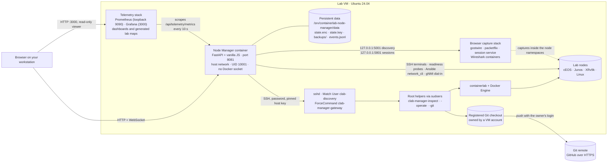
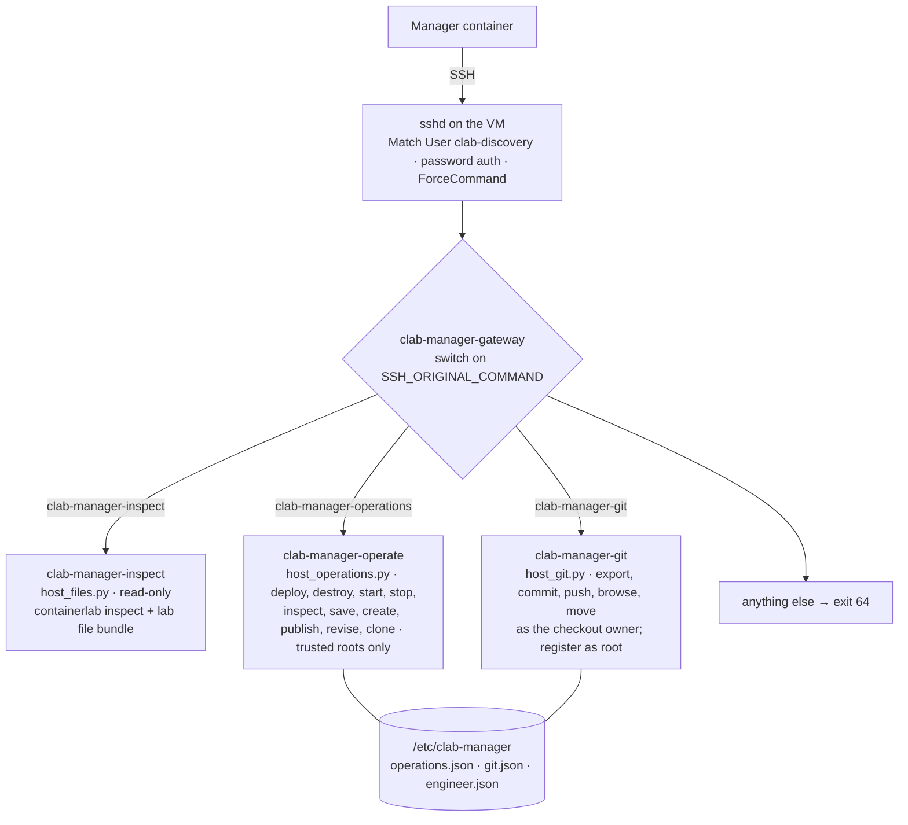
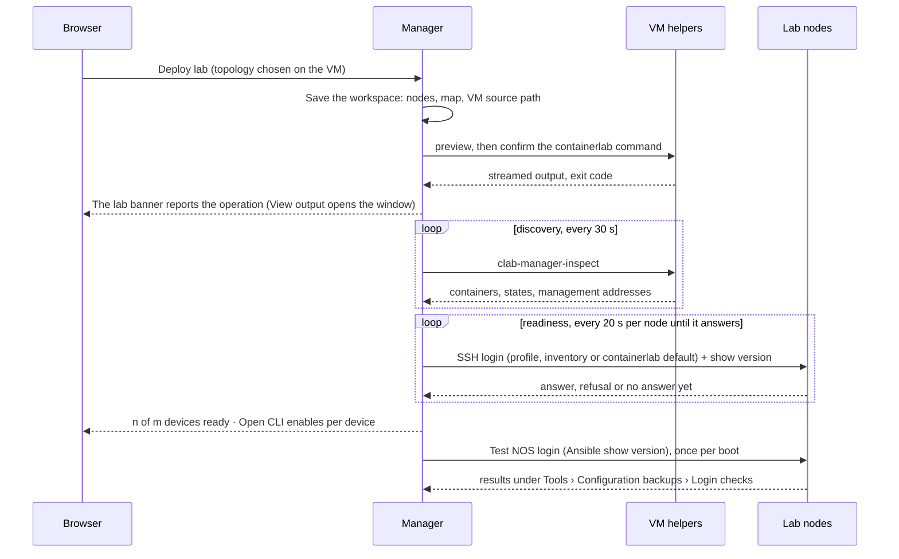
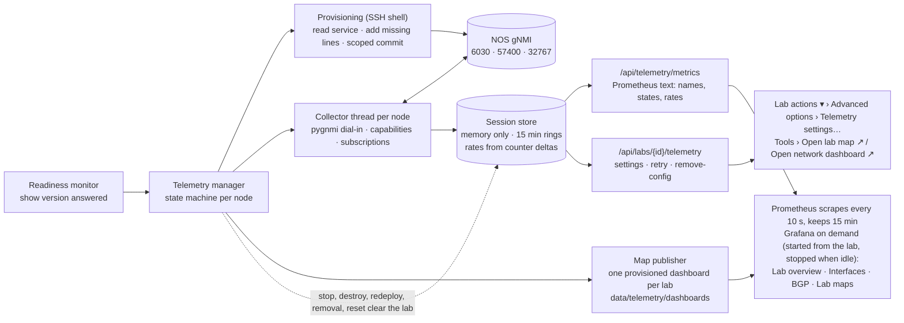
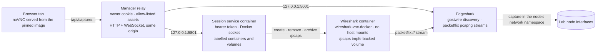

# Architecture

The manager is one container on the lab VM. It talks to the VM through a single
restricted SSH account, to the lab nodes through SSH, Ansible and gNMI, and to the
browser capture stack through localhost; the Grafana stack beside it scrapes the
manager's metrics. This page shows those relationships, the sequence that turns a
topology file into a usable lab, and which module owns what.

## System overview

## The VM access boundary

Everything the manager does on the host passes through one SSH account. Its only
shell command is a gateway that recognises three exact commands and starts the
matching helper through `sudo -n`; `/etc/sudoers.d` lists those helpers by full
path with an empty argument list, so nothing else can be run.

What each side can and cannot do:

| Party | Can | Cannot |
|---|---|---|
| Manager container | Serve the UI, keep encrypted state, open SSH to nodes and to `clab-discovery`, run Ansible against nodes | Reach the Docker socket, run arbitrary VM commands, read lab files outside the helper bundle |
| `clab-discovery` account | Start the three helpers through the gateway | Open a shell, run other commands, use SFTP in helper mode |
| Operations helper | Run containerlab on topology files under the trusted roots in `operations.json`, with every command reviewed and confirmed in the UI first | Touch files outside those roots, run commands the manager did not preview |
| Git helper | Export the workspace into a registered checkout and commit, push, list or move folders as its owner; as root, register another folder of an already registered checkout, or clone and register a repository for the VM account that owns the registered ones | Run Git as root, accept command text or credentials, read other owners' repositories |
| Capture session service | Create and remove labelled Wireshark containers from one pinned image | Accept images, commands, mounts or URLs from a client; it is never exposed to browsers |

## From topology file to usable lab

A node that stops or is redeployed goes back to *booting* and has to answer
again. Every Ansible run gets its own empty `known_hosts`, because lab containers
generate new SSH host keys on each deploy.

## Network telemetry

Only the per-lab setting and the exact configuration lines the manager added are
persisted, in the lab record. Samples never reach `state.enc`, the backups or Git;
the only files the feature writes are the generated lab-map dashboards under the
data directory. The manager UI draws no charts: Grafana is where telemetry is read.
Details, per-NOS support and the live acceptance procedure are in
[TELEMETRY.md](TELEMETRY.md); the map generator is described in
[GRAFANA-MAP.md](GRAFANA-MAP.md).

## Browser packet capture

Sessions are limited to four at a time, 15 minutes idle and two hours in total;
ending a session removes its container and files. Details, coverage and the
security notes are in [CAPTURE.md](CAPTURE.md).

## Where data lives

| Location | Owner | Contents |
|---|---|---|
| `/srv/containerlab-node-manager/data` | UID 10001 | `state.enc` (Fernet-encrypted workspaces, credentials, jobs), `state.key`, `backups/<lab>/latest` and `history/`, `events.jsonl` audit log |
| `/srv/containerlab-node-manager/projects` | root, group `clab_admins` | Trusted root for cloned or created topologies |
| `/etc/containerlab` | root, group `clab_admins` | Default trusted lab root; containerlab writes each lab's folder here |
| `/etc/clab-manager/` | root | `operations.json` (trusted roots, download permission), `git.json` (registered checkouts), `engineer.json` (VS Code account) |
| `/usr/local/lib/clab-manager/`, `/usr/local/sbin/clab-manager-*` | root | Installed helper copies and launchers |
| `/etc/ssh/clab-manager-password.conf`, `/etc/sudoers.d/clab-manager-*` | root | The `clab-discovery` SSH policy and the exact helper permissions |
| `/srv/containerlab-node-manager/telemetry/` | root; `plugins/` owned by Grafana's user (472) | `prometheus.yml` rendered for the manager's port; the pinned Flow panel plugin |
| `/srv/containerlab-node-manager/data/telemetry/dashboards/` | UID 10001 | One generated lab-map dashboard per lab, provisioned read-only into Grafana |
| A registered checkout, for example `~/labs/<repo>` | the VM account that owns it | Saved lab progress; pushed with that account's own Git login |
| `clab-backup-ui/.env` in the source folder | the installing account | Capture settings (`CAPTURE_*`) and telemetry settings (`TELEMETRY_*`) written by the two setup scripts, read when the manager is created or recreated |

Credentials never leave the encrypted state; API responses and logs scrub
passwords, keys and passphrases, and helper output is published only in complete
lines.

## Module map

| Module | Responsibility |
|---|---|
| `app/main.py` | Application factory, security headers and CSP, inventory, credential profiles, jobs and downloads, the public view of a lab |
| `app/downloads.py` | Download names, short device names, UTC timestamps, safe lookup of a job's snapshot files, ZIP and manifest assembly, legacy metadata backfill ([download names](../clab-backup-ui/NODE-FEATURES.md)) |
| `app/store.py` | Encrypted state file, atomic saves, bounded audit log, reset journal |
| `app/discovery.py`, `app/vm_files.py`, `app/host_files.py` | VM connection, 30-second inspection loop, address reconciliation, lab file bundles and import; `host_files.py` is the helper installed on the VM |
| `app/lab_operations.py`, `app/host_operations.py` | Reviewed containerlab commands with preview tokens and persistent output, topology browser and editor, diagram layout API; `host_operations.py` runs on the VM |
| `app/static/lab-builder.html`, `lab-builder-page.js`, `lab-builder.css`, `app/static/lab-builder/`, `lab-builder/` | The [lab builder](LAB-BUILDER.md): the page and its plain-JavaScript logic (browser drafts, starters, templates, reviewed save), the committed editor assets (SR Labs clab-ui, its licence, notices and hash manifest), and the build-time TypeScript project that produces them (never built on a VM). Saving uses the `publish` and `revise` actions of `host_operations.py` |
| `app/git_progress.py`, `app/host_git.py` | *Save progress*: capture, export, commit, push and history through the owner-scoped VM helper; the repository folder browser, folder moves and connecting a repository by URL. Junos snapshots also carry a hierarchical restore-grade artifact in the manifest |
| `app/restore.py`, `app/restore_junos.py` | *Apply to running lab*: a managed restore job that backs up each target first, then loads a saved Junos configuration onto the running node with `load override` and a confirmed commit and verifies the result. It runs over the manager's direct node-SSH path — no host helper — and serialises with backups, Git saves and lab operations |
| `app/runner.py` | Ansible `network_cli` backups and login tests, per-job environment and `known_hosts`, output validation, Git history of backups; Junos backups also capture the hierarchical restore candidate |
| `app/node_services.py` | SSH login checks and browser terminals over WebSocket |
| `app/node_readiness.py` | Readiness monitor: login and `show version` probes, SSH gating, the automatic login test |
| `app/telemetry.py`, `app/telemetry_adapters.py`, `app/telemetry_provision.py`, `app/telemetry_collector.py`, `app/telemetry_store.py`, `app/telemetry_names.py`, `app/telemetry_settings.py`, `app/telemetry_metrics.py`, `app/telemetry_map.py` | Automatic network telemetry: the per-node state machine and APIs, the EOS/IOS XR/Junos Evolved adapters (service lines, paths, encodings), the SSH provisioning driver, the pygnmi dial-in collector and normaliser, the bounded in-memory session store, wiring-name mapping, the persistent setting, the Prometheus exposition and the lab-map generator/publisher for the Grafana stack (`deploy/compose.telemetry.yml`, `deploy/setup-telemetry.sh`, `deploy/telemetry/`) |
| `app/grafana_control.py` | Grafana on demand: starts the dashboards container through the operations helper when a dashboard is opened and stops it after the idle time |
| `app/capture.py`, `app/capture_sessions.py`, `app/capture_service.py` | Edgeshark discovery and identity checks, the manager-side relay, and the separate session service that owns the Docker socket |
| `app/topology.py`, `app/layout.py`, `app/drawio_export.py` | Maps from annotations and YAML, layout persistence, draw.io and SuperPuTTY exports |
| `app/diagnostics.py` | The debug panel and its VM probes |
| `app/inventory.py` | Ansible inventory parsing, supported kinds and their documented default logins |
| `app/static/` | The manager UI, plain scripts loaded by `index.html` in a fixed order with no build step: `status.js` (student status vocabulary), `shell.js` (hash router, menus, browser storage), `app.js` (state, rendering, the Grafana link), `topology-render.js` and `topology.js` (the map and its menu), `home.js` (Home: the Deploy and Build cards, Recent labs), `management.js` (VM connection, labs found on the VM, import), `operations.js` (lab commands, topology browser, upload, Telemetry settings), `diagram-editor.js` (the basic map editor for a lab without a topology text), `git-progress.js` and `git-places.js` (the Progress tab and the repository folder browser), `restore.js` (*Apply to running lab*), `capture.js` (Wireshark). Standalone pages with their own scripts: `terminal`, `workspace` (CLI launcher), `grafana`, `debug` (Diagnostics), `vm-connection`, `capture-setup`, `capture-session`, and `map-editor.html` with `map-editor-page.js` (*Edit map*: the lab builder's editor restricted to the map, saving through the map-document API) |
| `deploy/` | `install.sh` and `install-manager.py` (guided installer), `start-manager.sh` and `recreate-manager.sh`, the `setup-*.sh` VM scripts (discovery, operations, engineer access, Git, capture, telemetry), `check-install.sh` with `check_*.py`, the two stack Compose files with `capture/smoke.py` and `telemetry/smoke.py`, `verify-release.py` and `set-release.py` |
