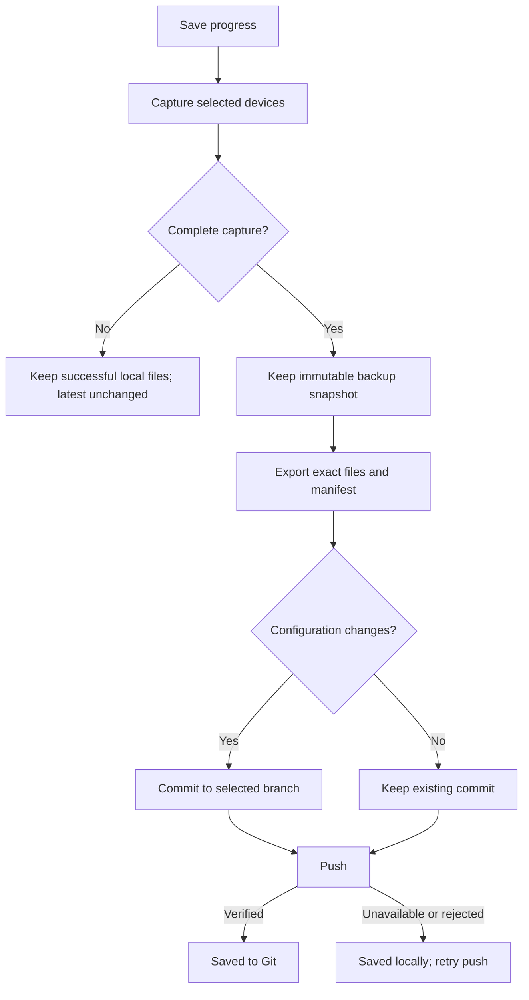
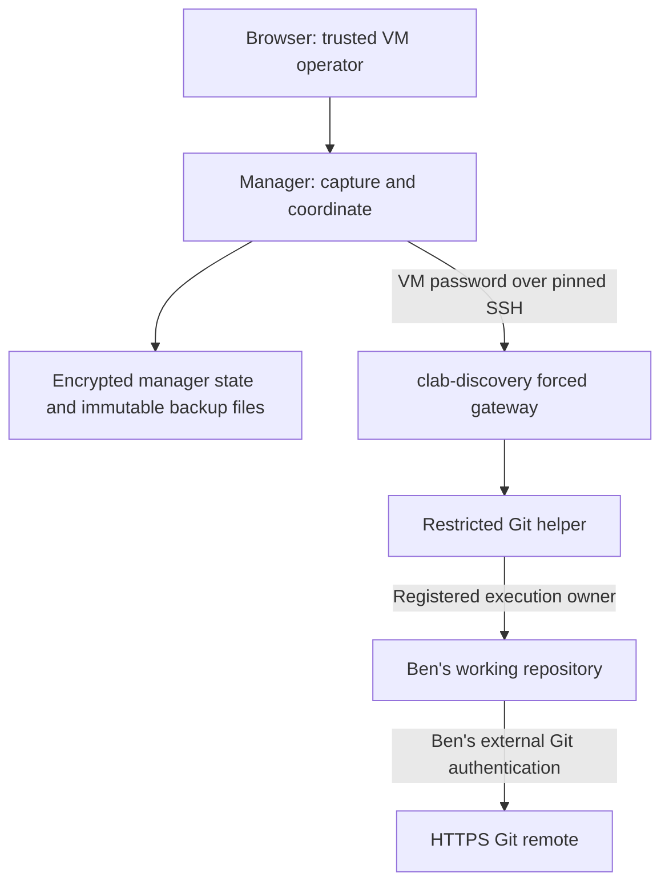
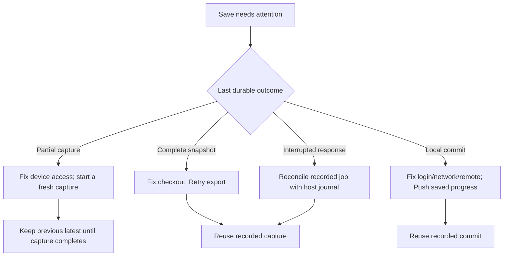
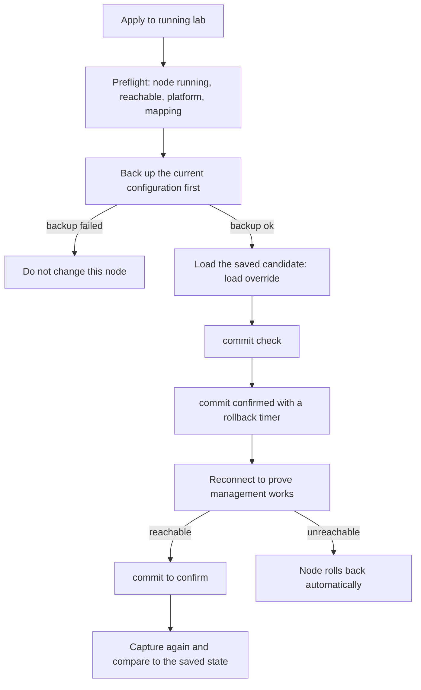

# Save lab progress to Git

Choose where a lab's progress is saved once (the first **Save progress** asks; the
**Progress** tab's *Save location* card holds the setting afterwards), then use
**Save progress** to capture its selected devices, save the complete capture in that
repository, commit changed configurations and push. Ben keeps his existing Git login and
commit identity. The manager never asks for his Git token.

The Git helper is installed on the VM by the guided installer and refreshed by every
upgrade; see [the installation guide](INSTALL.md) and [VM connection](VM-CONNECTION.md).

## What each save means

Capture, local commit and remote push have separate outcomes. **Saved on VM**
means a configuration snapshot or Git commit exists locally; **Pushed** means
the push was verified. A failed push does not turn a successful device capture
into a failed backup.



Only configurations and their manifest enter the Git commit. Existing topology
YAML, annotations, README files and unrelated edits stay outside the export. The
manifest records the lab, selected and excluded nodes, capture identity, topology
provenance, configuration formats and file checksums. Git export uses one completed
backup job, not the rolling `latest` backup directory that can contain files from
different capture attempts.

A progress save supports up to 500 devices, with nonempty UTF-8 configurations
up to 2 MiB each and 16 MiB in total. Oversized or incomplete captures do not
replace the repository snapshot.

## One-time setup

Start with [GIT-SETUP.md](GIT-SETUP.md). On the Ubuntu VM, run this as the existing
ordinary account, without sudo, from any directory:

```bash
bash "$HOME/projects/clab-manager/deploy/setup-git.sh"
```

The guided flow prepares the checkout, owner-scoped HTTPS login and commit
identity, then registers the current branch after noninteractive validation.
No additional Linux account is needed on a standalone VM. Linux and GitHub
usernames do not need to match. Existing working installations should upgrade
with `start-manager.sh` or `setup-git.sh --refresh` and retain their current owner.

In the lab, open the **Progress** tab. The first **Save progress** asks where the
lab's progress should be saved — the registered repository, a folder in it and the
devices to include — and the *Save location* card keeps the same settings for later
changes. **Save progress** then captures, commits and pushes automatically. A separate
Commit button is not needed.

The following sections are manual authentication and recovery reference. The
quickstart guide covers advanced registration, other HTTPS providers and separate
owners. Git authentication remains separate from the `clab-discovery` VM password.

## GitHub HTTPS login on the VM

GitHub does not accept the account's website password for HTTPS Git operations.
Use GitHub CLI to configure the repository owner's Git authentication.
The GitHub account must have write access to the intended repository.
See [GitHub authentication](https://docs.github.com/en/authentication/keeping-your-account-and-data-secure/about-authentication-to-github).

On Ubuntu 24.04, the VM administrator can install the
[GitHub CLI package](https://packages.ubuntu.com/noble/gh):

```bash
sudo apt update
sudo apt install gh
```

Then run the following **as the registered repository owner**, without sudo.
For the standalone installation, this can be the existing VM account; creating a
separate engineer account is optional.

```bash
gh auth login --hostname github.com --git-protocol https --web
gh auth setup-git --hostname github.com
gh auth status --hostname github.com
```

Complete the browser authorization using the URL and one-time code shown by the
command. On a VM without a desktop, use your workstation browser. The login and
Git credential helper must belong to the same Linux account selected by
`--owner`. See [CLI login](https://cli.github.com/manual/gh_auth_login) and
[Git credential setup](https://cli.github.com/manual/gh_auth_setup-git).

Git commit identity is configured separately. Inside the checkout, verify it:

```bash
git var GIT_AUTHOR_IDENT
git var GIT_COMMITTER_IDENT
```

If identity is missing, set repository-local `user.name` and `user.email` to your
intended author name and email before the first manager save. Authentication
alone does not supply these settings.

### Recovery after manually committing a failed manager export

If you already committed the exported files from the CLI, finish publishing that
manual commit as the repository owner. For a checkout on `main` with `origin`:

```bash
git push origin main
git status -sb
```

After the push succeeds, use **Keep snapshot only** on the superseded failed
manager saves, then start a new **Save progress**. Dismissal preserves backup
files and Git commits. A CLI commit changes the original export's expected
history; the old operation cannot always resume it, and the manager will not
automatically push unrelated unpublished commits. Normal manager saves commit
automatically; after an ordinary failure, retry the original job first.

## Repository layout

```text
BENS-BGP-LAB/
├── BENS-BGP-LAB.clab.yaml          existing file; not rewritten by saves
├── latest/
│   ├── PE1.cfg
│   ├── PE2.cfg
│   └── manifest.json
├── baseline/
│   ├── PE1.cfg
│   └── manifest.json
└── checkpoints/
    └── bgp-peering-working/
        ├── PE1.cfg
        └── manifest.json
```

Names above illustrate the layout; the exporter chooses stable filenames from
node identity and configuration format. Repeated saves update `latest/`; Git
history preserves earlier contents. Capture timestamps alone do not create an
extra commit when the configurations and meaningful metadata are unchanged.

**Set baseline…** changes `baseline/` explicitly. Replacing an existing baseline
requires review. **Create checkpoint…** creates a named milestone; choose a new name
for another milestone (the dialog shows the folder name it becomes as you type). The helpers reject unsafe paths, overlapping registered
destinations and unsupported repository layouts rather than guessing a location.

When one repository holds several labs, each lab registers a **subfolder** and the
whole `latest/`, `baseline/` and `checkpoints/` layout nests under it, for example
`bgp/latest/` and `eth/latest/`. Guided setup prompts for the subfolder; see
[GIT-SETUP.md](GIT-SETUP.md#one-repository-one-subfolder-per-lab). Each lab in the
manager connects to its own subfolder registration, so saving one lab never rewrites
another lab's folder.

## Everyday buttons

The lab header carries **Save progress** with a small menu (Create checkpoint…, Save on
this VM only, Saved versions & history, Save location settings…); the **Progress** tab
repeats them on its status card, whose **More ▾** adds the rest.

| Action | Result |
|---|---|
| **Save progress** | Capture the configured device selection, export `latest`, commit changes and push; the *review before upload* preference pauses before the push. A save that succeeds only shows a toast; the save window opens on its own when something needs you. |
| **Save on this VM only** | Capture and commit without pushing. |
| **Create checkpoint…** | Capture a named milestone in `checkpoints/<name>`. |
| **Set baseline…** | Select a complete recorded capture for `baseline`; replacing one is reviewed explicitly. |
| **Saved versions** (View / Compare with my latest save / Apply to running lab…) | The card lists *Latest*, *Checkpoints*, *Baseline*, the *Instructor and reference versions* kept in other folders of the repository and, folded, the other labs saving to it. *View* shows a version's files and offers the ZIP download; *Compare with my latest save* diffs it against the lab's `latest/` (never against the running devices); *Apply to running lab…* replaces the running configuration of the selected Junos devices with that version (no reboot; backed up first) without changing where the lab saves. |
| **Full history…** | Every commit of the lab's folder with its versions. |
| **Upload saved progress** / **Upload now** | Publish the existing saved commit without recapturing devices. |
| **Update from the repository** | Update an eligible clean checkout using a fast-forward; no merge/rebase conflict resolution. |
| **Recent saves** (Open / Upload now / Keep snapshot only) | One row per save with what happened; *Open* shows the save window with the details and retries. |
| **Save location settings…** / the *Save location* card | The repository and folder the lab saves to, the devices included in every save and the review preference; **Change folder…** opens the folder browser, **Browse the repository…** under *Saved versions* opens the same browser. |
| **Save this lab here** | Move this lab to the selected folder of its repository, optionally with the files already saved. |
| **New folder…** | Create a folder in the repository for this lab (or for a later lab). |
| **Use a different repository…** / **Connect by URL…** | Switch to another registered checkout, or connect a repository by its HTTPS URL. |

<a id="where-this-lab-lives"></a>

## Save location

The **Progress** tab's *Save location* card names the repository and folder the lab
saves to. **Change folder…** (or **Browse the repository…** under *Saved versions*)
shows the connected repository as a file browser would: the folder path at the top, a
folder outline on the left and the contents of the selected folder on the right. The listing is the repository's current commit as it is on the VM,
so it matches what GitHub shows once the last save was pushed. The manager reads the
checkout through the Git helper; it never reads GitHub, and the browser sends only
registration IDs and folder names.

- The folder this lab saves to is tagged **This lab**; a folder another lab saves to is
  tagged with that lab's name. `latest/`, `baseline/` and `checkpoints/` are described in
  plain words, and a lab folder that has never been saved to reads *created on first
  save*, because Git only shows a folder once a file is committed in it.
- **Save this lab here** moves the lab to the selected folder. The folder becomes the
  lab's registered destination, the device selection and review preference stay as they
  were, and the lab's previous folder registration is retired. When files were already
  saved under the old folder, the confirmation offers to move them along: every
  `latest/`, `baseline/` and `checkpoints/` file of the old folder is moved in one commit
  and pushed, and the move is recorded as a *Folder move* job with the same retry, review
  and push handling as a save. Earlier versions stay in Git history either way; a pending
  save has to finish or be dismissed first.
- **New folder…** creates a folder beside the existing ones. It accepts a whole nested
  path such as `Week-04/BGP/Final-State`, so a deep destination like
  `CCNP-SP/Labs/Week-04/BGP/Final-State` is created in one step; the dialog shows the
  resulting `repository / folder` destination as you type. With *Save this lab here*
  ticked, the lab moves into it immediately; otherwise the folder is only registered and
  waits for a lab.
- Folders of one repository never overlap: a folder cannot be created inside another
  lab's folder, `latest/`, `baseline/` and `checkpoints/` cannot be chosen as
  destinations, and a repository that a lab saves to at its root cannot also hold lab
  folders unless that lab moves first. The VM helper enforces the same rules again.

A moved lab keeps working with its old saves: *Saved versions* and *Full history…*
read the commits of the new folder, and the commit that moved the files lists
every file as moved. A dismissed save whose commit was never pushed stays outside the
new folder's history; publish it as the repository owner if it is still wanted.

Git commands are constructed by the helper from fixed operations. The UI accepts
repository IDs and reviewed choices, not arbitrary command lines. Commits include
the exact exported paths. A dirty checkout, unexpected staged work, changed branch
or remote, hooks/filters that alter exported files, or conflicting history can
require attention.
There is no force push, automatic stash, destructive reset or broad `git add .`.

Ordinary backup schedules still create manager backups. They do not automatically
publish configurations to Ben's remote repository. Saving progress is an explicit
action, and the downloads under **Tools › Configuration backups** remain available.

## Running account and persistence



The privileged entry point validates the registered owner/repository and drops
privileges before running Git. Git uses Ben's HOME, author configuration and
credential helper. The manager container neither mounts Ben's checkout nor needs
his token. The existing restricted VM SSH gateway stays in place.

The browser has no account login in this release. **Ben is the VM execution owner**,
not a signed-in web user. People with access to this manager share its authority
over the registered repositories. Use one trusted operator per VM, or a group
deliberately sharing that authority. Separate Ben/Alice browser permissions are
not implemented by registering two Linux owners.

| Data | Location / recovery requirement |
|---|---|
| Lab repository selection, scope and progress jobs | Encrypted manager state under `/srv/containerlab-node-manager/data`; keep `state.key` with `state.enc`. |
| Immutable captured configurations | Manager `backups/<lab-id>/history/<backup-job-id>`; included in a complete data archive. |
| Exported configurations and local Git commits | Ben's registered checkout; back it up independently until all intended commits are pushed. |
| Git credentials | Ben's external credential configuration; provision it again when rebuilding a VM. |
| Host registration | `/etc/clab-manager/git.json`, written by guided setup and by the manager's folder and connect actions through the helper; retain the root-owned registration when backing up the VM. |
| Host journal and transfer snapshots | `<checkout>/.git/clab-manager/`; retain these with the complete checkout for interrupted-save recovery. |

Back up the whole manager data directory, the registered checkout and its helper
registration/journal. A manager data archive alone does not include Ben's working
repository or external Git authentication. A remote Git repository alone does not
include unpublished snapshots, manager device credentials or diagram edits.

## Failure and recovery



| Message or condition | Next step |
|---|---|
| A selected device failed | Inspect the save under **Recent saves** (or the backup under Tools › Configuration backups), repair access and start a new save. Successful files remain local; the repository's complete latest is retained. |
| Complete snapshot; repository needs attention | Resolve the reported checkout problem as Ben, then **Retry export** from that job. |
| Commit exists; push failed or review is required | Review the recorded commit and use **Upload now** on its row (or the banner's *Retry*). No new capture is needed. |
| Remote advanced / push rejected | Inspect the repository as Ben. Resolve divergence outside the app; never force push merely to clear the status. |
| Unexpected branch, URL, owner or repository identity | Restore the registered destination or deliberately register/reconnect the intended checkout after resolving pending work. |
| The wrong repository is connected | Choose **Use a different repository…** on the *Save location* card: pick another registered checkout, or connect the right one by its HTTPS URL. Nothing is deleted from either repository; files already saved stay where they are. |
| The lab saves to the wrong folder | **Change folder…** on the *Save location* card, select the intended folder and choose **Save this lab here**, optionally moving the files already saved. |
| Helper unavailable or older than the manager | Run `sudo bash "$HOME/projects/clab-manager/deploy/setup-git.sh" --refresh` from the source that matches the running manager and refresh repository status. |
| Manager restarted during a save | Open the recorded job and retry. The coordinator reconciles the recorded operation with the VM journal rather than silently recapturing. |
| Git authentication expired | Repair Ben's Git login on the VM, then retry the existing push. Changing the VM SSH password does not repair Git credentials. |

Active progress jobs prevent conflicting lab operations. Pending saves also block
actions that would forget or redirect their context, including removing the lab,
starting fresh, replacing the repository connection and changing the VM identity.
Password rotation for the same VM/account is allowed so that access can be repaired.

To stop pursuing a pending export, choose **Keep snapshot only** and confirm the
explicit dismissal. It retains the captured backup and any existing Git commit,
then permits disconnect/removal. This does not unpublish a remote commit or undo
files already saved to the checkout. A later **Start fresh** still deletes manager
backup files after its normal confirmation; Ben's checkout and Git remote remain
outside manager storage.

## Loading an earlier lab version

**View** on a saved version (or a commit in **Full history…**) retrieves its files:
review the manifest and download the configuration ZIP. Downloading does not
switch the repository branch, rewrite the original lab YAML or redeploy the lab.

Older backup jobs can have unknown topology provenance; the UI does not represent
the current topology as the topology used for that historical capture.

## Apply a saved configuration to a running node

A saved Junos configuration can be applied to the running lab in two ways, both of
which converge the running node to exactly the saved configuration without a reboot or
a containerlab redeploy:

- **From the saved versions (simplest).** On the **Progress** tab, every version whose
  folder holds a saved Junos state (its `latest/` carries a restore-grade candidate)
  offers **Apply to running lab…** — the lab's own *Latest*, and the *Instructor and
  reference versions* kept in other folders of the same repository. **Browse the
  repository…** (or *Save location › Change folder…*) reaches any other folder with the
  same button. The lab does **not** have to save to that folder — you can keep saving
  wherever you save and still apply Base, working, Final or Broken straight from their
  folders. This makes a repository of named states a pick-and-load library.
- **From a specific commit.** Open a version in **Full history…** and choose
  **Apply to running lab…** to apply that commit's snapshot.



- **Complete replacement, not a merge.** Junos `show configuration | display set` output
  can only be *added* with `load set`, so it cannot remove a statement a student added
  that is not in the saved version. Every Junos backup therefore also captures a
  hierarchical restore-grade candidate (`show configuration`) and records it in the
  snapshot manifest. The restore loads that candidate with `load override terminal`, so a
  stale statement is removed, a changed statement is reset and a deleted desired statement
  is put back.
- **Backed up first.** The manager captures a fresh backup of every target node before it
  changes anything and references that backup's job id in the restore result. If the
  pre-restore backup fails for a node, that node is not modified.
- **Commit-confirmed safety.** The candidate is activated with `commit confirmed`. The
  manager then reconnects over SSH to prove the node is still reachable and only then runs
  a plain `commit` to make the change permanent. If management is lost, the node rolls
  back to the pre-restore configuration on its own when the timer expires. The rollback
  timer defaults to five minutes and is adjustable under *Advanced options* of the review.
- **Root-authentication.** The `juniper_cjunosevolved` lab image boots without a
  `root-authentication` statement and rejects any later commit that still lacks it. When
  the saved configuration has no root-authentication, the restore synthesises one from the
  saved configuration's own superuser login password so the node stays reachable and can
  commit; this is the only statement the restore may add beyond the saved state.
- **Verified.** After confirming, the manager captures the node again, normalises it the
  same way a backup is normalised and compares it to the saved desired state, so the
  result shows that the stale statements are gone and the desired statements are present.
- **Supported platforms.** Live restore covers `juniper_cjunosevolved` and
  `juniper_vjunosswitch`. IOS-XR and EOS versions remain view/download only.
- **Legacy snapshots.** A version saved before release 1.28.0 has no restore-grade
  artifact in its manifest; it is offered as view/download only and cannot be applied.

Captures retain their real format: Junos display-set output and IOS-XR/EOS running
configuration text are not universally interchangeable startup files, and the display-set
file stays the canonical human-readable and comparison form.

## Upgrade and validation

Upgrade the manager with the installer, retaining its persistent data; the
launcher refreshes the Git helper when a registry already exists. To refresh only
that helper, use `sudo bash "$HOME/projects/clab-manager/deploy/setup-git.sh"
--refresh` from the same source. This preserves registration IDs and revisions. Existing VM
passwords, labs, device profiles and backup files are retained. No remote repository is created,
and no user repository is pushed merely by installing the helper.

Registering unchanged settings preserves the ID, revision and original anchor
even when ordinary saves advanced HEAD. Changed settings create a new revision.
Use `--refresh` for routine code upgrades. Before changing
a registration, resolve pending saves and reconnect the lab afterward so it uses
the new revision. A registration binds the selected branch and push destination;
changing either outside the app requires deliberate registration and reconnection.

Before adopting the workflow on a real lab, verify a first save and unchanged save
against a disposable repository, then a locally saved commit and manual push retry.
Check baseline replacement, a named checkpoint and ZIP retrieval. Review the
release's [validation record](../clab-backup-ui/VALIDATION.md) for the exact automated
and platform-specific coverage. Linux owner switching, the external credential
helper, the selected Git service and real network devices need validation in the
deployment environment; a local source delivery does not establish those results.

The earlier [architecture proposal](archive/GIT-LAB-PROGRESS-PROPOSAL.md) records the broader
save-and-resume design. This guide describes the delivered save/export workflow;
the proposal's future restore and optional convenience stages remain separate work.
