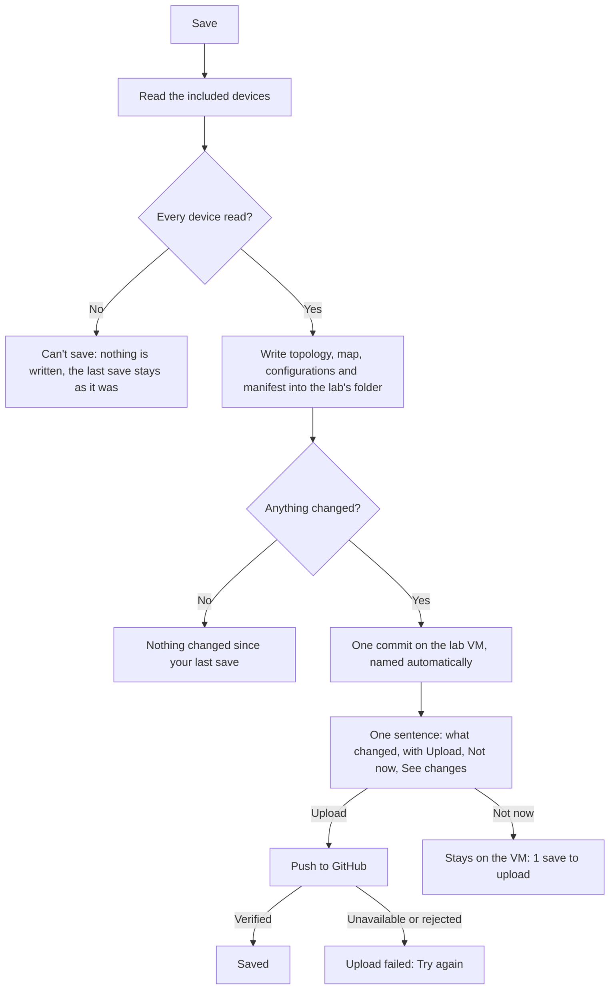
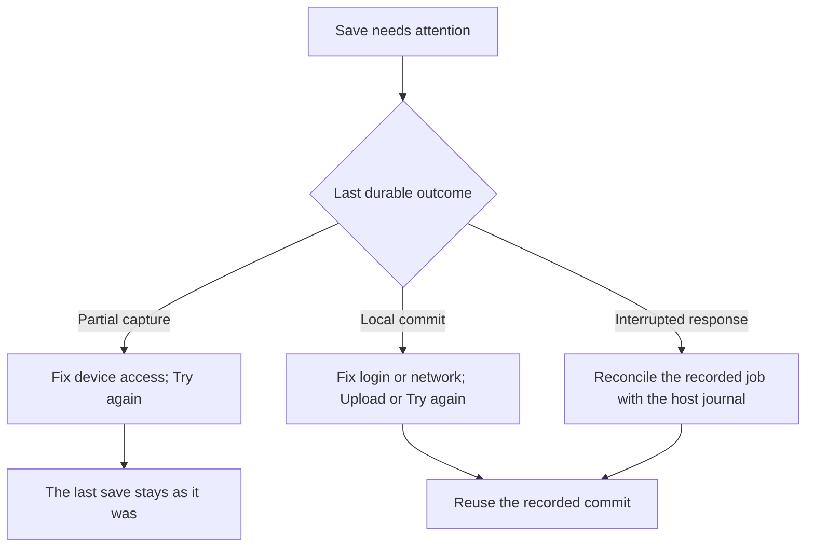
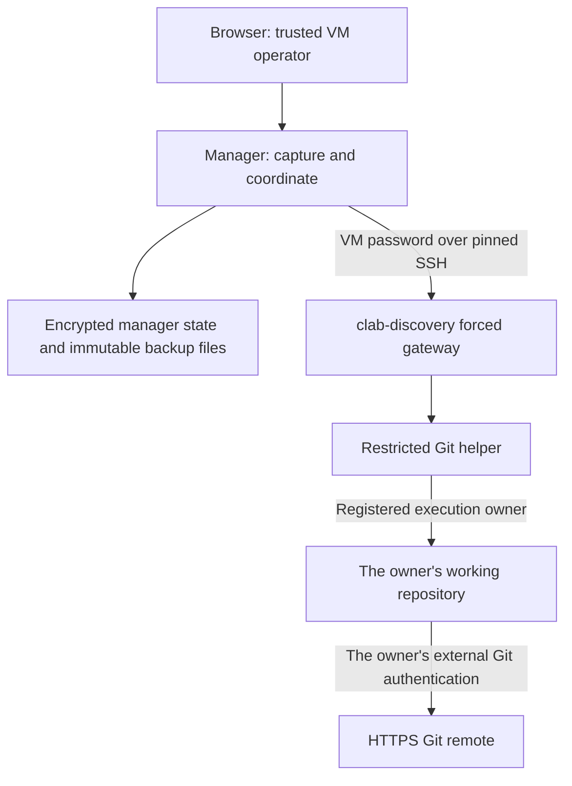

# Save lab progress to Git

Every lab has a **Save** button and a **Load** button in its header, on every tab. **Save** puts the
whole lab, as it is now, into one folder of a Git repository: the topology file, the map and the
configuration of every included device. **Load** puts a saved state back onto the running devices.
Between them sits the chip, a short line that always says where the lab stands (`Saved 21 min ago`,
`1 save to upload`, `Can’t save`, `Running Start`, …).

Nothing reaches GitHub until you press **Upload**. The manager never asks for a Git token: the lab VM
uses its own GitHub login, set up once by the administrator. You keep your existing Git login and
commit identity.

The Git helper is installed on the VM by the guided installer and refreshed by every upgrade; see
[the installation guide](INSTALL.md) and [VM connection](VM-CONNECTION.md). Course authors who make
Start, Broken and Final states for their students: [Lab states for a course](COURSE-STATES.md).

## What a save is

A save is **the whole lab in one folder of the repository, as one commit**. The files are:

- the topology file (`<lab>.clab.yml`) and the map (`<lab>.clab.yml.annotations.json`);
- one configuration per included device (`<node>.cfg`), and beside it, on a platform that can be
  loaded, the file Load uses (`<node>.jcfg`, `<node>.eoscfg` or `<node>.xrcfg`);
- `manifest.json`, which records the lab, the included devices, when the save was made and a checksum
  of every file.

The commit is made on the lab VM, in the repository's checkout (**Save settings › Git details** shows
its path). It is on GitHub only after you press **Upload**. A save on the VM is already a complete,
loadable save; the upload is the copy that survives the VM.

Which topology and which map a save takes:

- **The topology** is the file the lab runs: the deployed topology beside the lab on the VM. A save is
  what the lab is, not what it was meant to be. A lab imported from an inventory has no topology file
  in the manager; it saves its device configurations only, and **Save settings** says so, with
  **Update topology file…**.
- **The map** is the one you changed in the manager since the VM's map file was last read into it;
  otherwise it is the VM's file. A map edited on the Topology tab is therefore saved, and a map file
  changed on the VM afterwards wins over an older copy in the manager.
- If the topology or the map cannot be written into the save, the save stops with `The topology could
  not be saved with this capture. Try again.` and nothing is committed.

A topology file can carry what you wrote into it (an environment variable with a password, a startup
configuration path). Like the device configurations beside it, it reaches the repository, and the
**See changes** view shows it before an upload. Every panel that saves says it: `Saved files can
contain passwords or keys.`

A save holds up to 500 devices, nonempty UTF-8 configurations up to 2 MiB each and 16 MiB in total.
An incomplete or oversized capture does not replace what the repository already holds.

## One-time setup

Start with [GIT-SETUP.md](GIT-SETUP.md). On the Ubuntu VM, run this as the existing ordinary account,
without sudo, from any directory:

```bash
bash "$HOME/projects/clab-manager/deploy/setup-git.sh"
```

The guided flow prepares the checkout, the owner-scoped HTTPS login and the commit identity, then
registers the current branch after noninteractive validation. No additional Linux account is needed
on a standalone VM. Linux and GitHub usernames do not need to match. Existing working installations
upgrade with `start-manager.sh` or `setup-git.sh --refresh` and keep their current owner.

In the lab, the first **Save** asks where the lab should save (see [The first save](#the-first-save));
after that, **Save settings** holds the same choices.

The following sections are manual authentication and recovery reference. The quickstart guide covers
advanced registration, other HTTPS providers and separate owners. Git authentication remains separate
from the `clab-discovery` VM password.

## GitHub HTTPS login on the VM

GitHub does not accept the account's website password for HTTPS Git operations. Use GitHub CLI to
configure the repository owner's Git authentication. The GitHub account must have write access to the
intended repository. See
[GitHub authentication](https://docs.github.com/en/authentication/keeping-your-account-and-data-secure/about-authentication-to-github).

On Ubuntu 24.04, the VM administrator can install the
[GitHub CLI package](https://packages.ubuntu.com/noble/gh):

```bash
sudo apt update
sudo apt install gh
```

Then run the following **as the registered repository owner**, without sudo. For the standalone
installation, this can be the existing VM account; creating a separate engineer account is optional.

```bash
gh auth login --hostname github.com --git-protocol https --web
gh auth setup-git --hostname github.com
gh auth status --hostname github.com
```

Complete the browser authorization using the URL and one-time code shown by the command. On a VM
without a desktop, use your workstation browser. The login and Git credential helper must belong to
the same Linux account selected by `--owner`. See [CLI login](https://cli.github.com/manual/gh_auth_login)
and [Git credential setup](https://cli.github.com/manual/gh_auth_setup-git).

Git commit identity is configured separately. Inside the checkout, verify it:

```bash
git var GIT_AUTHOR_IDENT
git var GIT_COMMITTER_IDENT
```

If identity is missing, set repository-local `user.name` and `user.email` to your intended author name
and email before the first manager save. Authentication alone does not supply these settings.

## Saving

Press **Save** in the lab header. The manager reads the included devices, writes the whole lab into the
lab's folder as one commit on the VM, and then says in one sentence what changed. You keep working
while it runs: the chip reads `Saving…` and the panel says `Reading the configuration of 4 devices.
You can keep working.`


```mermaid
flowchart TD
    A[Save] --> B[Read the included devices]
    B --> C{Every device read?}
    C -- No --> D[Can't save: nothing is written, the last save stays as it was]
    C -- Yes --> E[Write topology, map, configurations and manifest into the lab's folder]
    E --> F{Anything changed?}
    F -- No --> G[Nothing changed since your last save]
    F -- Yes --> H[One commit on the lab VM, named automatically]
    H --> I[One sentence: what changed, with Upload, Not now, See changes]
    I -- Upload --> J[Push to GitHub]
    I -- Not now --> K[Stays on the VM: 1 save to upload]
    J -- Verified --> L[Saved]
    J -- Unavailable or rejected --> M[Upload failed: Try again]
```

### The chip

The chip is the only place that decides what state the lab is in. Open it to see what it means and
what you can do. These are its states, in the order the manager checks them (the first that holds is
shown):

| Chip | What it means | What you can do |
|---|---|---|
| `Loading… 2 of 4` | A load is running; each device that has an answer is counted. `Checking devices…` appears while the manager reads devices back after a restart. | Wait; **Save** and **Load** are off until it ends. |
| `Saving…`, `Uploading…`, `Updating…` | A save, an upload or an update from the repository is running. | Keep working; **Save** is off until it ends. |
| `Can’t save` | The last attempt to save failed, or the repository cannot take a save now. The panel says why (see [When saving is not possible](#when-saving-is-not-possible)). | The action the panel offers. |
| `Loaded 3 of 4` | The newest load changed the devices, but not every device ended `Loaded`. | **Details**, **Try … again**, **Undo this load**. |
| `Running Start` | The newest load succeeded and you have not saved since. The name is the state that was loaded. | **What changed**, **Undo this load**, or **Save** to keep what runs now. |
| `Upload failed` | A save is on the VM but the upload did not work. | **Try again**. |
| `1 save to upload`, `3 saves to upload` | Saves are on the VM and not on GitHub. | **Upload**. |
| `Saved 21 min ago` | The newest save that changed something is uploaded, or the lab has only unchanged saves. | Nothing needed. |
| `Kept on this VM` | Every save of the lab was put aside with **Keep snapshot only**. | **Save**. |
| `Not saved yet` | The lab has never been saved. | **Save**. |

After a load the chip says what the devices run now, because **Save** then saves what the devices run
now. A state the chip hides (a waiting upload, a failed attempt, a load) stays one click away as a line
`Also: 1 save to upload.` with **Show**.

**Save** is off, with the reason written beside it, while a load or a save runs, while the place to
save is being set, and while a backup or a lab operation is running (`A backup or lab operation is
running. Save is available when it finishes.`).

### After a save: Upload, Not now, See changes, Details

When the save has made a commit, the chip panel (title `Not uploaded yet`) opens by itself and says in
one sentence what changed, for example `2 devices changed since your last save: ceos and xrv9k. 14
lines added, 3 removed.` It also says where the save goes (`To: Course-Labs › BGP`) and offers:

- **Upload** sends the save to GitHub. This is the only button that uploads.
- **Not now** closes the panel. The save stays on the VM and the chip reads `1 save to upload`.
- **See changes** opens the **What changed** drawer: a line-by-line view of every file the save
  changed, device by device, with the topology and the map as their own entries. A device's loadable
  file is shown under the device, not as a second change.
- **Details** opens the save's window with its job record, its commit and **Keep snapshot only**, which
  stops the manager waiting for the upload of this save. Nothing is deleted: the commit stays on the VM
  and goes along with the next upload from that checkout, and the upload sentence names it then.

**Upload is enabled once the manager has read what the upload sends** (`Checking what this upload
sends…`). The sentence names every save the upload carries. Git pushes a branch, not a single save, so
an upload sends every save of that repository that is not on GitHub yet, whichever lab made it:
`This upload also sends 2 other saves: Start (BGP), ceos changed (Static routes).` The **What changed**
drawer lists each of them under **Also in this upload**, with its files. No upload carries a save you
were not shown.

Another lab's waiting save does **not** stop your save: you can save while any save waits. Only the
upload carries them together.

If someone saved in the repository after the sentence was shown, **Upload** answers `Another save was
made in this repository. Look at the changes again.` and shows the changed sentence before anything is
sent.

### An unchanged save

When nothing changed since the last save, the page says `Nothing changed since your last save.` and no
new commit is made. If the last save is not uploaded yet, the sentence says `Nothing changed since your
last save, which is not uploaded yet.` and **Upload** still sends it.

### A failed upload

`Upload failed` means `Your save is safe on the lab VM, but it could not be uploaded to github.com.`
or, when the online copy cannot be reached, `…but github.com could not be reached.` **Try again**
repeats the upload; no device is read again. If the cause is the VM account's login, see
[Git authentication expired](#failure-and-recovery).

### The name of a save and renaming it

A save is named automatically from what changed: `ceos changed`, `ceos and xrv9k changed`, `ceos,
cjunos and xrv9k changed`, `4 devices changed`, `Topology changed`, `Map changed` or `First save`.
Devices are matched by name, not by file name.

When the chip reads `Saved <time>` after a save that was named automatically, its panel shows the name
as a field (`Name of this save`): type a new name (up to 120 characters, one line) and press Enter or
leave the field. The name changes
what the manager shows; the Git commit is not touched. An empty name returns to the automatic one. A
renamed save keeps its name in **All versions** and in the sentences of later uploads.

### Keep as a checkpoint

Tick **Keep as a checkpoint** beside the name (in the same panel) to keep this save under its name in the lab's
`checkpoints/` folder (`ceos-and-xrv9k-changed`, or `…-2` when the name is taken). No device is read:
the checkpoint is made from the capture of that save. The box is off, with the reason, when the capture
is no longer kept (`The capture of this save is no longer kept. Save again to make a checkpoint.`) or
does not include the topology (`This capture does not include the topology. Save again first.`). A
save that is already a checkpoint reads `Kept as checkpoint <name>.`

### The starting point

A lab can have one **starting point**: the save a student returns to. Open **All versions**, open one
of **Your saves** and choose **Use as starting point…**. The manager asks `Make this save the starting
point of <lab>? No device is read or changed.` and, when one exists, says `It replaces the current
starting point, saved <when>. The previous one stays in the history.` The button is **Use as starting
point**, or **Replace the starting point**. **Choose a backup as starting point…** (under *Starting
point*) offers a configuration backup instead of a save. The starting point is the lab's `baseline/`
folder.

## The first save

A lab that has never been saved shows the chip `Not saved yet`. Its panel looks for a place and
offers one:

- **The default place.** The repository the lab used last, else the one saved to most recently, else
  the first on the VM; and a folder named after the lab (`Your first save goes to Course-Labs, in a
  folder named BGP.`). If that name is taken, the folder is the lab's name with `-2`, `-3`, … so that
  one click on **Save** always works. If the folder already holds the saves of a lab with the same
  name but another identity (the lab was removed and imported again, or it is somebody else's lab of
  that name), the panel asks once: `This repository already holds saves of a lab named BGP.` with
  **Continue there** and **Save in BGP-2**. It never continues there silently. When the folder holds
  this lab's own earlier saves the sentence reads `Your saves continue in Course-Labs, in the folder
  BGP.`
- **Choose another place** opens the folder chooser (see [Folders](#folders)).
- **A repository by its address.** With no repository on the VM, the panel asks for the HTTPS address:
  `Your saves go to a repository on GitHub. Paste its address; ask your instructor if you do not have
  one.` Paste it into **Repository address (HTTPS)** and press **Save**. The VM's own GitHub login is
  used: you are never asked for a password or a token. Connecting can take a minute.
- **An empty repository.** A brand-new repository has no commit yet. The panel says `<name> is empty.
  The manager adds a README.md file to start it.` and offers **Start the repository**. That button
  uploads one fixed `README.md` that holds nothing of a lab, then continues with your save. The
  manager does it only when you press the button.

The place is set and the lab is saved in one click. **Save as a lab state…** is also offered here
(see [Lab states](#lab-states)).

## Folders

<a id="where-this-lab-lives"></a>
<a id="save-location"></a>

A lab saves into one folder of a repository, its **lab folder**. It can be **any folder**: at the top
level, inside, above or beside another lab's folder, or one you create. Inside the lab folder the
manager writes exactly three things, the lab's **saved-state folders**:

- `latest/`, the newest save, updated in place by every save (changed files get a new commit and
  Git history keeps the earlier contents);
- `baseline/`, the starting point;
- `checkpoints/<name>/`, one folder per checkpoint.

**Part of a saved state** means one of these folders or anything inside one, or any folder that holds a
`manifest.json`. Those names are reserved, so a folder cannot be created inside a saved state, and a
lab cannot save *into* one: choose `working/latest` in the chooser and the lab saves in `working`, the
lab folder above it (`working/latest is part of a saved state, so BGP saves in working, the lab folder
above it.`). A folder named `latest` higher up (`course/latest/working`) is an ordinary name.

### Choosing a folder

**Choose another place** (first save), **Change…** beside `Saves to:` in the chip panel, and **Change
folder…** in **Save settings** all open the same chooser, titled `Where should <lab> save?`:

- **Folder** is a field you can type a whole path into, such as `Week-04/BGP/Final-State`. The line
  under it, `Saves go to Course-Labs › Week-04/BGP/Final-State`, shows the result as you type. Unsafe
  characters are replaced by `-` and the corrected path is shown, never refused.
- The **folder tree** shows the repository as it is on the VM (what GitHub shows once the last save was
  uploaded). The manager reads the checkout through the Git helper; it never reads GitHub. Each folder
  with subfolders has an arrow that opens and closes it without selecting it; the tree keeps the
  branches you opened. Looking at a folder never changes where the lab saves.
- Marks beside a folder: `This lab saves here`, `<lab> saves here`, `Lab state: <name>`, and `New` for a
  folder that exists only in the manager's list until its first save. A folder that holds nothing yet
  reads `<folder> is new. It appears in the repository with the first save.` (Git keeps no empty
  folders.)
- **New folder…** is always available. It adds a folder below the one you are looking at, nested paths
  allowed, even inside another lab's folder; inside a saved state it adds the folder in the lab folder
  above and says so. A name that already exists selects that folder. **Remove from the list** takes a
  folder you added but never saved into off the manager's list again. Neither changes anything in the
  repository.
- **Save here** sets the folder. Nothing is lost by choosing again: earlier saves stay as versions.
- A very large repository lists only what fits; type the path of a folder that is not shown.

### The three questions

The manager asks a question, as buttons, only in three cases. None of them is an error.

1. **Another lab saves in the very same folder.** `BGP saves here too.` with **Save in <folder>/<this
   lab>** (suggested) and **Use this folder anyway**. The second button disconnects the other lab from
   the folder and connects this one; the other lab's saves stay as versions, and a save of it that is
   still waiting stays part of the next upload. When the folder only collides with the other lab's
   saved-state folders (it lies inside one, or one lies inside it) there is one button, **Save in
   <folder>/<this lab>**, and the note `<this lab> gets a folder of its own inside it.`
2. **The folder already holds a saved state of another lab or a course.** `This folder holds the state
   “Start”.` with **Save beside it in <folder>/<this lab>** (suggested) and **Replace it**. **Replace
   it** lets the lab's next save replace the files there; the older contents stay in the Git history.
   A state whose files are stored directly in the folder cannot be replaced, so the second button
   reads **Use this folder anyway** and the note says `the state “Start” stays listed: its files are
   stored directly in the folder and are not replaced.`
3. **A save of this lab still waits for upload** and you change the folder. `1 save of BGP is waiting
   for upload.` with **Upload it, then move** and **Move and keep that save on the VM only**. Both go
   ahead: the first uploads the waiting saves and then moves the lab; the second moves it and leaves
   the save waiting, still part of the next upload.

Choosing the folder the lab already uses reads `<lab> already saves here.` with **Keep saving here**; a
folder that holds the lab's own earlier saves reads `<lab> saved here before and continues there.`

### Bringing the saved files along

When the lab has saved files in the folder it leaves and the new folder holds none, the chooser adds
the line **Bring this lab’s saved files along**. Ticked, the lab's `latest/`, `baseline/` and
`checkpoints/` files move to the new folder in one commit. That commit is one more waiting save: it
waits for **Upload** like any save and never uploads by itself. The line is not offered while a save of
the lab has not finished (`A save of this lab has not finished. Its files stay in <folder>.`), because
that save would otherwise be written to the folder the lab left. A destination that already holds saved
files is never a move target.

A moved lab keeps working with its old saves: **All versions** and **Full history…** read the commits
of the new folder, and the commit that moved the files lists every file as moved.

### Layout in the repository

One repository can hold several labs and several course states. This is a worked example for a course
repository, `Course-Labs`, with two labs saving into it and a course author's states:

```text
Course-Labs/
├── README.md
├── BGP/                            lab "BGP" saves here
│   ├── latest/
│   │   ├── BGP.clab.yml            the topology
│   │   ├── BGP.clab.yml.annotations.json   the map
│   │   ├── PE1.cfg   PE1.eoscfg
│   │   ├── PE2.cfg   PE2.eoscfg
│   │   └── manifest.json
│   ├── baseline/                   the starting point
│   ├── checkpoints/
│   │   └── peering-working/
│   ├── start/                      "Save as a lab state…" named start
│   │   └── latest/                 (shows in Load as "Start")
│   └── final/
│       └── latest/                 (shows as "Final")
├── OSPF/                           lab "OSPF" saves beside it
│   └── latest/
└── Week-04/
    └── Broken/                     a folder the author made; a state saved here shows as "Broken"
        └── latest/
```

The names are illustrative: the manager chooses the file names from the node and the configuration
format (`<node>.cfg` for Junos display-set text, EOS and IOS XR alike, plus the file Load uses beside
it: Junos `<node>.jcfg`, EOS `<node>.eoscfg`, IOS XR `<node>.xrcfg`). A folder saved before Junos moved
to `.cfg` may still hold `<node>.set`; it keeps listing, comparing (paired with a later save of the same
node whatever its extension) and loading exactly like a `.cfg` save, because every reader works from the
version's `manifest.json`, never from a filename guess.

`BGP/start` and `BGP/final` sit inside the `BGP` lab folder but outside its saved-state folders, so
they do not collide with `BGP/latest`. Both labs share one branch on the VM; that is why an upload can
carry saves of both, and why the sentence names them.

Guided setup for several labs in one repository: [GIT-SETUP.md](GIT-SETUP.md#where-labs-save-in-a-repository).

### A lab set up by an older release

A lab that an older release connected to a `…/latest` folder keeps working exactly as it is: its saves
go to `…/latest/latest`, and nothing is rewritten. To end the nesting, choose the folder above it with
**Save here** *without* bringing the files along: the next save updates the original `…/latest` again,
and the nested copy stays in the repository as its own saved state (visible in **All versions** and the
browser, loadable, and removable with Git on the VM whenever you want).

### Git on the VM

Git commands are constructed by the helper from fixed operations. The page sends repository and
folder names and reviewed choices, not command lines. Commits include the exact exported paths. A dirty
checkout, unexpected staged work, a changed branch or remote, hooks or filters that alter exported
files, or conflicting history can require attention (see
[When saving is not possible](#when-saving-is-not-possible)). There is no force push, automatic stash,
destructive reset or broad `git add .`.

Ordinary backup schedules still create manager backups. They do not publish anything to GitHub: saving
is an explicit action, and the downloads under **Tools › Configuration backups** remain available.

### Design exports

*Export plan to Git…* on a lab's Design tab saves a generated network-design plan through the same
pipeline as a save of kind `design`: the design file, the plan, the netlab topology, the endpoint
mapping and every generated device file, with a manifest of kind `network-design`. Such a save goes to
its own checkpoint folder (`…/checkpoints/<name>`) and never to `latest` or `baseline`; a checkpoint
folder holds either configurations or a design, never both. It carries no device rows and no loadable
file, so **All versions** lists it as `Design plan: view and download only` and **Load** never offers
it. Everything else is a save's: it waits for **Upload**, and **See changes** shows `What this design
export changed`. A design export is not a save of the lab and does not change the chip's `Saved`
state.

## Loading

<a id="apply-a-saved-configuration-to-a-running-node"></a>

**Load** puts a saved state onto the running devices. It is for returning to a known state: your own
last save or a checkpoint, or a course's Start, Broken or Final. The lab must be running. If it is not,
the panel says `Start the lab to load a state` with **Start lab**. A load never changes the topology:
it does not deploy, redeploy or edit the topology file.

### Choosing what to load

Press **Load**. The panel opens on the list, in two groups:

- **Your saves**: the lab's latest save (named by that save) and its three newest checkpoints, each
  with when it was saved.
- **Lab states**: the saved states of the repository that no connected lab owns: a course's `Start`,
  `Broken`, `Final`, or an earlier folder of this lab. Each shows how many of your devices it covers (`4
  devices`, `2 of 4 devices`). Up to eight are listed; `3 more in All versions` says when there are
  more. A lab that has never been saved lists the states of the VM's default repository and says
  `From Course-Labs.` A lab with no saves of its own says `This lab has no saves of its own yet. You
  can start from one of these.`

A state that cannot be loaded (see [A state that is view only](#a-state-that-is-view-only)) is greyed,
reads `View only` and offers **View**. Under the list: **All versions** and **Browse the
repository…**. Other labs' saves are not in this list; they are folded away in **All versions**. An
empty repository says `Nothing is saved in this repository yet. Save this lab, or ask your instructor
for the course's lab states.` With no repository at all: `There is nothing to load yet` with **Save…**.

### The confirmation

Choose a row. The manager checks that state against the running devices, without changing any, and
shows the confirmation `Load Start?`:

> The running configuration of the ticked devices is replaced. The current one is backed up first;
> nothing reboots.

with `Saved 3 days ago.` and one row per device, each with a tick and what differs:

| Row says | Meaning |
|---|---|
| `Ready to load` | The device can be loaded; the manager has no line count. |
| `1 line differs`, `12 lines differ` | The device can be loaded and this is how far it is from the state. |
| `Already matches` | The device already runs the saved configuration. |
| `Not in this state` | The lab has this device but the state does not; it is left as it is. |
| `Not in this lab` | The state holds a device that no running node of this lab matches. |
| `Not reachable`, `Blocked`, `Can't load` | The device cannot be loaded now, with the reason under its name and, where one exists, a button to fix it. |

Devices are matched to saved devices by their full node name. A state fits the lab it was saved from
and a lab deployed from the same topology under the same name (a student's copy of a course lab). It
does not match a lab with a different name.

Other lines you may see: `This state covers 2 of your 4 devices. The others are left as they are.`
and, when the state was saved on another topology, `Saved on a different topology: 3 of 4 devices
match.` with **View its topology**. The topologies are compared by their nodes and links, not byte by
byte; no line is shown when one side cannot be read. The line is a warning, not a refusal.

`Each device checks the new configuration itself and undoes it if it loses contact.` **Options** holds
the automatic undo time (`Undo automatically if a device cannot be reached again within (minutes)`,
5 by default, 2 to 60).

The buttons:

- the red **Load** is the confirmation. It loads the ticked devices. It is off, with the reason beside
  it, while `A save is running.` or when `Tick at least one device.`;
- **See what's different** opens the drawer `What's different`: for each ticked device, the saved
  configuration against what the device runs now, with its own button `Load on 3 devices`;
- **Cancel** goes back to the list.

### What a load does on a device

For every ticked device the manager:

1. makes an **automatic backup** of the current configuration. If it fails, that device is not changed;
2. replaces the device's **whole configuration** (never a merge) inside the device's own transaction,
   with the device's own timed recovery armed;
3. reaches the device again with a fresh connection to prove it is still manageable, and only then
   **confirms**. If it cannot reach the device in time, the device undoes the change on its own and the
   manager reads the device back and reports what it found;
4. reads the device again and compares it to the saved state.

Nothing reboots, the lab is not redeployed, and the topology is not touched. Several devices are changed
at the same time, each with its own timer and its own result; there is no all-or-nothing across devices,
and a mixed result is shown per device. The technical record of each platform's transaction is in
[Replace running configuration: platforms, semantics and acceptance record](multi-platform-restore/README.md).

**Which platforms can be loaded.** Junos (`juniper_cjunosevolved`, `juniper_vjunosswitch`), Arista EOS
(`arista_ceos`) and Cisco IOS XR (`cisco_xrv9k`). A device on another platform is listed with the
reason and is not touched. For IOS XR, a saved configuration that defines a `banner` is refused before
the device is touched; remove the banner from the saved state, or load a version saved before it was
added.

### The result, device by device

While it runs, each device reads `Waiting`, `Backing up…`, `Loading…` or, while the manager reads it
back after a restart, `Checking…`, and the chip counts them (`Loading… 2 of 4`). You can keep working.
Then each device reads one of:

| Word | Meaning |
|---|---|
| `Loaded` | The device was changed, confirmed, and now matches the saved state. |
| `Already matched` | The device already matched; nothing needed to change. |
| `Loaded, not verified` | The device was changed and confirmed, but the check afterwards did not run. |
| `Loaded, differences remain` | The device was changed and confirmed, but it still differs from the saved state in places. **Details** shows how. |
| `Not loaded` | The device was not changed: it refused the configuration, could not be reached, or the load stopped before it. The reason is under its name. |
| `Kept previous` | The change was not confirmed, the device undid it, and the manager read the previous configuration back. |
| `Not confirmed` | The manager could not confirm what the device runs. Open **Details** before relying on it. |
| `Skipped` | The device was not eligible (for example not in this lab or not on a loadable platform). |
| `Interrupted` | The manager restarted during the load. Open **Details**; the manager reads the device back. |

When every device ended well, the chip reads `Running <name>` and a toast says `Start loaded on 4
devices.` (`on 2 devices` for a subset). The panel says `Loaded 3 min ago on all 4 devices.` and `Before
loading: backed up automatically`. When not every device ended `Loaded`, the chip reads `Loaded 3 of 4`
and the panel opens with a sentence per worst outcome (`ceos undid the change and runs its previous
configuration again.`, `The manager could not confirm what xrv9k runs. Open Details before relying on
it.`). A load that changed nothing is not a chip state: the Load panel says `<Name> was not loaded` and
`No device was changed.`

### Undo this load, Try again

- **Undo this load** loads the automatic backup that was made before the load, through the same
  confirmation (`Undo loading Start?`, `This undoes the load on the 3 devices it changed. The others
  are left as they are.`). It is off, with `The automatic backup of this load is no longer kept.`, when
  that backup has been removed. Undoing an undo loads the earlier state again.
- **Try 2 devices again** (or **Try ceos again**) asks again about only the devices the load did not
  change, from the same saved state, through a new check and a confirmation that lists them alone
  (`Only the devices that were not loaded are listed.`). A device that ended `Loaded, not verified`,
  `Loaded, differences remain` or `Not confirmed` is not offered: look at **Details** first.
- **Load this backup…** in the load's job window loads that backup while it is kept.
- `Last load: Start, 3 min ago` with **Details** sits in the chip panel at rest.

### A state that is view only

A saved state can be viewed and downloaded but not loaded when it was saved without the files Load
needs: `Saved without the files needed to load it`. This is the case for a state saved before a
device's platform could be loaded, for a device whose loadable file is damaged or missing, and for a
design plan (`Design plan: view and download only`). **View** shows its files. A state whose save
details cannot be read says `Its save details cannot be read`. Such a save's configuration text is never
relabelled as something Load can use.

### A saved configuration carries its management address

A saved configuration is the node's whole configuration, including the address of its management
interface. When containerlab assigns management addresses dynamically, a redeploy can hand a node a
different address; loading a state saved before that redeploy then moves the node off its address, the
manager cannot reach it again, and the device undoes the change on its own: the manager reads it back
and reports `Kept previous`. **Pin `mgmt-ipv4` on the nodes** of any topology whose saved states will
be loaded after a redeploy.

### Technical details of a load

- **Complete replacement, not a merge.** Junos `show configuration | display set` output can only be
  *added*, so every Junos save also captures a hierarchical candidate (`show configuration`, the `.jcfg`
  file) and the load uses `load override terminal`: a stale statement is removed, a changed one reset
  and a deleted one put back. EOS and IOS XR saves keep the running configuration as the candidate
  (`.eoscfg`, `.xrcfg`); because an EOS configuration session starts as a copy of the running
  configuration, the load first empties it (`rollback clean-config`), while IOS XR's `commit replace
  confirmed` replaces the whole configuration in the same command that arms the timer.
- **Timed, confirmed activation.** Junos `commit confirmed <minutes>`, EOS `commit timer HH:MM:SS`, IOS
  XR `commit replace confirmed minutes <N>`. The manager confirms (Junos `commit`; EOS `configure
  session <name> commit` followed by `write memory`, since EOS does not save a confirmed change by
  itself) only after a fresh connection proved management. On IOS XR only the session that armed the
  change can confirm it, so the manager keeps that session open and confirms on it. If it cannot
  confirm in time it never assumes the device rolled back: it reads the node back and reports undone
  or uncertain, the same check a manager restart during a load runs.
- **Root authentication.** The `juniper_cjunosevolved` lab image boots without `root-authentication` and
  rejects any commit that still lacks it. When the saved configuration has none, the load adds one from
  the saved configuration's own superuser password; this is the only statement it adds.
- **The review is what gets loaded.** The confirmation names the repository commit the state was read
  from, and the load applies exactly that commit's files, so an **Update from the repository** between
  the confirmation and the click cannot swap in different bytes.
- **Older saves.** A save made before a node's platform could be loaded (before 1.28.0 for Junos,
  before 1.30.27 for EOS) has no file Load can use for that node: it is listed as view only for it, and
  the rest of the save is unaffected.

Captures keep their real format: Junos display-set output and IOS XR and EOS running-configuration text
are not interchangeable startup files, and each platform's capture stays its own canonical readable
and comparison form.

## Lab states

A **lab state** is a saved state in a folder of its own that no connected lab saves into: a course's
`Start`, `Broken` or `Final`, or an earlier folder of a lab. Anyone with access to the repository can
load one (see [Loading](#loading)).

To make one, open the chip and choose **Save as a lab state…** (also in **All versions**, and in the
first-save panel for a lab without a save location). The drawer is `Save as a lab state`:

- **Name**, with the buttons `start`, `broken` and `final` for common names. The folder follows the
  name: by default it is `<the lab's folder>/<name>`, so a lab that saves to `BGP` makes `BGP/start`,
  where the state is saved as `BGP/start/latest/…`. **Put it somewhere else** opens the chooser for any
  other folder.
- **Save state** reads every included device now, writes the lab (topology, map and configurations) as
  a normal save, and ends waiting for **Upload** with the same sentence as any save. The page says
  `Reads every included device now. Saved files can contain passwords or keys. Where <lab> normally
  saves does not change.`

Making a lab state does not change where the lab normally saves, and it does not count as `Saved <time>`
for the lab: it is a save to upload, and never "your latest save". A name that already holds a state
asks `“Start” already exists here.` with **Replace it** and **Use another name**; the older contents
stay in the Git history.

The state is named from its folder: the last folder name, with a trailing `latest` dropped and the
first letter made a capital when the name is all lower case (`start` → `Start`). Two states with the
same name each add their parent folder (`Start · BGP`). For the course author's workflow, with a worked
example, see [Lab states for a course](COURSE-STATES.md).

## All versions and Save settings

Both are drawers opened from the chip panel (the foot reads **All versions**, **Save as a lab
state…**, **Save settings**). The chip panel also shows `Saves to: Course-Labs › BGP` with **Change…**
and, after a load, `Last load: …` with **Details**.

### All versions

`Everything saved for <lab>. Choose one to load it.` Groups:

- **Your saves**: the lab's saves, newest first (five, then **Show older saves**). A save awaiting
  upload reads `Not uploaded yet` and has **Upload…** and **Details**.
- **Checkpoints** and **Starting point**, with **Choose a backup as starting point…**.
- **Lab states**, with **Save as a lab state…**.
- Folded: **Other labs in this repository** and **Save activity**.
- **Full history…**, every commit of the lab's folder with its versions, and **Browse the
  repository…**, the folder browser (every folder of the repository, with **Load this state…** and
  **View files** on any folder that is a saved state).

Open a row to see where it is (`Course-Labs › BGP/latest · commit a1b2c3d`) and its actions:

| Action | What it does |
|---|---|
| **Load this state…** | Starts a load of that state (the confirmation above). Off for a view-only state. |
| **See what’s different** | A line-by-line comparison of that version against the lab's latest save. It never compares with the running devices: to see what would change on the devices, use **Load this state…**; the devices are compared before anything is loaded. |
| **View files** | Its files, device by device, with the topology and map under `Topology and map`, the files Load uses folded, and `Save details` (the manifest). |
| **Download ZIP** | The version's files as a ZIP. Downloading changes no branch, topology or device. |
| **Keep as a checkpoint** | Makes a checkpoint of that save without reading devices; asks `Checkpoint name` (`Saved as: …`) and **Keep**. |
| **Use as starting point…** | See [The starting point](#the-starting-point). |

A lab with no save location lists the saved states of the default repository only; **All versions**
then says `This lab has not been saved yet.` with **Save**.

### Save settings

`Where <lab> saves, and which devices each save includes.`

- **Save location**: `Course-Labs › BGP › latest/` with **Change folder…**, **Use a different
  repository…** (another repository already on this VM, or one connected by its GitHub address) and
  **Connect by URL…**. Nothing already saved is deleted by changing either.
- **Devices included in every save**: tick the devices. If an included device cannot be read, the save
  stops and nothing is written; an older configuration is never saved in its place. A device that
  cannot be included yet (`can’t be included yet — configuration saves aren’t supported for its
  platform`) is named. A device that left the lab is dropped at the next save; the sentence then says
  its file was removed (`ceos is no longer saved; its file was removed.`) and older versions keep it.
  An empty selection is `No device of this lab is selected for saving.` Changing the devices while a
  save waits is allowed; the waiting save was made with the earlier choice and stays part of the next
  upload. **Save settings** writes the choice (`Save settings updated.`).
- **Git details** (folded): `Uploads go to` (the verified push destination), `Branch`, `VM account`,
  `Checkout path` on the VM, `Status`, **Refresh status**, and **Update from the repository**.
- **Update from the repository** downloads the newest files from the online repository, for example
  states your instructor added, by a fast-forward only; there is no merge and no conflict resolution,
  and your running devices are not changed. It is offered only when nothing waits here (`Saves are
  waiting for upload in this repository. Upload them before updating from the repository.`, with
  **Upload…**). Folders that arrive this way are in **Lab states** at once.
- **Disconnect this lab…** disconnects the lab from the repository (`Nothing is deleted. Your saved
  progress stays in <repository> and the configuration backups stay on this VM. To save again, choose a
  save location first.`). A save that is waiting stays waiting and stays part of the next upload from
  that repository.

## When saving is not possible

What can still stop a save is outside the manager. The chip reads `Can’t save`; the panel says which
cause it is and offers the action that clears it. None of them asks you to type Git commands except
one, and for that one the panel shows the two commands.

| What the panel says | What it means | Action |
|---|---|---|
| `The lab VM could not be reached.` | The manager cannot reach the lab VM. | **Try again**, **Check the VM connection…** |
| `The VM account cannot upload to github.com.` | The VM account's own GitHub login is expired or has no write access, or GitHub cannot be reached from the VM. | **Try again**, **Details**; the administrator repairs the login (see [Failure and recovery](#failure-and-recovery)). |
| `Someone is working in this repository on the VM.` | An unfinished Git operation, staged or unsaved edits in the folder the save writes, or commits somebody made there by hand and did not upload. | **Try again**, **Details**; finish, put away or upload that work on the VM. |
| `The online copy has changes this VM does not have.` | The online repository has newer commits and nothing waits here. | **Update from the repository** |
| `The online copy and this VM both have changes the other does not have. They have to be combined on the VM.` | Saves wait here **and** the online copy moved on. | The repository's owner runs the two commands the panel shows, then **Try again**; see below. |
| `ceos could not be read, so nothing was saved.` | A device could not be read; nothing was written and the last save stays as it was. | **Try again**, **Save settings** (leave it out), **Details** |
| `The topology could not be saved with this capture. Try again.` | The lab's topology file or map could not be written with the capture; nothing was saved. | **Try again**, **Details** |
| `Course-Labs/BGP holds files that were not saved by the manager.` | Someone else's files sit inside `latest`, `baseline` or a checkpoint folder of the lab. | **Choose another place**, **Details** |
| `This lab’s save location has to be set up again.` | The repository on the VM is gone or was changed: the checkout was removed, its branch or its upload address changed, or the VM was replaced. | **Save settings** (choose the repository again), **Details** (the exact cause) |
| `No device of this lab is selected for saving.` | The device selection is empty or names devices that left the lab. | **Save settings** |
| `The save did not work.` | A cause the manager has no sentence for. | **Try again**, **Details** |

**The online copy is brought in by itself when that is safe.** Before a save commits, and only while no
save waits for upload in that repository, the manager fast-forwards the VM's copy to the online
repository (the same step as **Update from the repository**). A file somebody added on GitHub, or a
save made from another VM, therefore does not stand in the way of the next save. If that step is not
possible (GitHub cannot be reached, or the copies differ), the save goes on exactly as before and the
upload says what is wrong.

**The one case that needs Git commands** is the fifth row: saves wait on the VM **and** the online copy
moved on in the meantime, so neither side can simply be brought to the other. The manager never merges,
rebases, stashes or force-pushes, and it will not guess which side is right. The repository's owner
runs, on the VM and as the account that owns the checkout (its own GitHub login is used; the path is
shown in the panel and under **Save settings › Git details**):

```bash
git -C <checkout> pull --no-rebase
git -C <checkout> push
```

Then **Try again** in the chip panel: every waiting save is found in the online history and reads
`Saved`. Both commands are needed: after the pull alone the manager still refuses to upload, because the
checkout then holds a commit it did not make (`The repository on the VM has changes the manager did not
make.`), and the owner's `push` is what clears it. The saves the manager made are ordinary commits in
that checkout; do not discard them, and never force-push to clear the status. (`git status -sb` in the
checkout may read `ahead` after the manager's own uploads until a `git fetch`: the manager uploads to
the repository's address and does not move the remote-tracking name.)

## Failure and recovery


```mermaid
flowchart TD
    A[Save needs attention] --> B{Last durable outcome}
    B -- Partial capture --> C[Fix device access; Try again]
    B -- Local commit --> E[Fix login or network; Upload or Try again]
    B -- Interrupted response --> F[Reconcile the recorded job with the host journal]
    C --> G[The last save stays as it was]
    E --> I[Reuse the recorded commit]
    F --> I
```

| Message or condition | Next step |
|---|---|
| A device failed | `<device> could not be read, so nothing was saved.` Check that every included device is Ready, then **Try again**. Nothing was written. |
| The commit exists, the upload failed | `Upload failed`: press **Try again**. No new device read is needed. |
| Remote advanced / push rejected | Inspect the repository as the owner; resolve divergence outside the app (see the previous section). |
| Unexpected branch, URL, owner or repository identity | Restore the registered destination or deliberately reconnect the intended checkout with **Save settings › Use a different repository…**. |
| The wrong repository is connected | **Save settings › Use a different repository…**: another repository on this VM, or connect the right one by its address. Nothing is deleted from either. |
| The lab saves to the wrong folder | **Change…** beside `Saves to:`, choose the folder, **Save here**, optionally bringing the saved files along. |
| Helper unavailable or older than the manager | Run `sudo bash "$HOME/projects/clab-manager/deploy/setup-git.sh" --refresh` from the source that matches the running manager and refresh the status. |
| Manager restarted during a save | The save is `interrupted`. If a commit exists it is a waiting save and **Upload** sends it; if it never reached a commit the chip reads `Can’t save` and **Try again** reuses the recorded capture. The manager reconciles the recorded operation with the VM's journal; it does not silently read the devices again. |
| Git authentication expired | Repair the owner's Git login on the VM, then **Try again**. Changing the VM SSH password does not repair Git credentials. |

Active jobs prevent conflicting lab operations: a save, a load, a backup and a lab operation do not
run at the same time for a lab. While the manager reads back the devices after a restart in the middle
of a network-design apply, that lab's **Save** waits and says so; other labs keep saving. A waiting save
no longer blocks a folder change, a device change, a reconnect or a disconnect: it keeps waiting and
stays part of the next upload. Removing a lab from the manager forgets its saves.

To stop pursuing a save, open its **Details** and choose **Keep snapshot only**. This retains the
captured backup and any Git commit, and the manager stops waiting for it. It does not unpublish a remote
commit or undo files already saved to the checkout; a kept commit that was not uploaded goes along with
the next upload from that checkout, and the sentence of that upload names it. A later **Start fresh**
still deletes manager backup files after its normal confirmation; the checkout and the Git remote
remain outside the manager's storage.

### Recovery after manually committing a failed manager export

If you already committed the exported files from the CLI, finish publishing that manual commit as the
repository owner. For a checkout on `main` with `origin`:

```bash
git push origin main
git status -sb
```

After the push succeeds, choose **Keep snapshot only** under **Details** of the superseded failed
saves, then press **Save** again. Dismissal preserves backup files and Git commits. A CLI commit
changes the original export's expected history; the old operation cannot always resume it, and the
manager will not automatically push unrelated unpublished commits. Normal manager saves commit
automatically; after an ordinary failure, retry the original save first.

## Running account and persistence


```mermaid
flowchart TD
    A[Browser: trusted VM operator] --> B[Manager: capture and coordinate]
    B --> C[Encrypted manager state and immutable backup files]
    B -->|VM password over pinned SSH| D[clab-discovery forced gateway]
    D --> E[Restricted Git helper]
    E -->|Registered execution owner| F[The owner's working repository]
    F -->|The owner's external Git authentication| G[HTTPS Git remote]
```

The privileged entry point validates the registered owner and repository and drops privileges before
running Git. Git uses the owner's HOME, author configuration and credential helper. The manager
container neither mounts the owner's checkout nor needs the token. The existing restricted VM SSH
gateway stays in place.

The browser has no account login in this release. **The registered owner is the VM execution owner**,
not a signed-in web user. People with access to this manager share its authority over the registered
repositories. Use one trusted operator per VM, or a group deliberately sharing that authority. Separate
browser permissions are not implemented by registering two Linux owners.

| Data | Location / recovery requirement |
|---|---|
| Lab repository selection, scope and save jobs | Encrypted manager state under `/srv/containerlab-node-manager/data`; keep `state.key` with `state.enc`. |
| Immutable captured configurations | Manager `backups/<lab-id>/history/<backup-job-id>`; included in a complete data archive. |
| Exported configurations and local Git commits | The registered checkout; back it up independently until all intended commits are uploaded. |
| Git credentials | The owner's external credential configuration; provision it again when rebuilding a VM. |
| Host registration | `/etc/clab-manager/git.json`, written by guided setup and by the manager's folder and connect actions through the helper, each under the lock `git.json.lock` beside it and merged into the file as it is then, so writers running at the same time keep each other's entries; retain the root-owned file when backing up the VM. A folder change never removes an entry, because the saves that wait in the checkout depend on it. |
| Host journal and transfer snapshots | `<checkout>/.git/clab-manager/`; retain these with the complete checkout for interrupted-save recovery. |

Back up the whole manager data directory, the registered checkout and its helper registration and
journal. A manager data archive alone does not include the owner's working repository or external Git
authentication. A remote Git repository alone does not include unuploaded saves, manager device
credentials or diagram edits.

## Upgrade and validation

Upgrade the manager with the installer, retaining its persistent data; the launcher refreshes the Git
helper when a registry already exists. To refresh only that helper, use
`sudo bash "$HOME/projects/clab-manager/deploy/setup-git.sh" --refresh` from the same source. This
preserves registration IDs and revisions. Existing VM passwords, labs, device profiles and backup files
are retained. No remote repository is created, and no user repository is pushed merely by installing the
helper.

Registering unchanged settings preserves the ID, revision and original anchor even when ordinary saves
advanced HEAD. Changed settings create a new revision. Use `--refresh` for routine code upgrades. A
registration binds the selected branch and push destination; changing either outside the app requires
deliberate registration and reconnection. A save carries the connection it was made with, so a save
that waits keeps working after the lab's folder, repository or devices change; saves made by older
releases are still compared with the lab's connection and stay recoverable. Stored connections are
never rewritten.

Before adopting the workflow on a real lab, verify a first save and an unchanged save against a
disposable repository, then a save left waiting with **Not now**, an **Upload**, a failed upload and its
**Try again**. Check a checkpoint, the starting point, a lab state, **Download ZIP** and a **Load** with
**Undo this load**. Review the release's [validation record](../clab-backup-ui/VALIDATION.md) for the
exact automated and platform-specific coverage. Linux owner switching, the external credential helper,
the selected Git service and real network devices need validation in the deployment environment; a
local source delivery does not establish those results.

The earlier [architecture proposal](archive/GIT-LAB-PROGRESS-PROPOSAL.md) records the broader
save-and-resume design. This guide describes the delivered save, load and lab-state workflow; the
proposal's optional convenience stages remain separate work.
