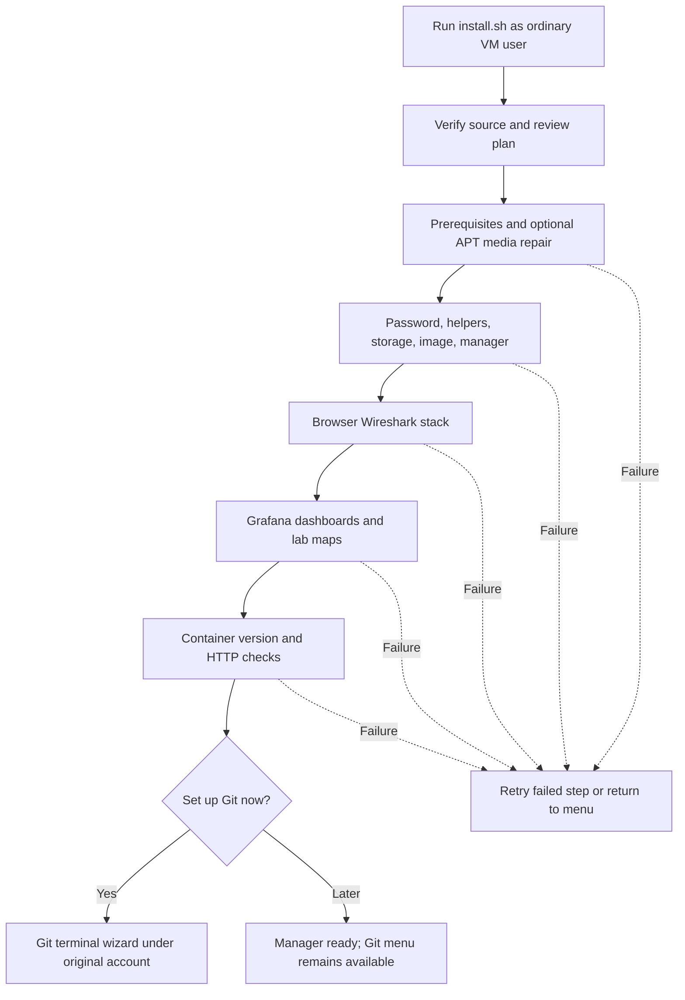

# Guided VM installation

One terminal installer takes an Ubuntu Server 24.04 VM from a bare account to a
running manager with the browser Wireshark stack, the Grafana dashboards and, if you
want it, Git setup. This page explains what its menu, phases and options do. The
[quick install](QUICK-INSTALL.md) is the paste-only version of the same route and the
[fresh VM guide](FRESH-VM-GUIDE-V2.md) starts before Ubuntu is installed.

Every command below works from any directory. The guides keep the source in
`~/projects/clab-manager`; replace that path if you cloned elsewhere.

## Before you start

Check the VM clock; APT and Git refuse to work with a wrong one:

```bash
date -u
timedatectl status
```

Compare UTC with a trusted current clock. After a Proxmox snapshot rollback the
clock is usually stuck at the snapshot time; paste this to resynchronise now:

```bash
sudo timedatectl set-ntp true
sudo systemctl restart systemd-timesyncd
sleep 10
date -u
timedatectl status
```

If the date is still wrong, or APT reports `not valid yet` / `expired`, follow
[the clock fix](FRESH-VM-GUIDE-V2.md#fix-the-clock), which includes a manual
bootstrap for a VM that cannot reach a time server, and
[clock recovery](FRESH-VM-GUIDE-V2.md#recovery-c) for a paused installer.

Then get the source and start the installer as your ordinary account, **without
sudo** (it asks for sudo where the VM needs it):

```bash
command -v git >/dev/null || sudo apt-get install -y git
git clone https://github.com/ArchRuger/CLAB-BACKUP-WORKER-v2.git "$HOME/projects/clab-manager"
bash "$HOME/projects/clab-manager/deploy/install.sh"
```

The installer requires the Python 3 and sudo normally present on Ubuntu Server; it
explains missing requirements. Internet access is needed for packages, images, the
Grafana plugin and GitHub.

## Terminal menu

```text
Containerlab Node Manager 1.30.11 — guided setup
Linux account: your existing VM account
Persistent home: /home/your-account
Source: /home/your-account/projects/clab-manager

Setup menu
  1. Install or update manager, then set up Git
  2. Git setup / repair only (no rebuild)
  3. VS Code / Containerlab extension access for your-account (no rebuild)
  4. Browser Wireshark and Grafana stacks only (reinstall or upgrade both, no rebuild)
  5. Check running installation
  6. Exit
```

Enter a number and press Enter. The menus work over SSH and VM consoles without
curses, a desktop browser or extra terminal UI packages. Commands that need
passwords or GitHub device authorisation keep the terminal attached.

## What the full installation does

Menu **1** asks four questions (bind/port settings, lab operation access, VS Code
access, APT media repair), shows the plan and asks once for approval. Then it runs:

| Phase | What happens |
|---|---|
| 1 Administrator access and settings | Confirms sudo; retains an existing `clab-backup-ui/.env` or copies one from another folder without showing its contents. Defaults are all VM interfaces and port 8081. |
| 2 VM prerequisites | Installs missing Git, SSH, Docker/Compose and containerlab and starts the services. Compatible tools stay installed; conflicting Docker packages stop with instructions. A previously disabled Docker source gets a specific recovery message. Optionally backs up and disables obsolete installation-media APT entries; network mirrors and signature checks stay. |
| 3 Password, helpers, image and manager | Runs the launcher (`start-manager.sh --manager-only`): prepares persistent storage, creates or retains the restricted `clab-discovery` password, installs and verifies the VM helpers through the restricted account and gateway, builds the image and creates the manager. |
| 4 Browser Wireshark capture stack | Pulls the pinned Wireshark image, builds the session service from this source, starts Edgeshark on localhost 5001/5801, writes the capture settings and recreates the manager so it loads them. |
| 5 Grafana dashboards and lab maps | Pulls Prometheus and Grafana by digest, installs the pinned Flow panel plugin, writes the scrape configuration for the real UI port, starts both, waits until they answer, stops Grafana again and recreates the manager. Grafana (TCP 3000) is on demand: the manager starts it when you open it from a lab and stops it after 15 minutes without an open dashboard; Prometheus keeps running with 15 minutes of history. |
| 6 Running manager verification | Checks the Compose container, the application version and the HTTP response on the actual bind address and port. |
| 7 Engineer access for VS Code | Only when chosen: `docker` and `clab_admins` groups for your account, group-writable trusted lab folders, the containerlab SUID mode. |

Before APT updates, both installation paths display UTC/NTP status and wait up
to 30 seconds only for already-active NTP. The check is read-only; the installer
does not set the clock or change time services, servers or timezone.



Each phase offers **Retry this step** or **Return to menu** on failure, so a failed
image pull or plugin download is retried on its own without repeating the password,
helper and image-build step. Existing manager data, passwords, registered Git
repositories and lab containers are retained. Source installation does not migrate
data out of an old container that lacks persistent storage; use
[the migration guide](STANDALONE-SETUP.md) first in that case.

The installer ends with `Manager 1.30.11: running; HTTP and version checks passed.`
and the local address. Open `http://VM_IP:8081` from your workstation (the VM's LAN
address, not the workstation's `127.0.0.1`).

## Upgrades

Keep one source folder and pull into it; the installer detects what is installed
and refreshes all of it while keeping data, passwords and `clab-backup-ui/.env`:

```bash
git -C "$HOME/projects/clab-manager" pull --ff-only
bash "$HOME/projects/clab-manager/deploy/install.sh"
```

Choose **1** again. The launcher rebuilds the manager image, reinstalls the matching
VM helpers, refreshes engineer access and the Git helper where they were set up, and
the two stack phases rebuild the capture session service (its image carries the
release) and re-provision Grafana. Running browser capture sessions are removed
during the upgrade; download saved captures first.

The launcher alone does the same when run by hand and is what the installer calls:

```bash
sudo bash "$HOME/projects/clab-manager/deploy/start-manager.sh"
```

It refreshes both stacks before it recreates the manager unless `clab-backup-ui/.env`
says `CAPTURE_PROVIDER=disabled` or `TELEMETRY_STACK=disabled` (written by the
`--remove` options below), or `--manager-only` is given.

## Browser Wireshark and Grafana

Both stacks are part of every installation. Menu **4** reinstalls or upgrades both
without rebuilding the manager; the same two scripts work on their own from any
directory and recreate the manager themselves so it loads the new settings. Grafana
is left stopped by its setup: the manager starts it on the VM when you open it from
a lab and stops it after 15 minutes without an open dashboard
(`TELEMETRY_GRAFANA_IDLE_MINUTES` in `clab-backup-ui/.env`; 0 keeps it running once
started), so an idle VM does not carry Grafana's memory:

```bash
sudo bash "$HOME/projects/clab-manager/deploy/setup-capture.sh"
sudo bash "$HOME/projects/clab-manager/deploy/setup-telemetry.sh"
```

To take a stack down deliberately, add `--remove`. The capture stack stops and
`CAPTURE_PROVIDER=disabled` is written (the session token is kept); the telemetry
stack stops, its tmpfs data and the plugin folder are deleted and
`TELEMETRY_STACK=disabled` is written (the admin password is kept). Later upgrades
respect the choice; running the script without `--remove` brings the stack back.
Details: [Browser Wireshark](CAPTURE.md), [Network telemetry](TELEMETRY.md),
[Grafana lab map](GRAFANA-MAP.md).

To reload the manager after editing `clab-backup-ui/.env` by hand, without a
rebuild:

```bash
sudo bash "$HOME/projects/clab-manager/deploy/recreate-manager.sh"
```

## Git setup and recovery

Use menu **2** whenever Git needs attention. It does not rebuild the manager.
You can open it directly from any directory:

```bash
bash "$HOME/projects/clab-manager/deploy/install.sh" --git
```

The wizard separates Linux owner, GitHub login, commit name/email and checkout
directory. It checks the repository and identity before registration and supports
existing checkout recovery. Already registered checkouts appear in a menu, so you
can select the saved path without typing it again. Your account name is detected;
there is no need to copy an example `--owner` command or create another Linux account.

Read [GIT-SETUP.md](GIT-SETUP.md) for repository preparation, device-code login,
registration and the detailed recovery table. You still create the destination
GitHub repository with an initial README. The wizard does not create a remote
repository, invent commit identity, or publish commits during setup.

## WinSCP file transfers

Use SFTP on port 22 with your normal Ubuntu account, such as `archtop`. For
uploads to your own directories, leave WinSCP's SFTP server setting at default.

Lab folders such as `/etc/containerlab` belong to root, so uploads there report
**Permission denied**, and a WinSCP site that launches SFTP with `sudo` fails
with `sudo: a password is required` until the VM allows it. The installer does
not add that sudoers rule. Paste this on the VM as the account WinSCP uses:

```bash
sudo -v
me="$(id -un)"
printf '%s ALL=(root) NOPASSWD: /usr/lib/openssh/sftp-server\n' "$me" | sudo tee "/etc/sudoers.d/${me}-sftp" >/dev/null
sudo chmod 0440 "/etc/sudoers.d/${me}-sftp"
sudo visudo -cf "/etc/sudoers.d/${me}-sftp"
sudo -k
sudo -n /usr/lib/openssh/sftp-server </dev/null >/dev/null && echo "Root SFTP is ready for $me"
```

Expect `parsed OK` and the `Root SFTP is ready` line; the block is safe to rerun.
In WinSCP's **Advanced → Environment → SFTP → SFTP server**, use:

```text
sudo -n /usr/lib/openssh/sftp-server
```

Save and reconnect as your account with its Ubuntu password. This session has
root-level file access, and uploaded files belong to root. See the
[full procedure and troubleshooting](FRESH-VM-GUIDE-V2.md#winscp-admin-sftp).
Use `clab-discovery` only for the manager connection.

## VS Code access

**Remote - SSH** connects as your account, but the Containerlab extension then
reports:

```text
Extension activation failed. Insufficient permissions. Ensure archtop is in the clab_admins and docker group(s).
```

and its file explorer cannot create a lab folder in the root-owned
`/etc/containerlab` (`EACCES: permission denied, mkdir`). The installer's
**VS Code / Containerlab extension access** step, offered in the standard
install and as menu option 3 afterwards, fixes both for your account. The same
one command, from any directory as your normal account:

```bash
sudo bash "$HOME/projects/clab-manager/deploy/setup-engineer-access.sh" --owner "$(id -un)"
```

It adds you to `docker` and `clab_admins`, makes the trusted lab folders
group-writable `clab_admins` folders (setgid, so new files inherit the group),
and restores the containerlab SUID mode. Then run **Remote-SSH: Kill VS Code
Server on Host...** from the VS Code Command Palette and reconnect, because the
VS Code server already running on the VM keeps the old groups. Both groups give
root-equivalent access; grant them only to your own account. The launcher
reapplies the access on upgrades, and the health check reports it as **Engineer
access**. See [the VS Code details](FRESH-VM-GUIDE-V2.md#vscode-access),
including the `~/.vscode-server` ownership fix.

## Finish in the browser

The final terminal checks verify the local manager. On your workstation:

1. Open `http://VM_ADDRESS:8081` (or the configured port). The VM connection
   dialog opens on its own when no connection exists: use `clab-discovery` and the
   password created during setup. After the first successful connection saves its
   fingerprint, reopen **Manager ▾ › VM connection…** and compare it with the VM
   console host key.
2. On Home choose **Deploy › Choose a file on the lab VM…**, pick a topology on the VM and deploy it (a topology
   file on your own computer goes through **Upload a file from this computer…**), or add a lab
   that already runs from **Manager ▾ › Labs found on the VM…**. Wait until the lab header
   reports every device ready (*n of n devices ready*).
3. Click **Open lab map ↗** under **Tools › Telemetry**: the manager starts Grafana on
   the VM (a few seconds) and shows the network dashboard; confirm it and the lab map
   fill in. Right-click a device for **Capture traffic…** and confirm Wireshark opens.
4. Take a backup (**Tools › Configuration backups › Back up now**), then click **Save
   progress** and choose the registered checkout as the save location.
5. Back in the VM terminal, run the [full installation report](HEALTH-CHECK.md):

   ```bash
   bash "$HOME/projects/clab-manager/deploy/check-install.sh" --require-git
   ```

   If you configured root file access in WinSCP, include that requirement:

   ```bash
   bash "$HOME/projects/clab-manager/deploy/check-install.sh" --require-git --require-admin-sftp
   ```

6. Resolve any **FAIL**, **WARN** or **SKIP** items using their displayed next
   steps. Then choose **Save progress** and check that it reports **Saved to Git** and
   that the intended files appear on GitHub.

Host trust, lab selection and device credentials still require your choices in
the browser. The installer does not deploy router labs or publish lab configs.

Menu **5. Check running installation** opens the same full report. The installer
still performs a shorter container/version/HTTP check during initial setup;
the saved VM connection is configured afterwards in the browser. The report checks
services, permissions, helpers through `clab-discovery`, actual folder browsing
through saved SSH, storage, registered Git checkouts, the capture stack and the
Grafana stack. It reports problems without automatically fixing them. Automated
success does not replace the real WinSCP transfer, device backup or deliberate Git
push above.

For **Operations helper is unavailable**, rerun the launcher (it reinstalls the
gateway, helpers and sudoers, verifies them through the restricted account and
recreates the manager), then check the failed folder:

```bash
sudo bash "$HOME/projects/clab-manager/deploy/start-manager.sh" --enable-operations
bash "$HOME/projects/clab-manager/deploy/check-install.sh" --lab-path /etc/containerlab/YOUR_LAB
```

Use your actual failed folder. Close and reopen the UI folder afterwards.

## Retry without starting over

Each failed install phase offers **Retry this step** or **Return to menu**. Read
the actual package/launcher error before retrying. A successful launch with an
HTTP problem can be checked again using menu **5**, without rebuilding. If Git
was cancelled or failed, use menu **2**. If only a stack failed, use menu **4**.
Exiting retains completed work; on a later run, the scripts inspect the current VM
and preserve existing setup.

For `Release file ... is not valid yet`, keep the installer open, fix/check the
VM clock in another terminal, then choose **1. Retry this step after fixing the
error**. See [detailed clock recovery](FRESH-VM-GUIDE-V2.md#recovery-c). A successful
CD-ROM source repair does not fix clock errors; no fresh VM or new clone is needed.

If you accidentally run the installer with `sudo`, it prints the equivalent
ordinary-user command and stops before running Git as root. The installer uses
sudo only where the VM needs administrator access. A separate repository owner
without sudo access can use the advanced administrator/owner workflow in the Git
guide instead.

## Provider installation notes

Docker uses its [official Ubuntu signed APT repository](https://docs.docker.com/engine/install/ubuntu/).
Containerlab uses the [official release packages](https://containerlab.dev/install/)
with published checksum verification. New installations keep containerlab at
normal executable permissions and use sudo for host operations; the VS Code access
step restores the SUID mode for your account. Existing containerlab installations
are preserved. No Docker group change or re-login is needed for the manager. The
helper does not deploy a lab, prune images or replace unrelated APT sources. The
automated prerequisite path targets Ubuntu 24.04; use the
[manual setup guide](STANDALONE-SETUP.md) and the
[original fresh VM guide](archive/FRESH-VM-GUIDE.md) for other distributions or
offline staging.
