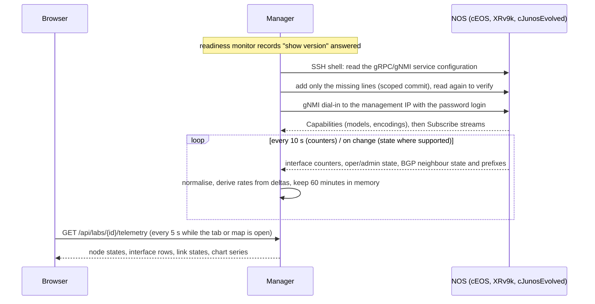

# Network telemetry — 1.23.0

Live interface rates, link state and BGP neighbour state from the nodes of a
deployed lab, collected automatically and kept in memory for the last hour. No
collector to install, no target files, no dashboards to build per lab: enable
telemetry once, deploy, and watch the charts and the map follow what you do on the
routers.

## What you get

- **Telemetry tab** in the lab workspace: a lab-level verdict, one card per node
  with its state and the reason, an interface table (admin/oper state, RX/TX bit
  rate, packet rate, error and discard counters, last sample), charts for the
  selected interface over the last 5, 15 or 60 minutes, and a BGP neighbour table
  with session state and received/sent prefix counts where the node exposes them.
- **Live link state on the topology map**: green for up, red for down, dashed
  green when only one end is observed, amber dashes for stale and grey dots for no
  telemetry. Hovering a link shows both ends with their rates. A right-click on a
  link offers *Capture packets* and *Telemetry* for either end; the node menu and
  the node details drawer have a *View telemetry* entry that opens the tab already
  filtered.
- **Nothing persistent**: samples live in a bounded ring per interface and
  neighbour in the manager's memory. A browser refresh changes nothing; a manager
  restart, a stop, destroy, redeploy or removal clears the lab's session.

## How it works

1. **Readiness first.** A node is touched only after the readiness monitor has
   recorded a real `show version` answer over SSH (the *NOS ready* state of 1.22.0).
   A running container is not a ready NOS.
2. **Provisioning over SSH**, with the node's saved login (profile, inventory or
   the containerlab default), reads the current service configuration and adds
   only what is missing, using each NOS's own scoped commit:
   - cEOS: `management api gnmi` / `transport grpc default` (plus the management
     VRF when Management0 is in one). Containerlab's default cEOS configuration
     already contains this, so usually nothing is written. Running configuration
     only; the manager never issues `write memory`.
   - IOS XR: `grpc` with `port 57400` (plus `vrf` when the management interface is
     in one), committed with `commit`. Containerlab's XRv9k boots with gNMI
     pre-provisioned, so usually nothing is written. Whatever `no-tls` says decides
     the transport.
   - Junos Evolved: `set system services extension-service request-response grpc
     clear-text port 32767` (plus `routing-instance mgmt_junos` when the management
     instance is enabled), applied in `configure private` and committed with
     `commit and-quit`, so only the manager's own candidate changes are committed.
   Every line added is recorded per node in the lab's settings; a repeat check that
   finds the service present writes nothing.
3. **gNMI dial-in** from the manager itself: the manager runs with host networking
   on the VM and already reaches every node's management address for SSH, so the
   same path reaches TCP 6030 (EOS), 57400 (XR) and 32767 (Junos). The client is
   [pygnmi](https://github.com/akarneliuk/pygnmi) (BSD-3) over grpcio. The
   transport recorded on the node is tried first (TLS with the device's own
   certificate, unverified, or plain text) and the other one is probed only after a
   transport error, never after a login refusal. Encodings are chosen from the
   node's capabilities in the adapter's preference order; a rejected subscription
   falls back to the next path variant (leaf paths, then the state container).
4. **Normalisation.** Records carry the lab, the node, a generation (one per boot
   cycle and provisioning attempt), the interface or neighbour, the metric, the
   device timestamp (or receive time when the device clock is off by more than five
   minutes) and the collection method. Rates come from counter deltas over elapsed
   device time. A counter that goes backwards is a reset (no rate, counted per
   interface), the first sample and a sample after a gap longer than five minutes
   produce no rate, out-of-order samples are ignored, and a record from another
   generation is dropped, so a previous deployment with the same node name and
   address can never feed the new one.

**Streaming** means usable samples arrived. A successful login or a successful
commit alone leaves the node in *Configuring* or *Connecting*.

## Node states

| State | Meaning | What to do |
|---|---|---|
| Off | Automatic telemetry is off (or not yet enabled) for this lab, or the collector is disabled in the manager environment | Enable it in the Telemetry tab |
| Waiting | The node is not running, discovery is stale, the NOS has not answered `show version`, or a lab operation/backup job is running | Nothing; it proceeds by itself |
| Configuring | An SSH session is reading and, if needed, adding the telemetry service | Nothing |
| Connecting | gNMI connected or connecting; subscriptions not yet delivering | Nothing; becomes Streaming or Failed |
| Streaming | Usable samples are arriving | Use the charts and the map |
| Stale | No sample for more than 45 s while the session is open; recent history stays visible until it ages out | Check the node; the session reconnects by itself |
| Unsupported | No adapter for this kind (only cEOS, XRv9k and cJunosEvolved have one) | Nothing; its links show as *no telemetry* |
| Failed | A concrete reason: login refused, port unreachable, NOS rejected the configuration, gNMI needs a password login, enable password missing | Fix it and press *Retry now*; retries also happen by themselves with a growing delay (15 s to 5 min) |

A partially supported node (for example interfaces streaming, BGP model not
advertised) stays *Streaming* and shows the BGP group as unavailable. Unsupported
metrics show as `n/a`, never as zero.

## Settings

Open **Telemetry → Telemetry settings**:

- **Automatic telemetry**: on by default for labs created with 1.23.0 or later
  (deploy, import, YAML registration or inventory upload). Labs saved earlier show
  *Automatic telemetry is not enabled for this lab yet* with an **Enable automatic
  telemetry** button; nothing is written to a device before that click. Once on,
  setup and recovery proceed without further confirmations. Turning it off stops
  collection and provisioning and clears the lab's buffers; it leaves the device
  configuration as it is.
- **gNMI login**: by default each node's saved password login (profile, inventory
  or containerlab default). gNMI cannot use an SSH key, so a node whose profile is
  key-based needs a password profile chosen here; the node reports *Failed* with
  that exact reason until then.
- **Remove manager-added lines…**: available only while automatic telemetry is
  off. It removes, over SSH and on running nodes only, exactly the lines the manager
  recorded as its own (`no transport grpc default`, `no grpc`, `delete … grpc
  clear-text`), never a transport or service the user configured.

The manager environment variable `TELEMETRY_COLLECTOR` (`gnmi`, the default, or
`disabled`) turns the collector off globally; `compose.yml` reads it from
`clab-backup-ui/.env`.

## Per-NOS support

| | cEOS / EOS | XRv9k / IOS XR | cJunosEvolved / Junos Evolved |
|---|---|---|---|
| Service the manager expects | `management api gnmi`, `transport grpc default`, TCP 6030 | `grpc`, TCP 57400, TLS unless `no-tls` | `system services extension-service request-response grpc clear-text`, TCP 32767 |
| Lines added when missing | `management api gnmi` / `transport grpc default` (/ `vrf X`) | `grpc` / `port 57400` (/ `vrf X`) | `set … grpc clear-text port 32767` (/ `routing-instance mgmt_junos`) |
| Commit semantics | running-config only, no save | `commit` of this session's candidate | `configure private` + `commit and-quit` |
| Interface counters and state | OpenConfig `/interfaces/interface/state` (counters sampled every 10 s, oper/admin on change with a sampled fallback) | `openconfig-interfaces:` origin, everything sampled every 10 s | OpenConfig `/interfaces/interface/state`, sampled every 10 s |
| BGP neighbours | `/network-instances/…/bgp/neighbors/neighbor/state/session-state` and `afi-safis/afi-safi/state/prefixes` | same with the `openconfig-network-instance:` origin | same, when the image advertises the model |
| Encodings tried | JSON_IETF, JSON, PROTO | JSON_IETF, PROTO | JSON_IETF, PROTO |
| Wiring name mapping | `eth1` → `Ethernet1`, `eth1_1` → `Ethernet1/1` | `eth1` → `GigabitEthernet0/0/0/0`, `Gi0/0/0/N` accepted | `eth4` → `et-0/0/0` (eth1–3 reserved), `et-0/0/N[.unit]` accepted |
| Validation status (1.23.0) | fixture and in-process gNMI server only | fixture and in-process gNMI server only | fixture and in-process gNMI server only |

Other kinds (vQFX, vJunos-switch, Linux, unmapped) report *Unsupported* and their
links show as *no telemetry*.

## Bounds

| Limit | Value |
|---|---|
| History per series | 60 minutes; at most 400 points |
| Interfaces per node / neighbours per node / nodes per manager | 96 / 64 / 512 |
| Concurrent gNMI sessions / SSH provisioning sessions | 64 / 4 |
| Record queue between collectors and the store | 5,000 records (overflow is counted) |
| Chart windows | 5, 15, 60 minutes |
| Series response | one interface or neighbour, at most 400 points |

Nothing in this feature touches Docker, the VM helpers or the encrypted state
other than the lab's telemetry setting and the record of added lines.

## Security notes

- The telemetry APIs live under `/api/` and inherit the manager's origin check,
  request size limit, CSP and audit logging. They accept lab and node names from
  the saved inventory only; there is no client-supplied address, port, command or
  path. Device secrets never enter responses or logs; failure messages are
  classified, not echoed.
- gNMI uses the same password login as SSH, in gRPC metadata. Plain-text gRPC
  carries that login unencrypted on the containerlab management network, exactly
  as the lab's default SSH host-key policy already assumes an isolated lab. When a
  node already has TLS (XR by default, EOS with an `ssl profile`, Junos with
  `grpc ssl`), the manager uses it with the device's own certificate, unverified.
  The manager does not generate device certificates in this release.
- The manager writes device configuration only for this service and only after
  the explicit per-lab setting is on; every change is logged with the exact lines.

## Health check

`bash deploy/check-install.sh` reports **Network telemetry**: INFO when the
collector is disabled, PASS with the linked labs' verdicts, WARN when a lab reports
failed nodes, and a manual step to confirm charts and link colours follow real
traffic and an interface shutdown.

## Live acceptance procedure

Run this on a lab VM with one node of each kind, after installing 1.23.0 with
`bash deploy/install.sh` (the image build installs pygnmi):

1. Deploy a lab from the manager. Wait for *NOS ready* in the deployment bar.
2. Open **Telemetry**. Each supported node should pass Waiting → Configuring →
   Connecting → Streaming without a click. Check the action log for
   `telemetry.configure` lines (expected on cJunosEvolved; usually none on cEOS and
   XRv9k, whose containerlab defaults already enable gNMI).
3. On each node, confirm the service by hand: `show management api gnmi` (EOS),
   `show grpc status` (XR), `show system connections | match 32767` (Junos).
4. Generate traffic across a wired link (`ping` with a size and count, or an
   `iperf` container) and confirm the RX/TX chart of both ends and the link's
   hover text follow it within about 20 s.
5. Shut the interface on one end; the link must turn red within a minute and the
   table must show the oper state; unshut and confirm green. Shut only one end and
   confirm the other end still reports, with *the two ends disagree* in the title.
6. Where BGP runs, clear a session and confirm the neighbour state and prefix
   counts change.
7. Restart one node (`docker restart` or *Restart lab nodes*): the node returns to
   Waiting, then streams again with a new generation and an empty chart;
   `telemetry.clear` appears when the operation is submitted through the manager.
   Redeploy the lab and confirm no old samples appear under the new deployment.
8. Turn automatic telemetry off, use **Remove manager-added lines…**, and confirm
   only the manager's lines are gone (Junos: the `grpc clear-text` statement; EOS
   and XR: nothing, when the defaults were already present).
9. Confirm terminals, captures, backups and *Save progress* behave as before while
   telemetry streams.

Record the versions of the three images and the outcome of each step in
`clab-backup-ui/VALIDATION.md`.

## Limitations in 1.23.0

- No live device validation was possible for this release; the three adapters were
  validated against fixtures and an in-process gNMI server. The paths, encodings,
  prompts and configuration lines follow the vendors' documentation and containerlab
  defaults, but a specific image may reject a path or need an extra line; the node
  then reports the exact failure and *Retry now* re-checks it.
- Utilisation percentages are not shown: a virtual interface's speed does not
  describe real throughput. Discards and errors are device counters, not measured
  end-to-end loss.
- One address family per BGP neighbour is charted (the first seen).
- Sampling is 10 s; interface state uses on-change subscriptions only on EOS.
- Structured polling fallbacks for metrics a device does not stream are not
  implemented; such metrics show as unavailable.
- Redeploys done outside the manager that complete within one discovery poll keep
  the previous minutes of history on the same node name; counter resets are still
  detected and never produce spikes.
