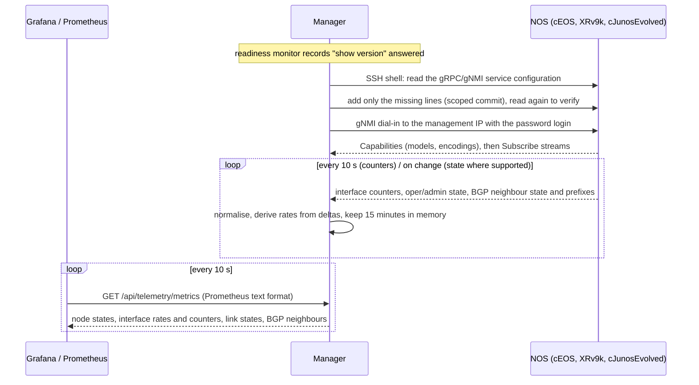

# Network telemetry

Live interface rates, link state and BGP neighbour state from the nodes of a
deployed lab, collected by the manager and shown in Grafana. No collector to install
by hand, no target files, no dashboards to build per lab: deploy the lab, open the
**network dashboard** (Grafana) from the lab's **Tools** tab, and watch the dashboards
and the lab map follow what you do on the devices.

## What you get

- **Grafana on the VM**, installed beside the manager by the installer and reachable
  on `http://VM_IP:3000`. Three provisioned dashboards, each filtered by lab:
  **Lab overview** (node and link states, per-node traffic, errors), **Interfaces**
  (bit and packet rates, errors and discards, an operational-state timeline, an
  interface table, by node and interface) and **BGP neighbours** (session table,
  established timeline, prefixes received and sent). The folder **Lab maps** holds
  one generated weathermap per lab, links coloured and animated by traffic, port and
  node dots by state; see [GRAFANA-MAP.md](GRAFANA-MAP.md). Anyone who reaches the
  port is a read-only Viewer; editing needs the `admin` login whose password is in
  `clab-backup-ui/.env` (`TELEMETRY_GRAFANA_ADMIN_PASSWORD`).
- **One button in the manager.** The **Telemetry** card on the lab's **Tools** tab shows
  **Open lab map ↗** when the lab has a map, else **Open network dashboard ↗** for the
  lab overview, both filtered to the lab and opened in a new tab on the manager's own
  host name. The manager's own map
  shows the imported wiring; live state is Grafana's job.
- **Grafana runs only while someone reads it.** It idles at a few hundred MiB, so the
  stack leaves it stopped. The button opens a small manager page that starts Grafana on
  the VM (a `docker start` through the reviewed VM helper, a few seconds on a fresh
  data volume) and moves on to the dashboard; the manager then watches Grafana's own
  request counters and stops it again after 15 minutes without an open dashboard (a
  dashboard tab refreshes every 10 seconds, so it keeps Grafana alive). **Telemetry
  settings…** (**Tools › Telemetry** or **Lab actions ▾ › Advanced options**) shows the state and has
  **Stop Grafana now**. The idle time is
  `TELEMETRY_GRAFANA_IDLE_MINUTES` in `clab-backup-ui/.env` (0 keeps Grafana running once
  started; reload the manager after a change with `recreate-manager.sh`). Prometheus keeps
  running: it is small and must scrape while a lab streams.
- **Telemetry settings…** on the **Tools** tab (also under **Lab actions ▾ › Advanced options**): automatic
  telemetry on or off for the
  lab, the gNMI login profile, removal of the configuration lines the manager added,
  the reason a node is not streaming, and a retry for failed nodes.
- **Nothing persistent in the manager, fifteen minutes of history everywhere.** Samples
  live in a bounded ring per interface and neighbour in the manager's memory (the last
  15 minutes) so that Prometheus can scrape rates and states every 10 seconds;
  Prometheus keeps 15-minute blocks with a 15-minute retention on tmpfs, and the
  dashboards open on the last 15 minutes with 5- and 15-minute quick ranges. A manager
  restart, a stop, destroy, redeploy or removal of the lab clears its session; a VM
  reboot, a stack removal or a Grafana stop clears Grafana's own data (everything in it
  is provisioned from files, so nothing is lost).

## How it works



1. **Readiness first.** A node is touched only after the readiness monitor has
   recorded a real `show version` answer over SSH (the device shows *Ready*). A running
   container is not a ready NOS.
2. **Provisioning over SSH**, with the node's saved login (profile, inventory or
   the containerlab default), reads the current service configuration and adds
   only what is missing, using each NOS's own scoped commit:
   - cEOS: `management api gnmi` / `transport grpc default` (plus the management
     VRF when Management0 is in one). Containerlab's default cEOS configuration
     already contains this, so usually nothing is written. Running configuration
     only; the manager never issues `write memory`.
   - IOS XR: `grpc` with `port 57400` and `no-tls` (plus `vrf` when the management
     interface is in one), committed with `commit`. Containerlab's XRv9k boots with
     gNMI pre-provisioned; when that service lacks `no-tls`, only that line is added.
     The lab runs gRPC in plain text by the operator's choice.
   - Junos Evolved: `set system services extension-service request-response grpc
     clear-text port 32767` (plus `routing-instance mgmt_junos` when the management
     instance is enabled), applied in `configure private` and committed with
     `commit and-quit`, so only the manager's own candidate changes are committed.
   Every line added is recorded per node in the lab's settings; a repeat check that
   finds the service present writes nothing.
3. **gNMI dial-in** from the manager itself: the manager runs with host networking
   on the VM and already reaches every node's management address for SSH, so the
   same path reaches TCP 6030 (EOS), 57400 (XR) and 32767 (Junos). The client is
   [pygnmi](https://github.com/akarneliuk/pygnmi) (BSD-3) over grpcio. The
   transport recorded on the node is tried first (plain text on all three kinds by
   default; TLS with the device's own certificate, unverified, where a user configured
   it on EOS or Junos) and the other one is probed only after a transport error, never
   after a login refusal. Encodings are chosen from the node's capabilities in the
   adapter's preference order; a rejected subscription falls back to the next path
   variant (leaf paths, then the state container).
4. **Normalisation.** Records carry the lab, the node, a generation (one per boot
   cycle and provisioning attempt), the interface or neighbour, the metric, the
   device timestamp (or receive time when the device clock is off by more than five
   minutes), the manager's receive time and the collection method. Rates come from
   counter deltas over the elapsed receive time; the device timestamp only orders
   the samples of one leaf. That distinction matters on cEOS, which stamps every
   notification with the last change time of the leaves it carries: one 10 s cycle
   arrives as several notifications whose timestamps differ by minutes. A counter
   that goes backwards is a reset (no rate, counted per interface), the first sample
   and a sample after a gap longer than five minutes produce no rate, a sample older
   than the last accepted sample of the same leaf is ignored, and a record from
   another generation is dropped, so a previous deployment with the same node name
   and address can never feed the new one.
5. **Exposition.** `/api/telemetry/metrics` renders the current snapshot in the
   Prometheus text format: names, states and rates only, never addresses, logins or
   configuration. Stale series keep their state but drop their rates.

**Streaming** means usable samples arrived. A successful login or a successful
commit alone leaves the node in *Configuring* or *Connecting*.

## Node states

The state of every node is shown in **Tools › Telemetry › Telemetry settings…** (with the
reason for failed and stale nodes), in the Lab overview dashboard as the node state
code, and by the health check.

| State | Meaning | What to do |
|---|---|---|
| Off | Automatic telemetry is off (or not yet enabled) for this lab, or the collector is disabled in the manager environment | Turn it on in Telemetry settings |
| Waiting | The node is not running, discovery is stale, the NOS has not answered `show version`, or a lab operation/backup job is running | Nothing; it proceeds by itself |
| Configuring | An SSH session is reading and, if needed, adding the telemetry service | Nothing |
| Connecting | gNMI connected or connecting; subscriptions not yet delivering | Nothing; becomes Streaming or Failed |
| Streaming | Usable samples are arriving | Open Grafana |
| Stale | No sample for more than 45 s while the session is open; recent history stays visible until it ages out | Check the node; the session reconnects by itself |
| Unsupported | No adapter for this kind (only cEOS, XRv9k and cJunosEvolved have one) | Nothing; its links stay grey on the map |
| Failed | A concrete reason: login refused, port unreachable, NOS rejected the configuration, gNMI needs a password login, enable password missing | Fix it and press *Retry failed nodes*; retries also happen by themselves with a growing delay (15 s to 5 min, 30 s at most for an unreachable port) |

A partially supported node (for example interfaces streaming, BGP model not
advertised) stays *Streaming* and reports the BGP group as unavailable. A group whose
path has nothing behind it (BGP subscribed on a node without neighbours) shows
*idle* after two quiet minutes: the subscription stays open and turns streaming
when a neighbour appears. Unsupported metrics are absent, never zero.

## Settings

Open **Tools › Telemetry › Telemetry settings…**:

- **Automatic telemetry**: on by default for labs created since 1.23.0 (deploy,
  import, YAML registration or inventory upload). Labs saved earlier show *This lab
  was saved before automatic telemetry existed*; nothing is written to a device before
  you tick the box and save. Once on, setup and recovery proceed without further
  confirmations. Turning it off stops collection and provisioning and clears the
  lab's buffers; it leaves the device configuration as it is.
- **gNMI login**: by default each node's saved password login (profile, inventory
  or containerlab default). gNMI cannot use an SSH key, so a node whose profile is
  key-based needs a password profile chosen here; the node reports *Failed* with
  that exact reason until then.
- **Remove manager-added lines…**: available only while automatic telemetry is
  off. It removes, over SSH and on running nodes only, exactly the lines the manager
  recorded as its own (`no transport grpc default`, `no grpc`, `delete … grpc
  clear-text`), never a transport or service the user configured.
- **Retry failed nodes** re-checks every failed or stale node at once.

The manager environment variable `TELEMETRY_COLLECTOR` (`gnmi`, the default, or
`disabled`) turns the collector off globally; `compose.yml` reads it from
`clab-backup-ui/.env`. With the collector off, Grafana stays empty.

## Per-NOS support

| | cEOS / EOS | XRv9k / IOS XR | cJunosEvolved / Junos Evolved |
|---|---|---|---|
| Service the manager expects | `management api gnmi`, `transport grpc default`, TCP 6030 | `grpc` with `no-tls`, TCP 57400 | `system services extension-service request-response grpc clear-text`, TCP 32767 |
| Lines added when missing | `management api gnmi` / `transport grpc default` (/ `vrf X`) | `grpc` / `port 57400` / `no-tls` (/ `vrf X`), or `no-tls` alone under an existing `grpc` | `set … grpc clear-text port 32767` (/ `routing-instance mgmt_junos`) |
| Commit semantics | running-config only, no save | `commit` of this session's candidate | `configure private` + `commit and-quit` |
| Interface counters and state | OpenConfig `/interfaces/interface/state` (counters sampled every 10 s, oper/admin on change with a 10 s heartbeat because cEOS sends no initial value for a plain on-change subscription; sampled fallback) | `openconfig-interfaces:` origin, everything sampled every 10 s | OpenConfig `/interfaces/interface/state`, sampled every 10 s |
| BGP neighbours | `/network-instances/…/bgp/neighbors/neighbor/state/session-state` and `afi-safis/afi-safi/state/prefixes` | same with the `openconfig-network-instance:` origin | same, when the image advertises the model |
| Encodings tried | JSON_IETF, JSON, PROTO | JSON_IETF, PROTO | JSON_IETF, PROTO |
| Wiring name mapping | `eth1` → `Ethernet1`, `eth1_1` → `Ethernet1/1` | `eth1` → `GigabitEthernet0/0/0/0`, `Gi0/0/0/N` accepted | `eth4` → `et-0/0/0` (eth1–3 reserved), `et-0/0/N[.unit]` accepted |
| Validation status | live on the dev VM (cEOS 4.35.0F): provisioning check, streaming, rates under traffic, map colours, shutdown/no shutdown, node restart, Grafana | fixture and in-process gNMI server only | fixture and in-process gNMI server only |

Other kinds (vQFX, vJunos-switch, Linux, unmapped) report *Unsupported* and their
links stay grey on the lab map.

## Bounds

| Limit | Value |
|---|---|
| History per series in the manager | 15 minutes; at most 130 points |
| Interfaces per node / neighbours per node / nodes per manager | 96 / 64 / 512 |
| Concurrent gNMI sessions / SSH provisioning sessions | 64 / 4 |
| Record queue between collectors and the store | 5,000 records (overflow is counted) |
| Prometheus | scrape every 10 s, 15-minute blocks with a 15-minute retention (15 to about 35 minutes visible) or 48 MB on tmpfs; always running |
| Grafana | started on request, stopped after 15 minutes without an open dashboard (`TELEMETRY_GRAFANA_IDLE_MINUTES`); dashboards open on the last 15 minutes and refresh every 10 s; lab maps re-provisioned within 30 s of a change |

Nothing in this feature touches Docker, the VM helpers or the encrypted state
other than the lab's telemetry setting and the record of added lines.

## Security notes

- The telemetry APIs live under `/api/` and inherit the manager's origin check,
  request size limit, CSP and audit logging. They accept lab and node names from
  the saved inventory only; there is no client-supplied address, port, command or
  path. Device secrets never enter responses or logs; failure messages are
  classified, not echoed.
- gNMI uses the same password login as SSH, in gRPC metadata. Plain-text gRPC
  carries that login unencrypted on the containerlab management network, exactly
  as the lab's default SSH host-key policy already assumes an isolated lab; the
  operator chose plain text on all three kinds. When an EOS or Junos node already
  has TLS (`ssl profile`, `grpc ssl`), the manager uses it with the device's own
  certificate, unverified. The manager does not generate device certificates.
- Grafana is reachable by anyone who reaches the VM's Grafana port as a read-only
  Viewer, the same trust model as the manager UI itself. Prometheus listens on the
  loopback address only. Keep the VM on the trusted lab network.
- The manager writes device configuration only for this service and only after
  the explicit per-lab setting is on; every change is logged with the exact lines.

## The Grafana stack

The installer sets the stack up as its fifth phase and every later install or
upgrade refreshes it. The same script works on its own from any directory and
recreates the manager itself so it announces Grafana:

```bash
sudo bash "$HOME/projects/clab-manager/deploy/setup-telemetry.sh"
```

What it does:

- creates the manager data directory if it is missing, then writes
  `TELEMETRY_STACK=grafana`, the Grafana port (3000), bind address (0.0.0.0), the
  Prometheus port (9090, loopback only), a generated admin password and the two
  folders it uses into `clab-backup-ui/.env`, keeping unrelated settings and an
  existing password;
- renders the Prometheus scrape configuration for the manager's actual `UI_PORT`
  into `/srv/containerlab-node-manager/telemetry/`, creates the plugin folder there
  for Grafana's user and the lab-map folder (`TELEMETRY_MAPS_DIR`, default
  `/srv/containerlab-node-manager/data/telemetry/dashboards`) for the manager's user;
- pulls Prometheus and Grafana OSS by digest and installs the pinned Flow panel
  plugin once with the Grafana image's own CLI (access to grafana.com is needed
  during this step only);
- starts both with host networking, dropped capabilities, memory and PID limits and
  tmpfs-backed data volumes (`deploy/compose.telemetry.yml`), then waits until
  Prometheus answers `/-/ready` and Grafana `/api/health` (90 s at most) and prints
  the scrape target's health and whether the Flow panel loaded. A service that
  starts and then crash-loops fails the setup with the Compose status and its last
  log lines instead of leaving dashboards whose every panel shows an error; CI
  starts the real stack against a fixture manager on every push
  (`deploy/telemetry/smoke.py`, which also stops and starts Grafana by its container
  name the way the manager does);
- stops Grafana again: it is on demand. The container is named
  `clab-manager-grafana` with the restart policy `no`, so nothing but the manager
  starts it (`docker start` through the VM helper when a lab's *Open lab map ↗* or *Open network dashboard ↗* link is
  used) and the manager stops it after `TELEMETRY_GRAFANA_IDLE_MINUTES` (default 15,
  written into `.env` by this setup) without a dashboard request. Prometheus keeps
  running with its 15-minute retention;
- recreates the manager so it reads the new settings (unless `--no-recreate`, which
  the launcher passes because it creates the manager afterwards).

To take the stack down, add `--remove`: it stops both services, deletes their tmpfs
data and the plugin folder and writes `TELEMETRY_STACK=disabled`, so later upgrades
leave it alone; the admin password is kept for a later reinstall. Rerun without
`--remove` to bring it back. The manager's own behaviour never depends on the
stack: the collector runs either way, and the dashboard button on the Tools tab simply hides.

A state timeline with nothing to show yet (*Session established* on a lab without
BGP, *Operational state* for a filter that matches no interface) says *Data does not
have a time field*: that is Grafana's wording for an empty query result, not a
failure; it fills in as soon as the manager exports the series. Dashboards come from
files in the repository; edits made in the Grafana UI are not saved. Component
licences are listed in `deploy/TELEMETRY-THIRD-PARTY-NOTICES.md`.

## Health check

`bash "$HOME/projects/clab-manager/deploy/check-install.sh"` reports **Network
telemetry**: INFO when the collector is disabled, PASS with the linked labs'
verdicts, WARN when a lab reports failed nodes, and a manual step to confirm in
Grafana that the Interfaces dashboard and the lab map follow real traffic and an
interface shutdown. **Grafana telemetry dashboards** is WARN when the stack is not
installed, and otherwise checks that Prometheus answers at all (a crash-looping
container is reported with the Compose commands that show its state and logs), that
it scrapes the manager (a scrape error is classified, for example a 404 from a manager
older than 1.23.0) and that the manager can write its lab maps (a WARN otherwise).
A stopped Grafana is the normal state and passes as *provisioned and stopped until
someone opens it*; the check stays read-only and never starts it. While Grafana runs
(open it from a lab first) the check also covers its health endpoint and that the
Flow panel is loaded. Every `Next:` line is a command that works from any directory.

## Live acceptance procedure

Run this on a lab VM with one node of each kind, after installing with
`bash "$HOME/projects/clab-manager/deploy/install.sh"`:

1. Deploy a lab from the manager. Wait until the lab header reports every device ready
   (*n of n devices ready*).
2. Open **Tools › Telemetry › Telemetry settings…**. Each supported node should pass
   Waiting → Configuring → Connecting → Streaming without a click. Check the action
   log for `telemetry.configure` lines (expected on cJunosEvolved; usually none on
   cEOS and XRv9k, whose containerlab defaults already enable gNMI).
3. On each node, confirm the service by hand: `show management api gnmi` (EOS),
   `show grpc status` (XR), `show system connections | match 32767` (Junos).
4. Click **Open lab map ↗** (Tools › Telemetry). Generate traffic across a wired link (`ping` with a size and
   count, or an `iperf` container) and confirm the Interfaces dashboard of both ends
   and the lab map's link colour and rate labels follow it within about 20 s.
5. Shut the interface on one end; the map link must turn red within a minute and the
   Interfaces dashboard must show the oper state; unshut and confirm green.
6. Where BGP runs, clear a session and confirm the neighbour state and prefix
   counts change on the BGP neighbours dashboard.
7. Restart one node. Through the manager (*Restart devices*, stop, destroy or
   redeploy) the lab's session is cleared at once (`telemetry.clear` in the action
   log) and the node returns to Waiting. After a bare `docker restart` the address
   and running state do not change, so the node reports *Failed: the gNMI port did
   not answer* while the NOS boots and retries every 30 s; it streams again with a
   new generation shortly after the service answers. Prefer the manager's operations
   for this: a bare `docker restart` also removes the veth links containerlab
   created (on the dev VM the restarted cEOS came back without Ethernet1 and never
   started its gNMI server), which only a redeploy repairs. Redeploy the lab and
   confirm no old samples appear under the new deployment.
8. Turn automatic telemetry off, use **Remove manager-added lines…**, and confirm
   only the manager's lines are gone (Junos: the `grpc clear-text` statement; EOS
   and XR: nothing, when the defaults were already present).
9. Confirm terminals, captures, backups and *Save progress* behave as before while
   telemetry streams.

Record the versions of the three images and the outcome of each step in
`clab-backup-ui/VALIDATION.md`.

## Limitations

- cEOS is validated live (see VALIDATION.md); the XRv9k and cJunosEvolved adapters
  are validated against fixtures and an in-process gNMI server only. Their paths,
  encodings, prompts and configuration lines follow the vendors' documentation and
  containerlab defaults, but a specific image may reject a path or need an extra
  line; the node then reports the exact failure and *Retry failed nodes* re-checks it.
- cEOS in a container reports transmit counters of 0 on its data ports (the
  container data plane has no hardware TX counters), so TX rates on cEOS links read
  0 b/s while RX on the far end shows the traffic; the lab map therefore draws every
  link half from the far end's receive rate. Management0 counts both ways.
- Utilisation percentages are not shown: a virtual interface's speed does not
  describe real throughput. Discards and errors are device counters, not measured
  end-to-end loss.
- One address family per BGP neighbour is exported (the first seen).
- Sampling is 10 s; interface state uses on-change subscriptions only on EOS.
- Structured polling fallbacks for metrics a device does not stream are not
  implemented; such metrics are absent.
- Redeploys done outside the manager that complete within one discovery poll keep
  the previous minutes of history on the same node name; counter resets are still
  detected and never produce spikes.
