# Tour

The manager is built around what a networking student does with a lab: open it, see
which devices are ready, get into a CLI, save progress, put a saved state back, look
at packets and traffic. The screenshots below are the real UI at 1440×900, captured with
a scripted headless browser against a manager whose lab VM answers are scripted (the
fixture manager under `docs/redesign/tools/`), so the labs, devices and saved versions
are examples rather than a live containerlab deployment. The layout, copy and controls
are exactly what a live manager shows.

## My labs

**Home is the list of your labs.** Each card carries the lab's state — *Running*,
*Starting*, *Stopped*, *Needs attention* — how many devices are ready and when progress
was last saved; the list opens on *Recent labs* (most recently deployed first, from the manager's own record of successful deploys and redeploys; labs it has not deployed come last, by name; *All labs* lists favourites first), under the two starting choices *Deploy* (*Choose a file on the lab VM…* or *Upload a file from this computer…*) and *Build* (*Open the lab builder*). Labs that run on the
VM but are not in the manager yet are listed under *Manager ▾ › Labs found on the VM…*,
where one click adds them. The **Manager ▾** menu holds everything that is not about one lab: the VM
connection, importing lab files, deploying a new lab, the labs running on the VM,
operation history, manager settings and Diagnostics.

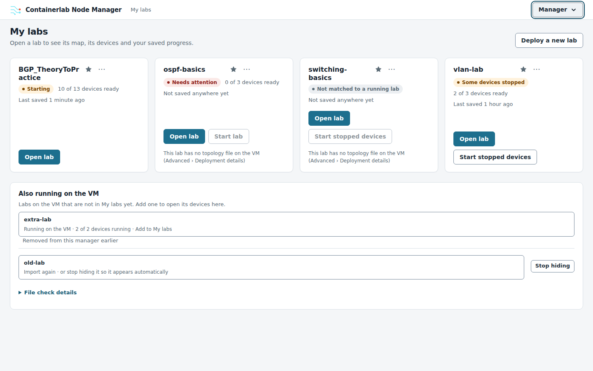

## The lab workspace

**One header, one situation.** The lab name, its state, *n of m devices ready*, the
last save, **Save progress** and **Lab actions ▾**. When something needs you — a device
that refuses its login, an operation that failed, a save that needs attention — a
banner under the header says so in one sentence with the button that fixes it. Five
tabs: **Topology · Devices · Progress · Tools · Advanced**.

**Topology.** Every device on the map carries its state; right-click one (or press
Shift+F10) for *Open CLI ↗*, *Capture traffic…*, *Back up configuration* and *Device
details*, with the reason underneath when an action is not available yet. Click a link
to capture either end.

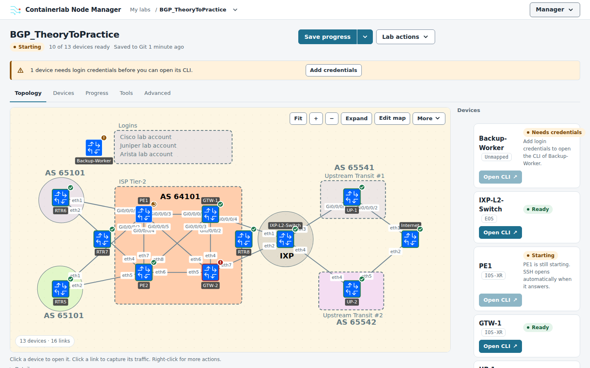

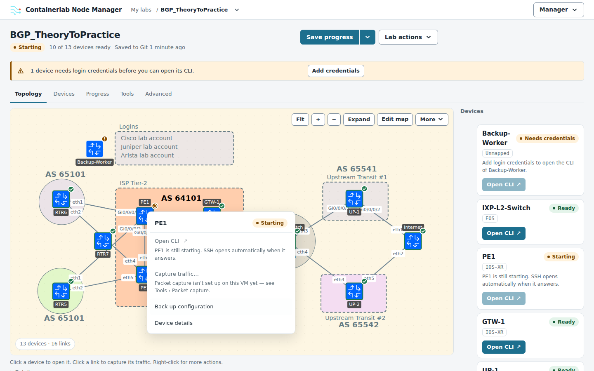

**Devices.** One row per device with its state and what to do about it; **Technical
view** switches to the classic table with addresses, network OS, credentials and the last
checks. The device panel shows the same state, the actions, the backups of that device
and, under *Advanced*, the connection and credential settings.

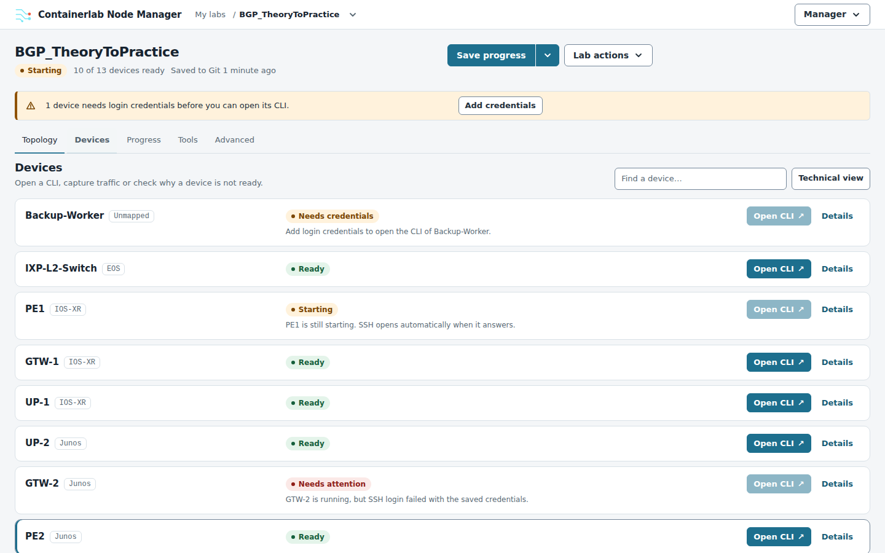

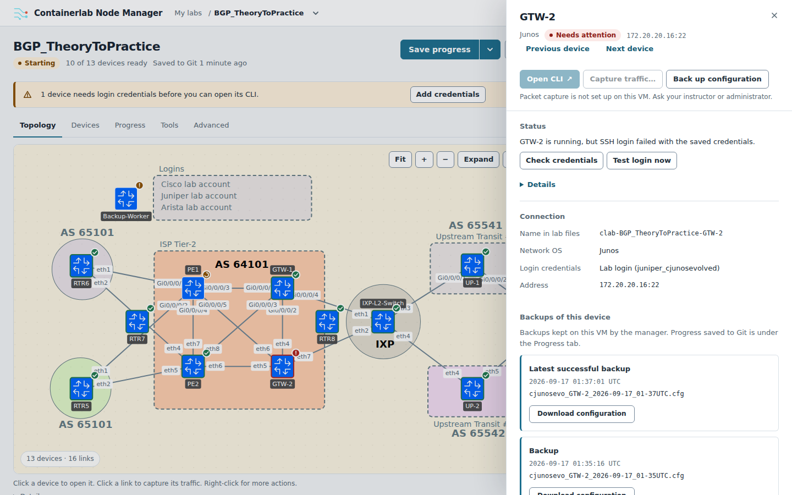

**Progress.** Where the lab saves (*Saving to Course-Labs › labs/BGP/work*), when it
last saved, and the saved versions you can return to: *Latest*, your *Checkpoints*,
the *Baseline*, and the *Instructor and reference versions* kept in other folders of
the same repository. Every version can be viewed, compared with your latest save or —
for Junos, EOS and IOS XR labs — applied to the running devices without changing where the lab saves.

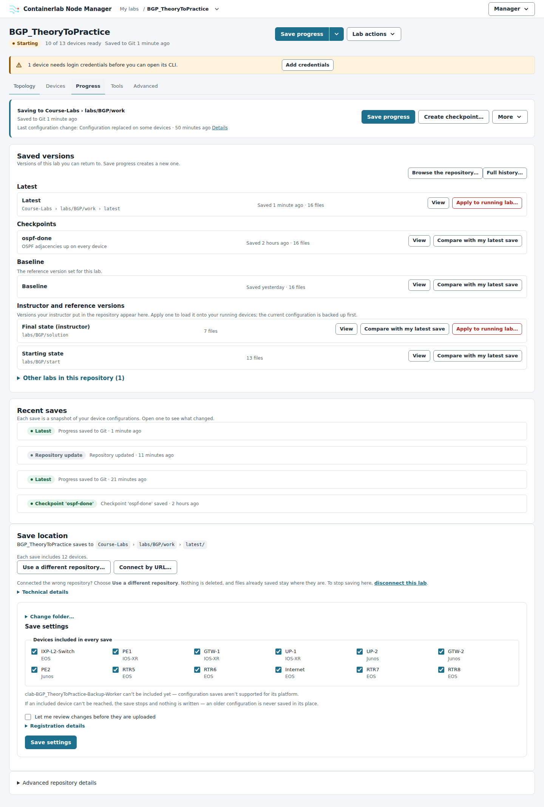

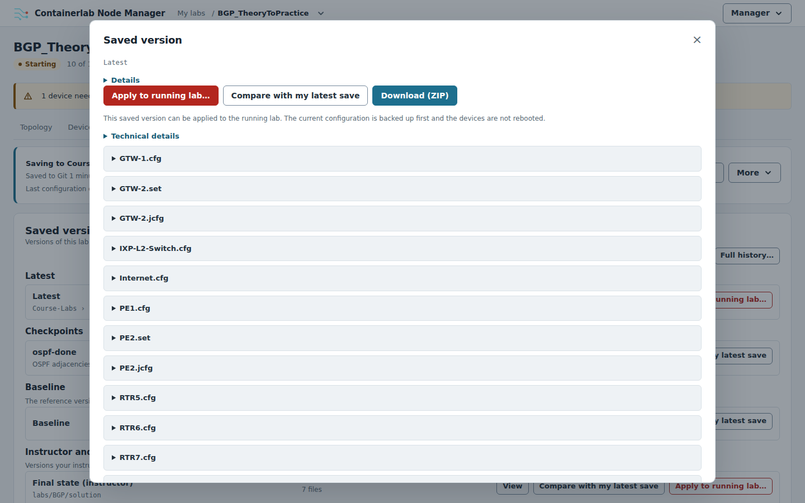

**Replacing the running configuration is reviewed first.** The review lists the source,
every device with what would change (or why it is skipped), the three safety rules —
a backup first, no reboot, automatic undo when a device cannot be reached — and asks
you to acknowledge before *Replace configurations*.

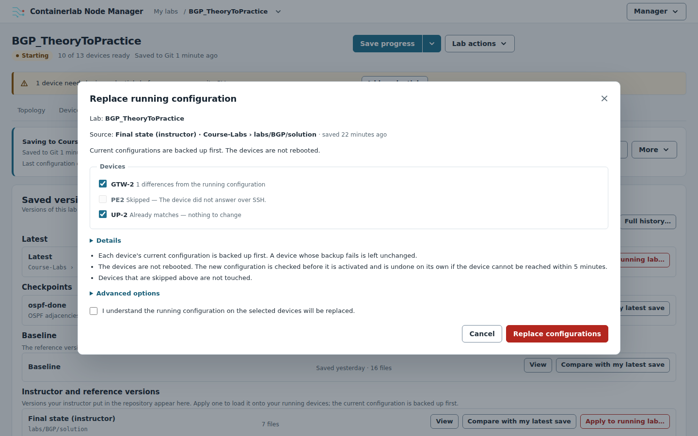

**Tools.** Packet capture and the manager's own configuration backups, with *Open all
CLIs* and *Edit map* (where the map file download and the draw.io export are) under *More tools*.

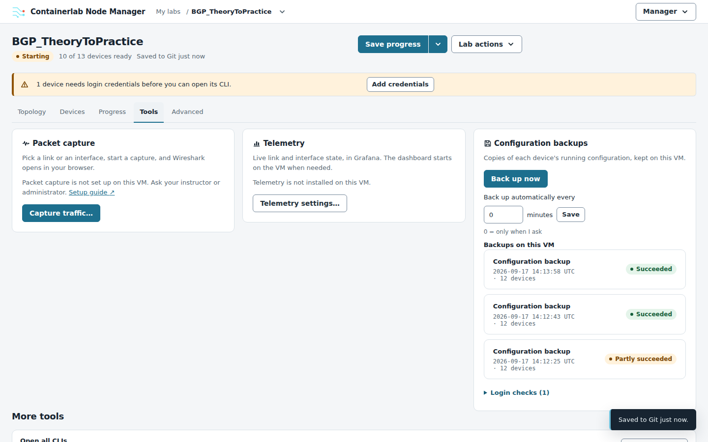

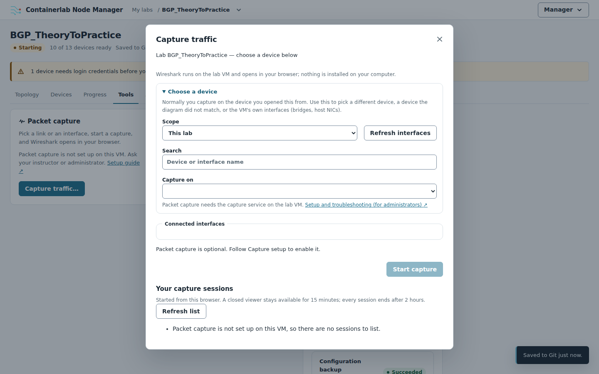

**Advanced.** Deployment details, the lab's source, credentials, action logs, the full
list of lab operations and the danger zone.

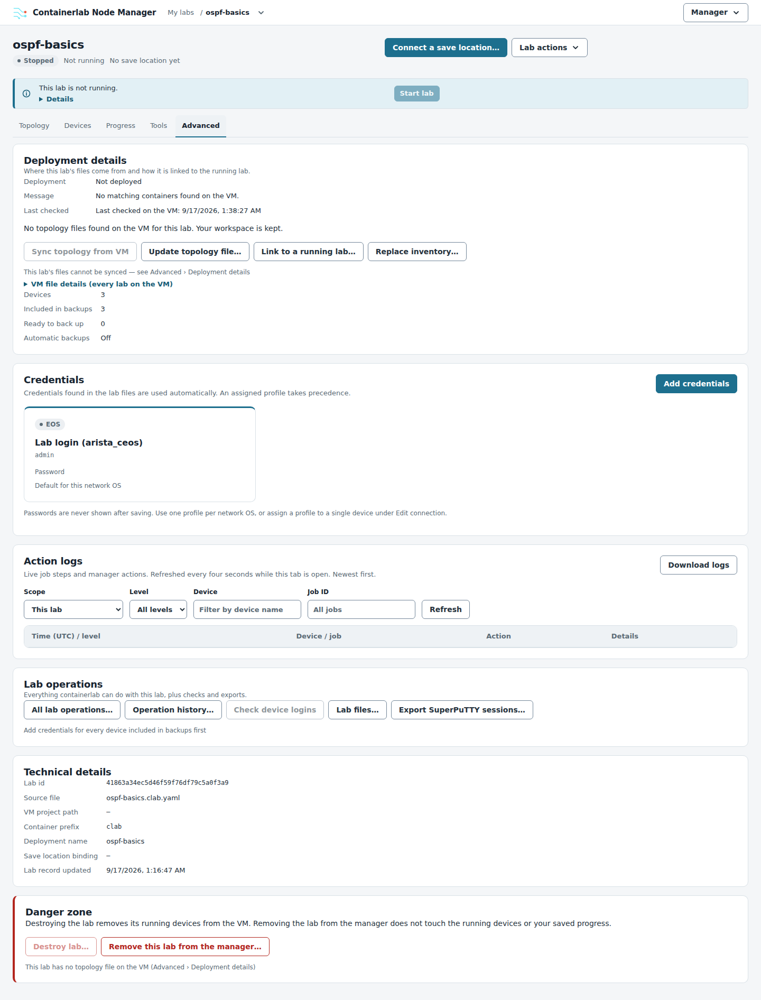

## Every lab operation is reviewed before it runs

**Lab actions ▾** starts, stops, restarts, redeploys and destroys the lab; its *Advanced
options* group holds *Import map…*, *Edit map* and *Operation history…*. The review
names the action, says what happens to the devices, warns that unsaved configuration
changes are lost, shows when progress was last saved (in red when it never was) and
offers *Save progress first*; the exact containerlab command sits under *Technical
details*. Confirming closes the review; the banner reports the running operation with
*View output*.

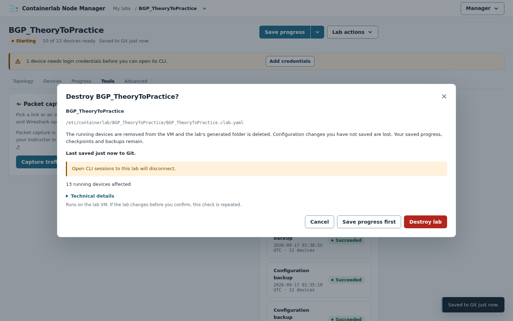

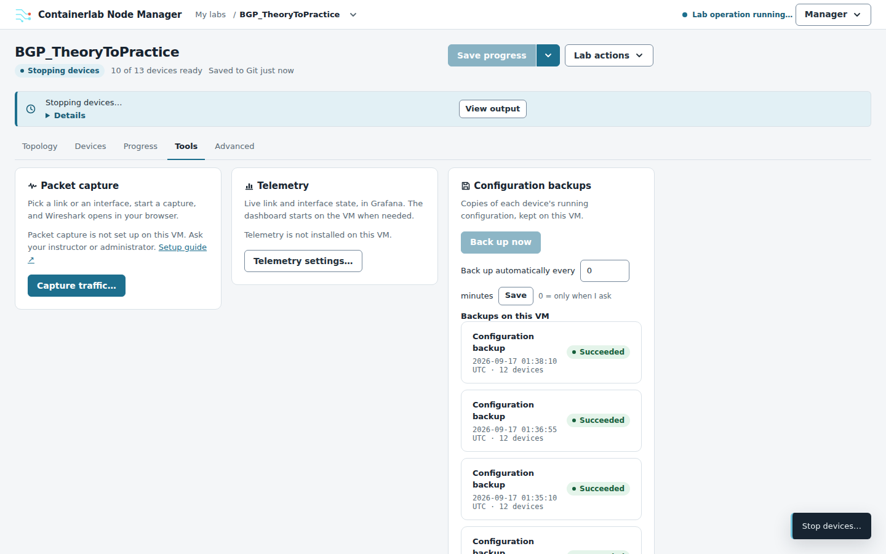

## CLIs in the browser

**Open CLI** opens the device's own CLI in a new tab with the credentials the manager
holds; **Open all CLIs** opens a launcher with one row per device.

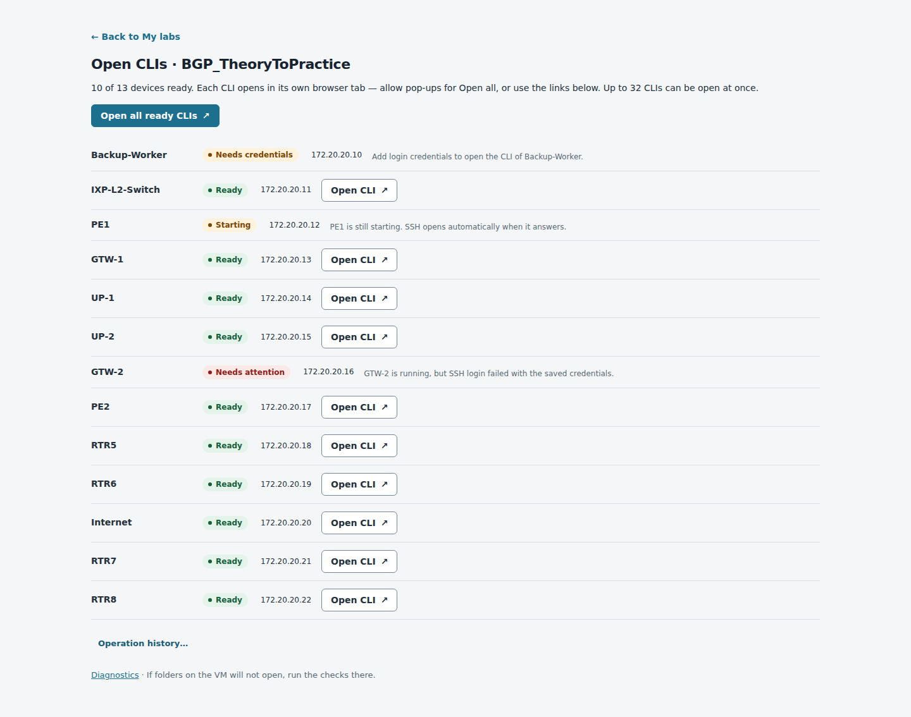

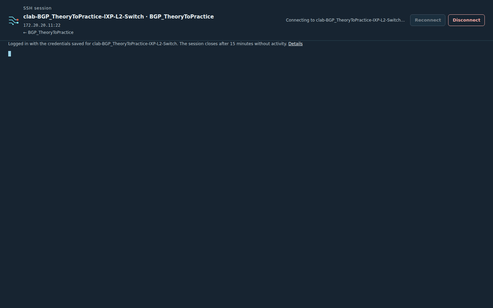
