# Tour

The manager is built around what a networking student does with a lab: open it, see
which devices are ready, get into a CLI, save progress, put a saved state back, look
at packets and traffic. The screenshots below are the real UI at 1440×900, captured with
a scripted headless browser against a manager whose lab VM answers are scripted (the
fixture manager under `docs/redesign/tools/`), so the labs, devices and saved versions
are examples rather than a live containerlab deployment. The layout, copy and controls
are exactly what a live manager shows.

## My labs

**Home is the list of your labs.** Each card carries the lab's state — *Running*,
*Starting*, *Stopped*, *Needs attention* — how many devices are ready and when progress
was last saved; the list opens on *Recent labs* (most recently deployed first, from the manager's own record of successful deploys and redeploys; labs it has not deployed come last, by name; *All labs* lists favourites first), under the two starting choices *Deploy* (*Choose a file on the lab VM…* or *Upload a file from this computer…*) and *Build* (*Open the lab builder*). Labs that run on the
VM but are not in the manager yet are listed under *Manager ▾ › Labs found on the VM…*,
where one click adds them. A card's ⋯ menu has *Hide from Home*: the card goes, the lab
and everything it has stays, and the same dialog (or adding the topology again from
*Choose a file on the lab VM…*) brings it back. The **Manager ▾** menu holds everything that is not about one lab: the VM
connection, importing lab files, deploying a new lab, the labs running on the VM,
operation history, manager settings and Diagnostics.

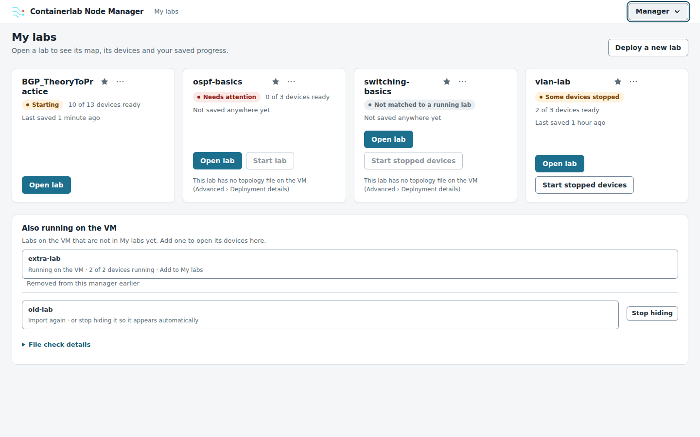

## The lab workspace

**One header, one situation.** The lab name, its state, *n of m devices ready*, a small
**save chip** that says where the lab's saved work stands (*Saved 21 min ago*, *1 save to
upload*, *Can't save*, *Running <name>*), **Save**, **Load** and **Lab actions ▾**. The header
is the same on every tab: saving and loading are never more than one click away. Clicking the
chip opens a panel with the one sentence that matters now and the button that goes with it. When
something else needs you — a device that refuses its login, an operation that failed — a
banner under the header says so in one sentence with the button that fixes it. Four tabs:
**Topology · Devices · Tools · Advanced**.

**Topology.** Every device on the map carries its state; right-click one (or press
Shift+F10) for *Open CLI ↗*, *Capture traffic…*, *Back up configuration* and *Device
details*, with the reason underneath when an action is not available yet. Click a link
to capture either end.

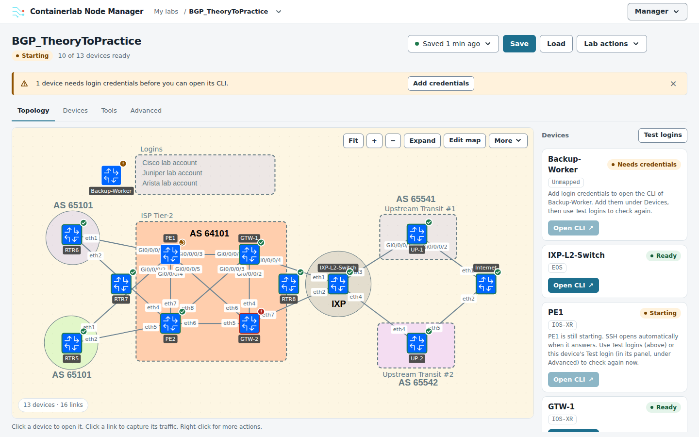

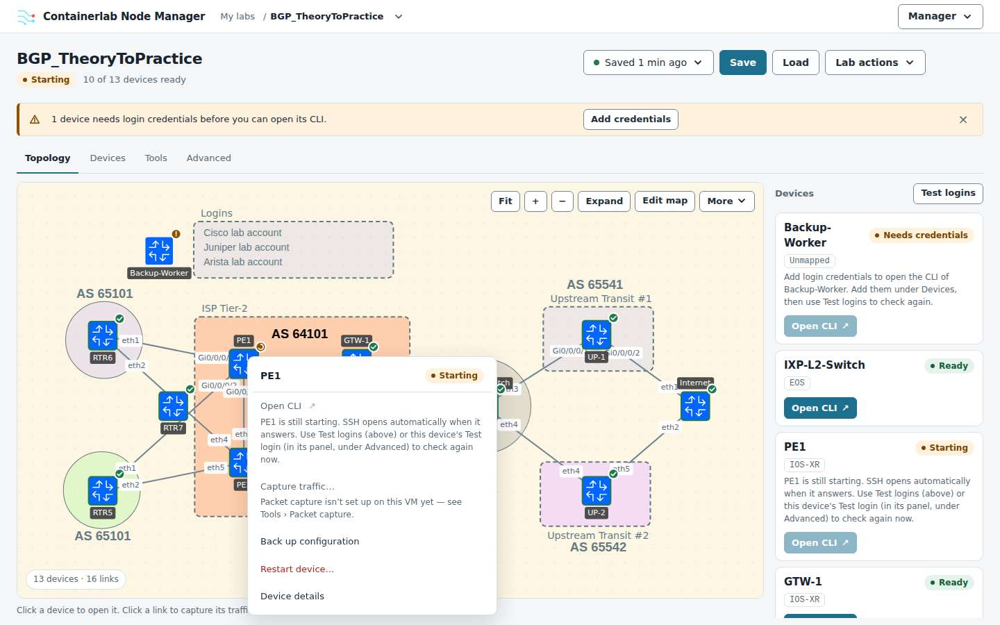

**Devices.** One row per device with its state and what to do about it; **Technical
view** switches to the classic table with addresses, network OS, credentials and the last
checks. The device panel shows the same state, the actions, the backups of that device
and, under *Advanced*, the connection and credential settings.

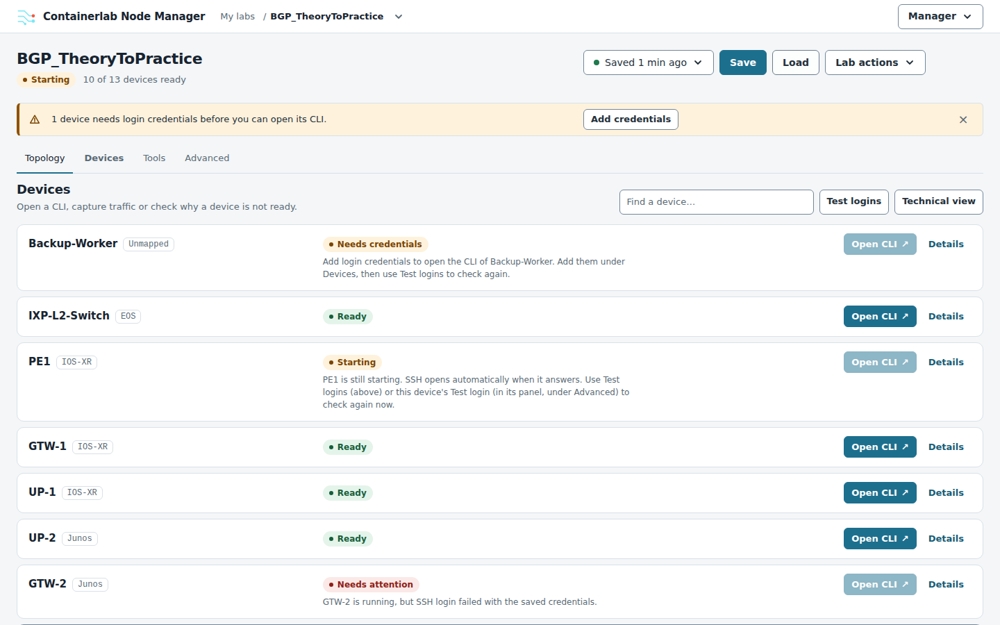

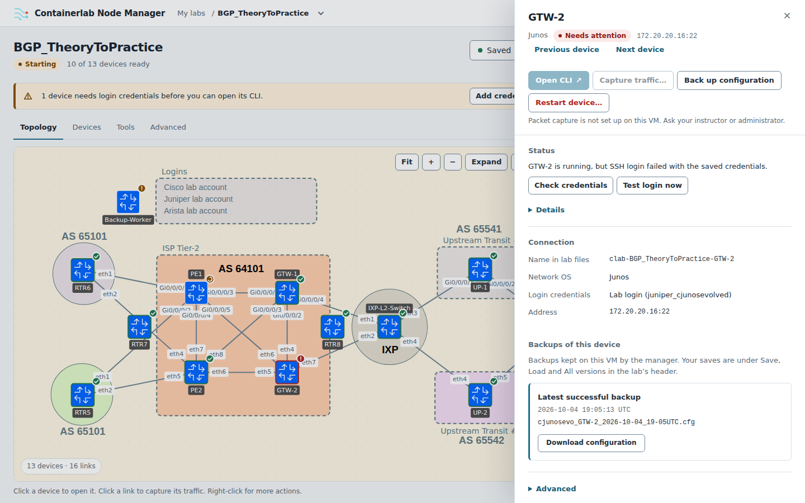

**Save.** **Save** saves the lab at once, without asking you to type anything: the topology
file, the map and the configuration of every included device go into one folder of your
repository as one save on the lab VM. Then one sentence says what changed, with three buttons:
**Upload** sends it to the online repository, **Not now** leaves it on the VM (the chip then
says *1 save to upload*) and **See changes** opens the files. Nothing is uploaded without
**Upload**. A save gets a name automatically (*ceos and xrv9k changed*); you can change it, and
**Keep as a checkpoint** keeps a save under a name you choose. The chip panel also shows where
the lab saves (*Saves to: Course-Labs › BGP*, with **Change…**) and, at the bottom, **All
versions**, **Save as a lab state…** and **Save settings**.

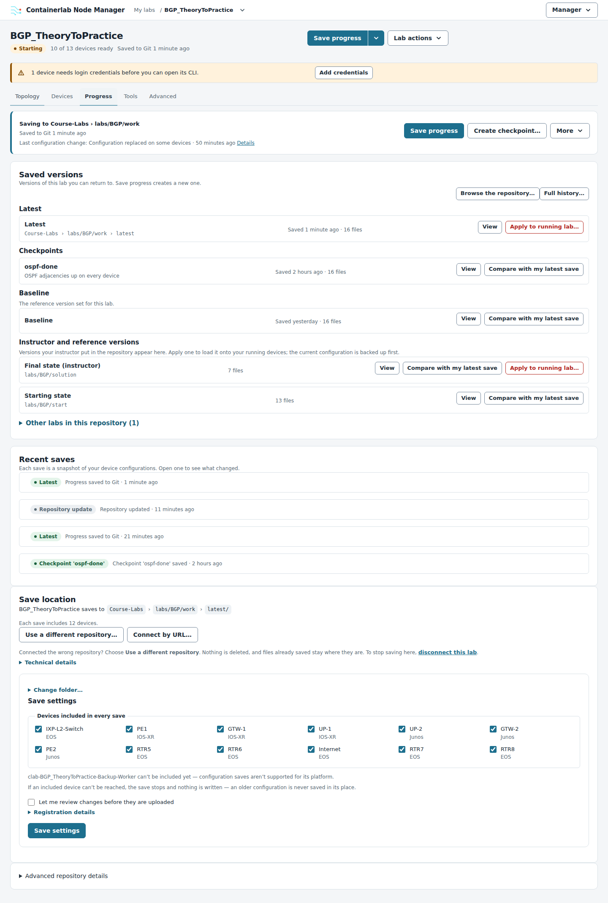

**All versions.** The drawer opened from the chip panel lists everything saved for the lab:
*Your saves*, *Checkpoints*, the *Starting point*, the *Lab states* of the repository (a
course's Start, Broken and Final) and, folded away, *Other labs in this repository*. Every
version can be viewed, downloaded as a ZIP, compared with your latest save (**See what's
different**) or loaded with **Load this state…**.

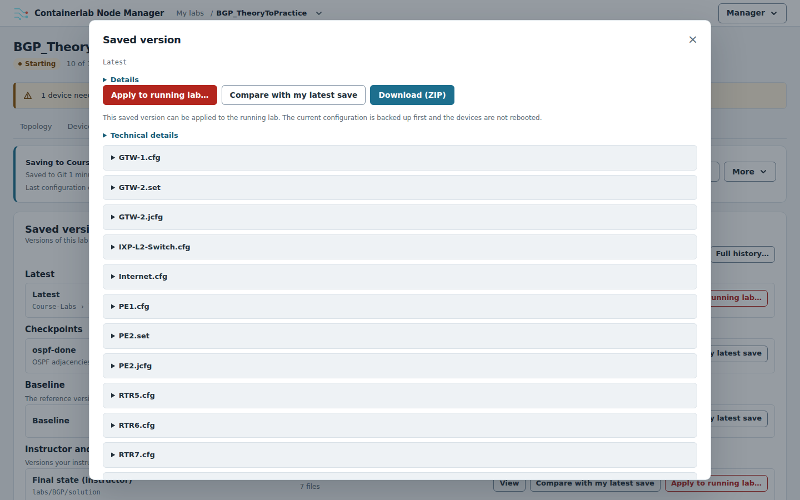

**Loading is reviewed first.** **Load** lists your saves and the lab states of the repository.
Choose one and the panel lists every device with what would change (*3 lines differ*, *Already
matches*, or why a device is skipped). The red **Load** is the confirmation: each device
replaces its whole running configuration inside its own transaction, after an automatic
backup, nothing reboots, and each device undoes the change itself if it loses contact. **Undo
this load** puts the backup from before the load back. Load never changes the topology.

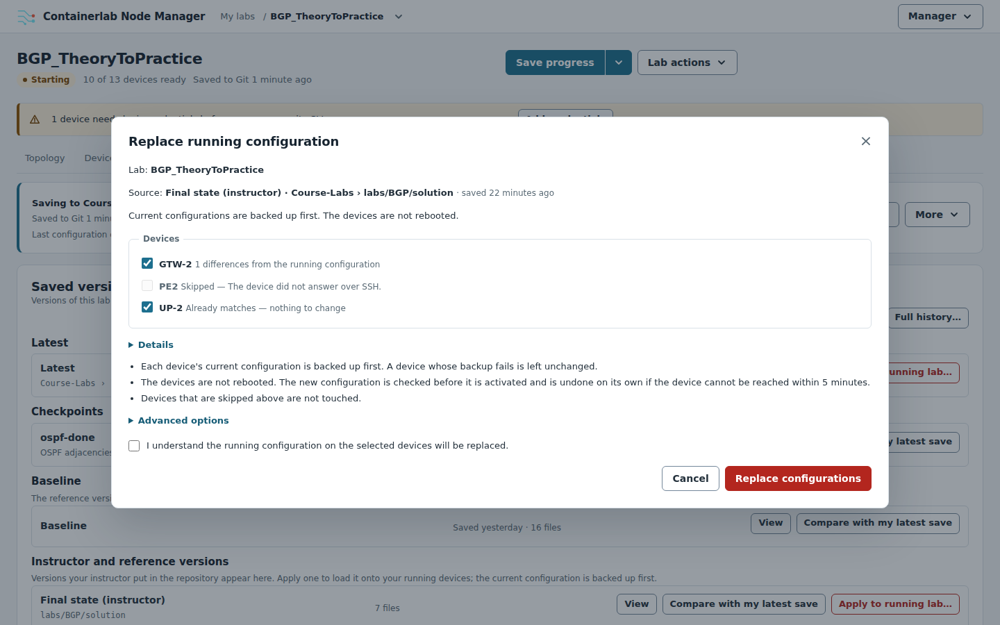

**Tools.** Packet capture and the manager's own configuration backups, with *Open all
CLIs* and *Edit map* (where the map file download and the draw.io export are) under *More tools*.

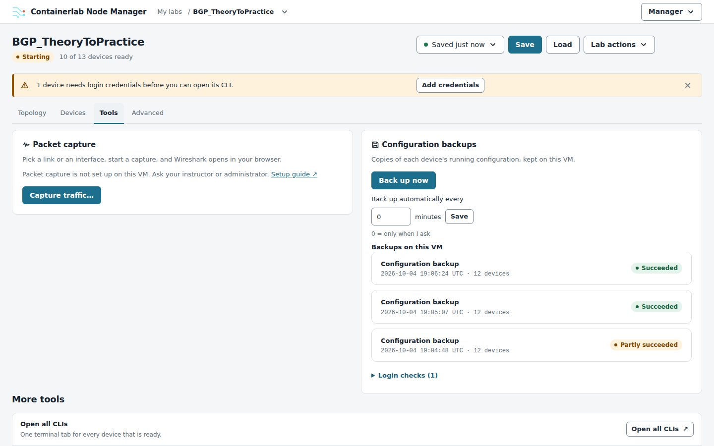

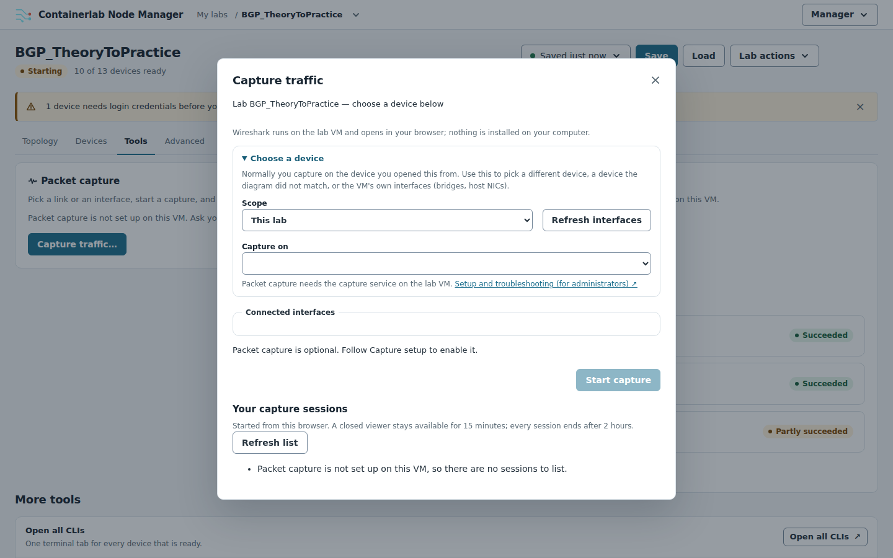

**Advanced.** Deployment details, the lab's source, credentials, action logs, the full
list of lab operations and the danger zone.

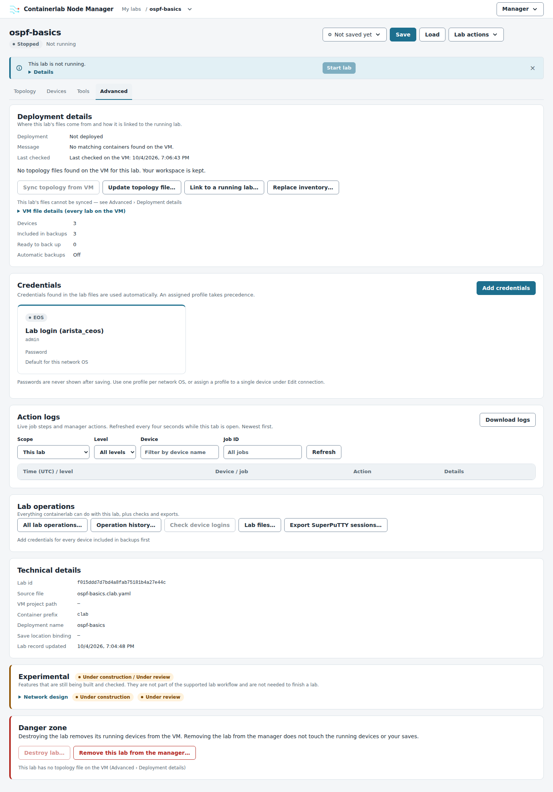

## Every lab operation is reviewed before it runs

**Lab actions ▾** starts, stops, restarts, redeploys and destroys the lab; its *Advanced
options* group holds *Import map…*, *Edit map* and *Operation history…*. The review
names the action, says what happens to the devices, warns that unsaved configuration
changes are lost, shows when progress was last saved (in red when it never was) and
offers **Save first**; the exact containerlab command sits under *Technical
details*. Confirming closes the review; the banner reports the running operation with
*View output*.

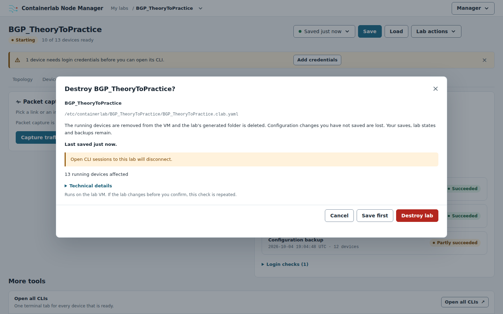

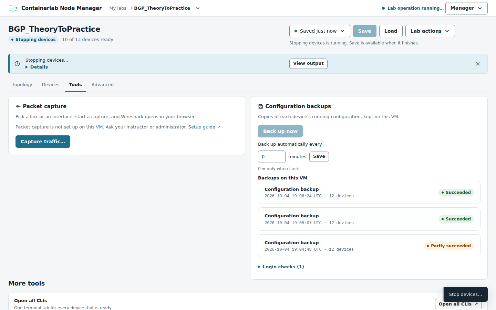

## CLIs in the browser

**Open CLI** opens the device's own CLI in a new tab with the credentials the manager
holds; **Open all CLIs** opens a launcher with one row per device.

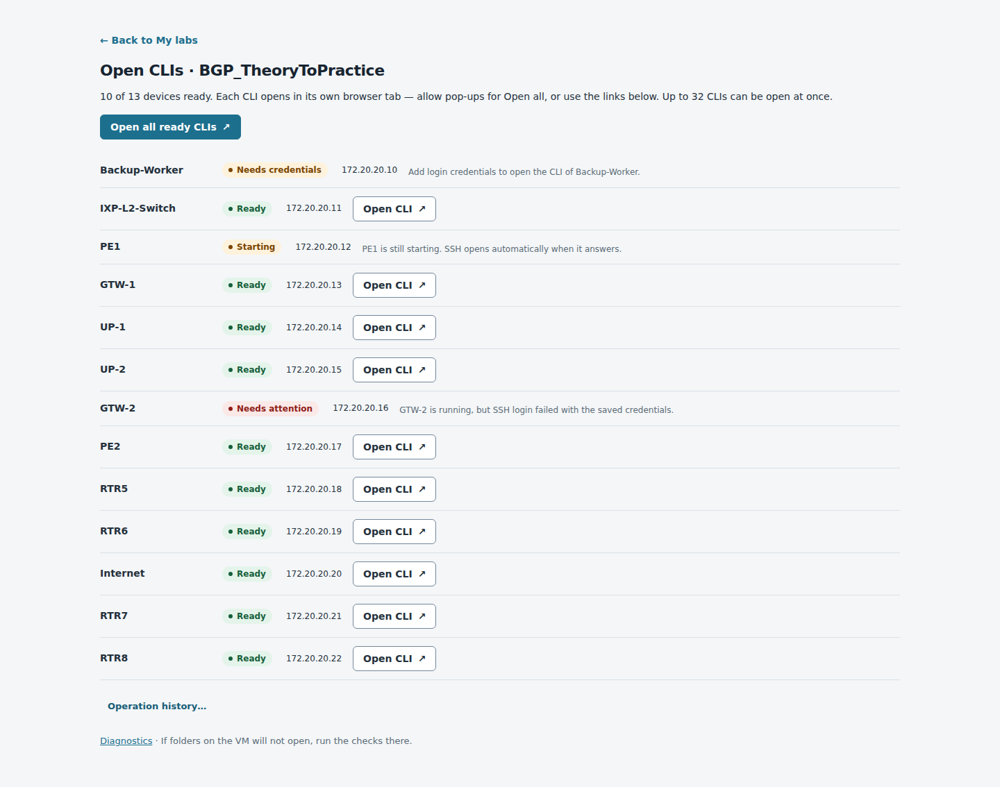

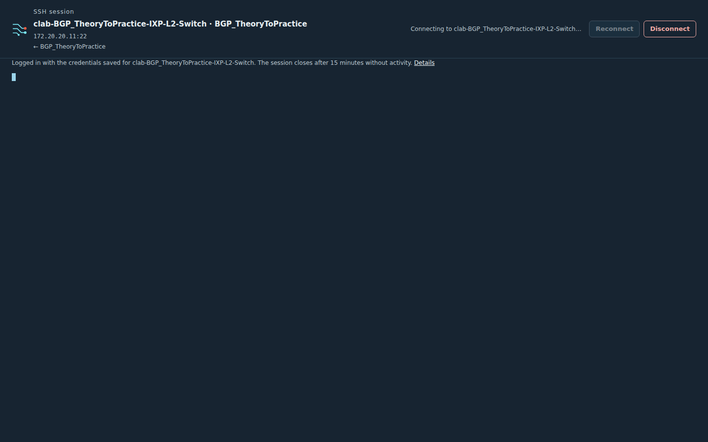
